# Legend_of_B.E.W.D.

|Secret| | | | |
|---|---|---|---|---|
|)|[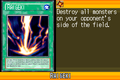](https://yugipedia.com/wiki/Raigeki_(World_Championship_2006))||||

|Ultra| | | | |
|---|---|---|---|---|
|)|[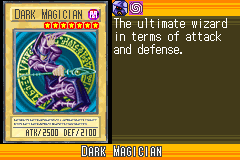](https://yugipedia.com/wiki/Dark_Magician_(World_Championship_2006))|)|)||

|Super| | | | |
|---|---|---|---|---|
|)|[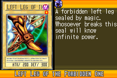](https://yugipedia.com/wiki/Left_Leg_of_the_Forbidden_One_(World_Championship_2006))|)|)|[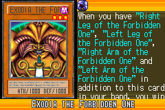](https://yugipedia.com/wiki/Exodia_the_Forbidden_One_(World_Championship_2006))|
|)|)||||

|Rare| | | | |
|---|---|---|---|---|
|[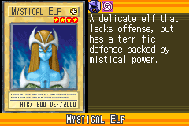](https://yugipedia.com/wiki/Mystical_Elf_(World_Championship_2006))|)|[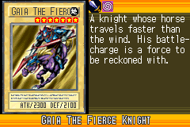](https://yugipedia.com/wiki/Gaia_The_Fierce_Knight_(World_Championship_2006))|)|)|
|)|)|[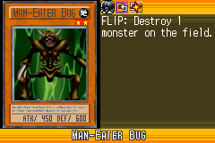](https://yugipedia.com/wiki/Man-Eater_Bug_(World_Championship_2006))|)|)|
|)|[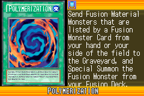](https://yugipedia.com/wiki/Polymerization_(World_Championship_2006))|)|)|)|

|Common| | | | |
|---|---|---|---|---|
|)|)|)|)|)|
|[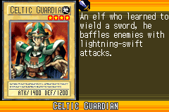](https://yugipedia.com/wiki/Celtic_Guardian_(World_Championship_2006))|)|)|)|)|
|)|)|)|)|)|
|[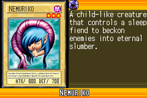](https://yugipedia.com/wiki/Nemuriko_(World_Championship_2006))|[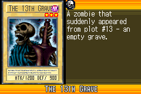](https://yugipedia.com/wiki/The_13th_Grave_(World_Championship_2006))|)|)|[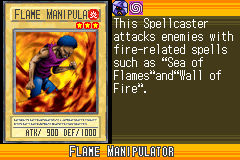](https://yugipedia.com/wiki/Flame_Manipulator_(World_Championship_2006))|
|)|[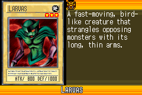](https://yugipedia.com/wiki/Larvas_(World_Championship_2006))|[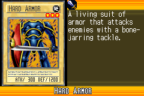](https://yugipedia.com/wiki/Hard_Armor_(World_Championship_2006))|)|)|
|[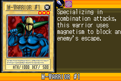](https://yugipedia.com/wiki/M-Warrior_1_(World_Championship_2006))|)|)|)|)|
|[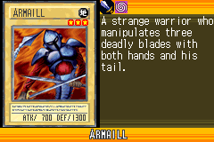](https://yugipedia.com/wiki/Armaill_(World_Championship_2006))|)|)|)|)|
|)|)|)|)|[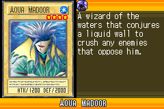](https://yugipedia.com/wiki/Aqua_Madoor_(World_Championship_2006))|
|)|)|)|)|)|
|)|)|)|)|)|
|)|)|)|)|)|
|[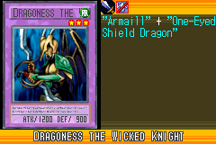](https://yugipedia.com/wiki/Dragoness_the_Wicked_Knight_(World_Championship_2006))|)|)|[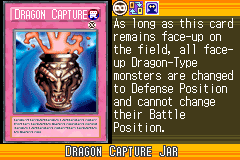](https://yugipedia.com/wiki/Dragon_Capture_Jar_(World_Championship_2006))|)|
|)|)|[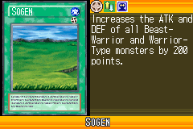](https://yugipedia.com/wiki/Sogen_(World_Championship_2006))|)|[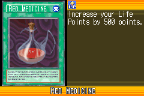](https://yugipedia.com/wiki/Red_Medicine_(World_Championship_2006))|
|)|)|)|)|)|
|)|)|)|)|)|
|)|)|)