# Metal_Raiders_(World_Championship_2006)

|Secret| | | | |
|---|---|---|---|---|
|[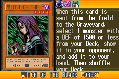](https://yugipedia.com/wiki/Witch_of_the_Black_Forest_(World_Championship_2006))|[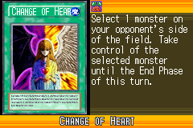](https://yugipedia.com/wiki/Change_of_Heart_(World_Championship_2006))|[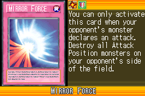](https://yugipedia.com/wiki/Mirror_Force_(World_Championship_2006))|||

|Ultra| | | | |
|---|---|---|---|---|
|[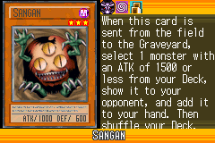](https://yugipedia.com/wiki/Sangan_(World_Championship_2006))|[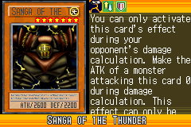](https://yugipedia.com/wiki/Sanga_of_the_Thunder_(World_Championship_2006))|[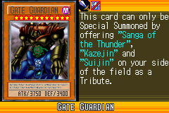](https://yugipedia.com/wiki/Gate_Guardian_(World_Championship_2006))|[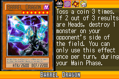](https://yugipedia.com/wiki/Barrel_Dragon_(World_Championship_2006))||

|Super| | | | |
|---|---|---|---|---|
|[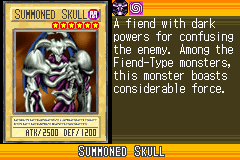](https://yugipedia.com/wiki/Summoned_Skull_(World_Championship_2006))|[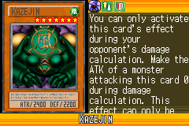](https://yugipedia.com/wiki/Kazejin_(World_Championship_2006))|[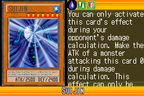](https://yugipedia.com/wiki/Suijin_(World_Championship_2006))|)|)|
|)|)||||

|Rare| | | | |
|---|---|---|---|---|
|[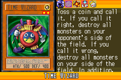](https://yugipedia.com/wiki/Time_Wizard_(World_Championship_2006))|[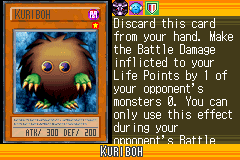](https://yugipedia.com/wiki/Kuriboh_(World_Championship_2006))|[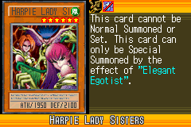](https://yugipedia.com/wiki/Harpie_Lady_Sisters_(World_Championship_2006))|[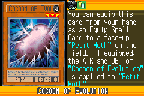](https://yugipedia.com/wiki/Cocoon_of_Evolution_(World_Championship_2006))|[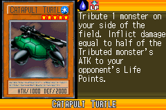](https://yugipedia.com/wiki/Catapult_Turtle_(World_Championship_2006))|
|)|[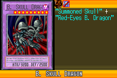](https://yugipedia.com/wiki/B._Skull_Dragon_(World_Championship_2006))|[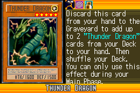](https://yugipedia.com/wiki/Thunder_Dragon_(World_Championship_2006))|)|)|
|[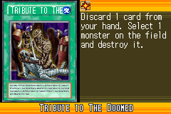](https://yugipedia.com/wiki/Tribute_to_The_Doomed_(World_Championship_2006))|[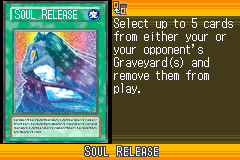](https://yugipedia.com/wiki/Soul_Release_(World_Championship_2006))|[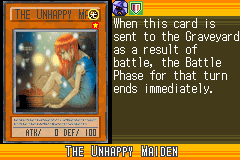](https://yugipedia.com/wiki/The_Unhappy_Maiden_(World_Championship_2006))|)|[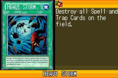](https://yugipedia.com/wiki/Heavy_Storm_(World_Championship_2006))|

|Common| | | | |
|---|---|---|---|---|
|[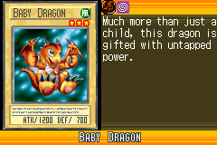](https://yugipedia.com/wiki/Baby_Dragon_(World_Championship_2006))|[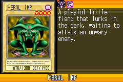](https://yugipedia.com/wiki/Feral_Imp_(World_Championship_2006))|[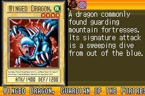](https://yugipedia.com/wiki/Winged_Dragon,_Guardian_of_the_Fortress_1_(World_Championship_2006))|[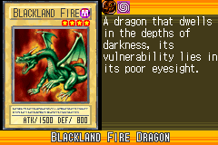](https://yugipedia.com/wiki/Blackland_Fire_Dragon_(World_Championship_2006))|[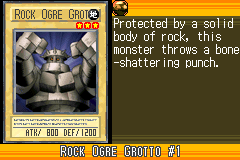](https://yugipedia.com/wiki/Rock_Ogre_Grotto_1_(World_Championship_2006))|
|[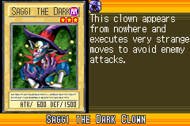](https://yugipedia.com/wiki/Saggi_the_Dark_Clown_(World_Championship_2006))|[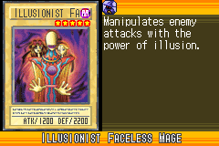](https://yugipedia.com/wiki/Illusionist_Faceless_Mage_(World_Championship_2006))|[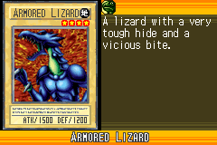](https://yugipedia.com/wiki/Armored_Lizard_(World_Championship_2006))|[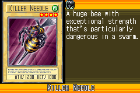](https://yugipedia.com/wiki/Killer_Needle_(World_Championship_2006))|[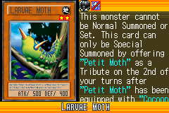](https://yugipedia.com/wiki/Larvae_Moth_(World_Championship_2006))|
|[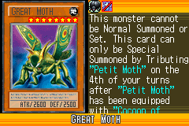](https://yugipedia.com/wiki/Great_Moth_(World_Championship_2006))|[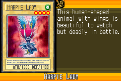](https://yugipedia.com/wiki/Harpie_Lady_(World_Championship_2006))|[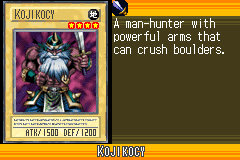](https://yugipedia.com/wiki/Kojikocy_(World_Championship_2006))|[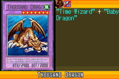](https://yugipedia.com/wiki/Thousand_Dragon_(World_Championship_2006))|[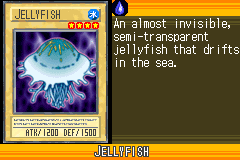](https://yugipedia.com/wiki/Jellyfish_(World_Championship_2006))|
|)|[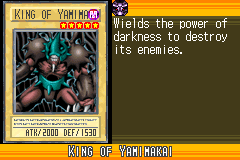](https://yugipedia.com/wiki/King_of_Yamimakai_(World_Championship_2006))|[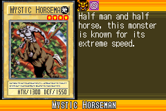](https://yugipedia.com/wiki/Mystic_Horseman_(World_Championship_2006))|[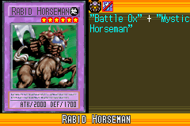](https://yugipedia.com/wiki/Rabid_Horseman_(World_Championship_2006))|[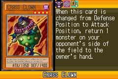](https://yugipedia.com/wiki/Crass_Clown_(World_Championship_2006))|
|)|)|[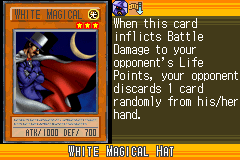](https://yugipedia.com/wiki/White_Magical_Hat_(World_Championship_2006))|[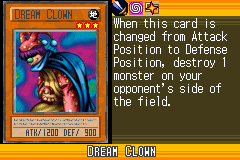](https://yugipedia.com/wiki/Dream_Clown_(World_Championship_2006))|[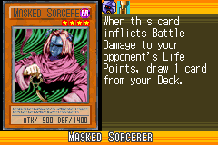](https://yugipedia.com/wiki/Masked_Sorcerer_(World_Championship_2006))|
|[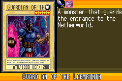](https://yugipedia.com/wiki/Guardian_of_the_Labyrinth_(World_Championship_2006))|[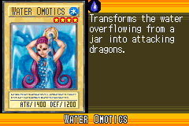](https://yugipedia.com/wiki/Water_Omotics_(World_Championship_2006))|[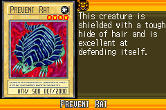](https://yugipedia.com/wiki/Prevent_Rat_(World_Championship_2006))|[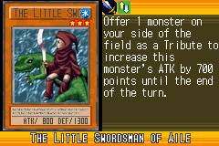](https://yugipedia.com/wiki/The_Little_Swordsman_of_Aile_(World_Championship_2006))|)|
|[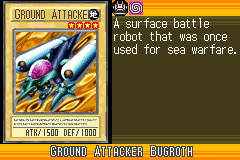](https://yugipedia.com/wiki/Ground_Attacker_Bugroth_(World_Championship_2006))|[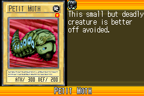](https://yugipedia.com/wiki/Petit_Moth_(World_Championship_2006))|[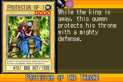](https://yugipedia.com/wiki/Protector_of_the_Throne_(World_Championship_2006))|)|)|
|)|)|)|)|)|
|)|)|)|)|)|
|)|)|)|)|)|
|)|)|)|)|)|
|)|)|)|)|)|
|)|)|)|)|)|
|)|)|)|)|)|
|)|)|)|)|)|
|)|)|)|)|)|
|)|)|)|)|)|
