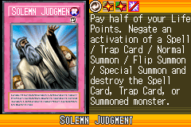
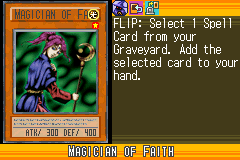
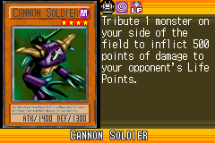
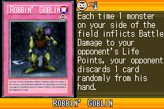
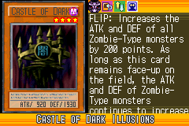
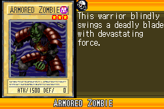
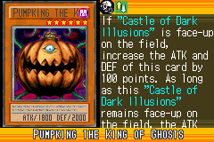
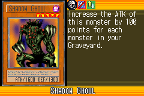
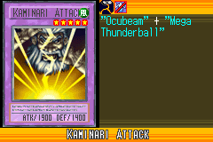
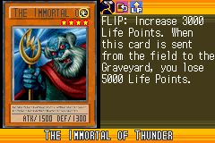

# Metal_Raiders_(World_Championship_2006)

|Secret| | | | |
|---|---|---|---|---|
|)|)|)|||

|Ultra| | | | |
|---|---|---|---|---|
|)|)|)|)||

|Super| | | | |
|---|---|---|---|---|
|)|)|)|)|)|
|)|)||||

|Rare| | | | |
|---|---|---|---|---|
|)|)|)|)|)|
|)|)|)|)|)|
|)|)|)|)|)|

|Common| | | | |
|---|---|---|---|---|
|)|)|)|)|)|
|)|)|)|)|)|
|)|)|)|)|)|
|)|)|)|)|)|
|)|)|)|)|)|
|)|)|)|)|)|
|)|)|)|)|)|
|)|)|)|)|)|
|)|)|)|)|)|
|)|)|)|)|)|
|)|)|)|)|)|
|)|)|)|)|)|
|)|)|)|)|)|
|)|)|)|)|)|
|)|)|)|)|)|
|)|)|)|)|)|
|)|)|)|)|)|
