# Pharaoh%27s_Servant_(World_Championship_2006)

|Secret| | | | |
|---|---|---|---|---|
|)|||||

|Ultra| | | | |
|---|---|---|---|---|
|)|)|)|)|[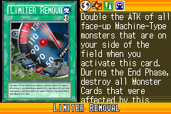](https://yugipedia.com/wiki/Limiter_Removal_(World_Championship_2006))|

|Super| | | | |
|---|---|---|---|---|
|)|)|)|)|)|
|[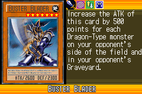](https://yugipedia.com/wiki/Buster_Blader_(World_Championship_2006))|)|)|||

|Rare| | | | |
|---|---|---|---|---|
|)|)|[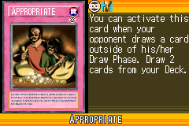](https://yugipedia.com/wiki/Appropriate_(World_Championship_2006))|)|)|
|)|)|)|)|)|
|)|)|)|)||

|Common| | | | |
|---|---|---|---|---|
|)|)|)|[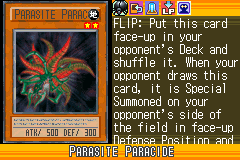](https://yugipedia.com/wiki/Parasite_Paracide_(World_Championship_2006))|)|
|)|)|)|)|[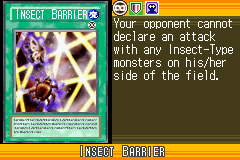](https://yugipedia.com/wiki/Insect_Barrier_(World_Championship_2006))|
|)|)|)|)|[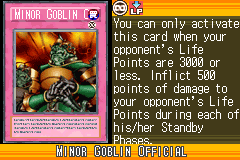](https://yugipedia.com/wiki/Minor_Goblin_Official_(World_Championship_2006))|
|)|)|)|)|)|
|[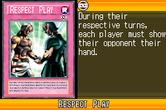](https://yugipedia.com/wiki/Respect_Play_(World_Championship_2006))|[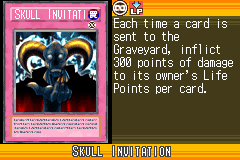](https://yugipedia.com/wiki/Skull_Invitation_(World_Championship_2006))|)|)|)|
|)|)|[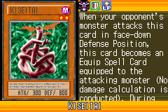](https://yugipedia.com/wiki/Kiseitai_(World_Championship_2006))|)|)|
|)|)|)|)|)|
|)|)|)|[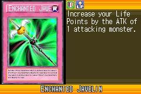](https://yugipedia.com/wiki/Enchanted_Javelin_(World_Championship_2006))|)|
|)|)|)|)|)|
|)|[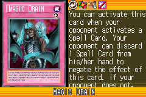](https://yugipedia.com/wiki/Magic_Drain_(World_Championship_2006))|)|)|)|
|[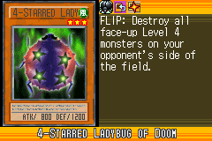](https://yugipedia.com/wiki/4-Starred_Ladybug_of_Doom_(World_Championship_2006))|)|)|)|)|
|)|)|)|)|)|
|)|[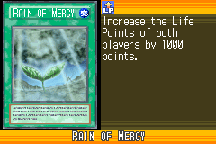](https://yugipedia.com/wiki/Rain_of_Mercy_(World_Championship_2006))|)|[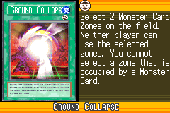](https://yugipedia.com/wiki/Ground_Collapse_(World_Championship_2006))