# Pharaonic_Guardian_(World_Championship_2006)

|Secret| | | | |
|---|---|---|---|---|
|)|||||

|Ultra| | | | |
|---|---|---|---|---|
|)|)|)|)||

|Super| | | | |
|---|---|---|---|---|
|)|[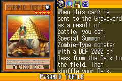](https://yugipedia.com/wiki/Pyramid_Turtle_(World_Championship_2006))|)|[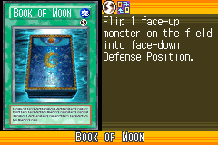](https://yugipedia.com/wiki/Book_of_Moon_(World_Championship_2006))|)|
|)|)||||

|Rare| | | | |
|---|---|---|---|---|
|)|)|[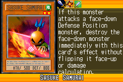](https://yugipedia.com/wiki/Sasuke_Samurai_(World_Championship_2006))|)|)|
|)|)|)|)|)|
|[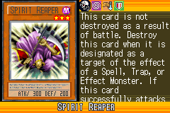](https://yugipedia.com/wiki/Spirit_Reaper_(World_Championship_2006))|[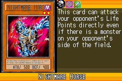](https://yugipedia.com/wiki/Nightmare_Horse_(World_Championship_2006))|)|)||

|Common| | | | |
|---|---|---|---|---|
|)|)|)|)|)|
|)|)|)|[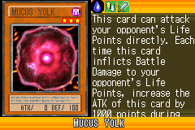](https://yugipedia.com/wiki/Mucus_Yolk_(World_Championship_2006))|)|
|)|)|)|)|)|
|)|)|)|)|[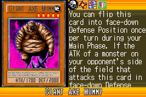](https://yugipedia.com/wiki/Giant_Axe_Mummy_(World_Championship_2006))|
|)|)|)|[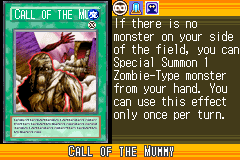](https://yugipedia.com/wiki/Call_of_the_Mummy_(World_Championship_2006))|)|
|)|)|)|)|)|
|)|)|)|[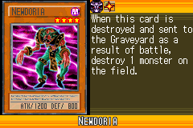](https://yugipedia.com/wiki/Newdoria_(World_Championship_2006))|)|
|[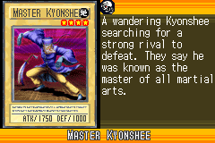](https://yugipedia.com/wiki/Master_Kyonshee_(World_Championship_2006))|)|)|)|)|
|)|[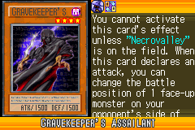](https://yugipedia.com/wiki/Gravekeeper%27s_Assailant_(World_Championship_2006))|)|)|)|
|)|)|[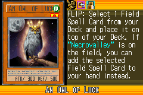](https://yugipedia.com/wiki/An_Owl_of_Luck_(World_Championship_2006))|)|)|
|)|)|)|)|)|
|)|)|[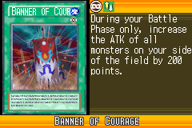](https://yugipedia.com/wiki/Banner_of_Courage_(World_Championship_2006))|)|)|
|)|)|)|[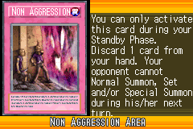](https://yugipedia.com/wiki/Non_Aggression_Area_(World_Championship_2006))|)|
