# Spell_Ruler_(World_Championship_2006)

|Secret| | | | |
|---|---|---|---|---|
|[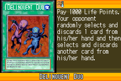](https://yugipedia.com/wiki/Delinquent_Duo_(World_Championship_2006))|[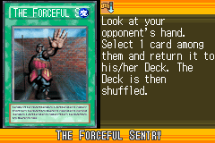](https://yugipedia.com/wiki/The_Forceful_Sentry_(World_Championship_2006))|[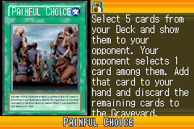](https://yugipedia.com/wiki/Painful_Choice_(World_Championship_2006))|||

|Ultra| | | | |
|---|---|---|---|---|
|)|[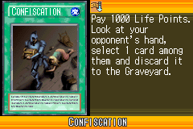](https://yugipedia.com/wiki/Confiscation_(World_Championship_2006))|)|)||

|Super| | | | |
|---|---|---|---|---|
|[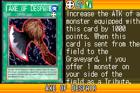](https://yugipedia.com/wiki/Axe_of_Despair_(World_Championship_2006))|)|[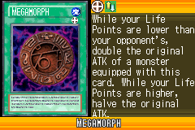](https://yugipedia.com/wiki/Megamorph_(World_Championship_2006))|[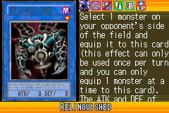](https://yugipedia.com/wiki/Relinquished_(World_Championship_2006))|)|
|)|)||||

|Rare| | | | |
|---|---|---|---|---|
|)|[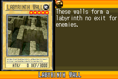](https://yugipedia.com/wiki/Labyrinth_Wall_(World_Championship_2006))|)|)|[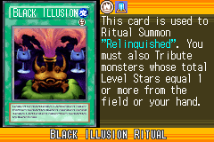](https://yugipedia.com/wiki/Black_Illusion_Ritual_(World_Championship_2006))|
|[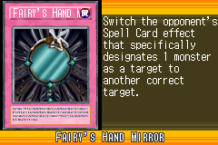](https://yugipedia.com/wiki/Fairy%27s_Hand_Mirror_(World_Championship_2006))|[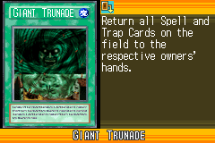](https://yugipedia.com/wiki/Giant_Trunade_(World_Championship_2006))|)|)|)|
|)|[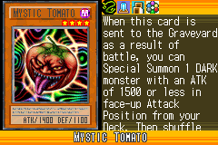](https://yugipedia.com/wiki/Mystic_Tomato_(World_Championship_2006))|[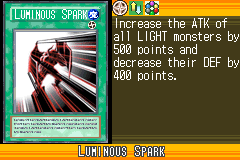](https://yugipedia.com/wiki/Luminous_Spark_(World_Championship_2006))|[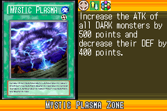](https://yugipedia.com/wiki/Mystic_Plasma_Zone_(World_Championship_2006))|)|

|Common| | | | |
|---|---|---|---|---|
|[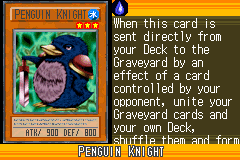](https://yugipedia.com/wiki/Penguin_Knight_(World_Championship_2006))|[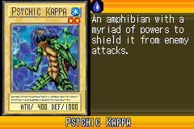](https://yugipedia.com/wiki/Psychic_Kappa_(World_Championship_2006))|[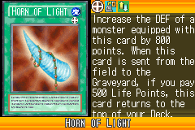](https://yugipedia.com/wiki/Horn_of_Light_(World_Championship_2006))|[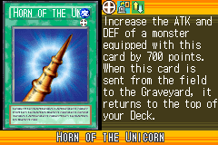](https://yugipedia.com/wiki/Horn_of_the_Unicorn_(World_Championship_2006))|[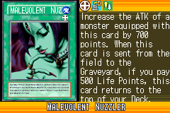](https://yugipedia.com/wiki/Malevolent_Nuzzler_(World_Championship_2006))|
|[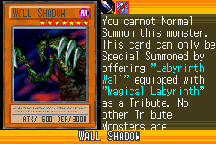](https://yugipedia.com/wiki/Wall_Shadow_(World_Championship_2006))|)|)|[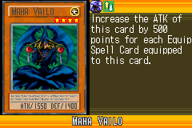](https://yugipedia.com/wiki/Maha_Vailo_(World_Championship_2006))|[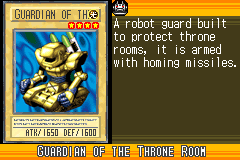](https://yugipedia.com/wiki/Guardian_of_the_Throne_Room_(World_Championship_2006))|
|[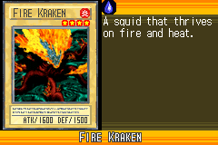](https://yugipedia.com/wiki/Fire_Kraken_(World_Championship_2006))|)|)|[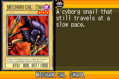](https://yugipedia.com/wiki/Mechanical_Snail_(World_Championship_2006))|[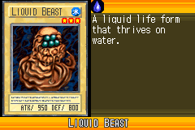](https://yugipedia.com/wiki/Liquid_Beast_(World_Championship_2006))|
|[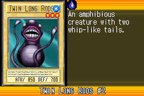](https://yugipedia.com/wiki/Twin_Long_Rods_2_(World_Championship_2006))|)|[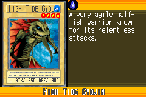](https://yugipedia.com/wiki/High_Tide_Gyojin_(World_Championship_2006))|)|[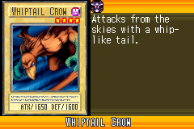](https://yugipedia.com/wiki/Whiptail_Crow_(World_Championship_2006))|
|[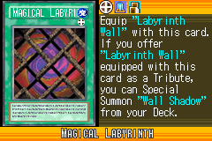](https://yugipedia.com/wiki/Magical_Labyrinth_(World_Championship_2006))|[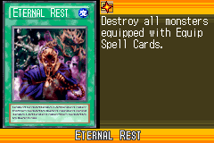](https://yugipedia.com/wiki/Eternal_Rest_(World_Championship_2006))|[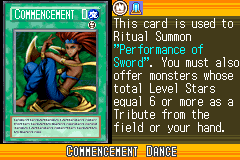](https://yugipedia.com/wiki/Commencement_Dance_(World_Championship_2006))|[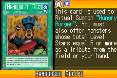](https://yugipedia.com/wiki/Hamburger_Recipe_(World_Championship_2006))|)|
|[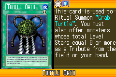](https://yugipedia.com/wiki/Turtle_Oath_(World_Championship_2006))|)|[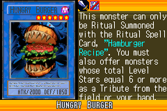](https://yugipedia.com/wiki/Hungry_Burger_(World_Championship_2006))|[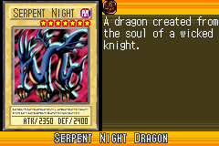](https://yugipedia.com/wiki/Serpent_Night_Dragon_(World_Championship_2006))|[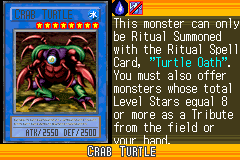](https://yugipedia.com/wiki/Crab_Turtle_(World_Championship_2006))|
|[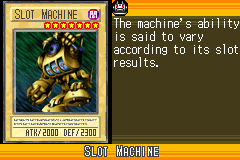](https://yugipedia.com/wiki/Slot_Machine_(World_Championship_2006))|[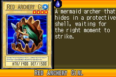](https://yugipedia.com/wiki/Red_Archery_Girl_(World_Championship_2006))|[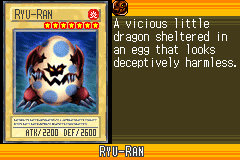](https://yugipedia.com/wiki/Ryu-Ran_(World_Championship_2006))|)|)|
|[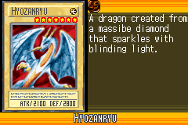](https://yugipedia.com/wiki/Hyozanryu_(World_Championship_2006))|)|)|[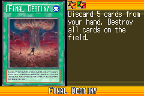](https://yugipedia.com/wiki/Final_Destiny_(World_Championship_2006))|[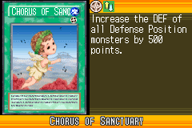](https://yugipedia.com/wiki/Chorus_of_Sanctuary_(World_Championship_2006))|
|)|)|)|)|[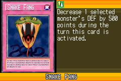](https://yugipedia.com/wiki/Snake_Fang_(World_Championship_2006))|
|[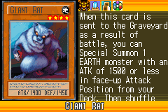](https://yugipedia.com/wiki/Giant_Rat_(World_Championship_2006))|[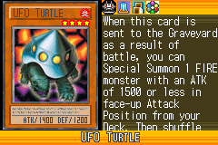](https://yugipedia.com/wiki/UFO_Turtle_(World_Championship_2006))|[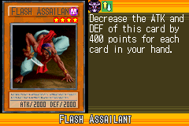](https://yugipedia.com/wiki/Flash_Assailant_(World_Championship_2006))|[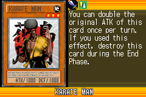](https://yugipedia.com/wiki/Karate_Man_(World_Championship_2006))|)|
|[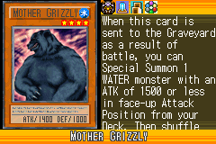](https://yugipedia.com/wiki/Mother_Grizzly_(World_Championship_2006))|[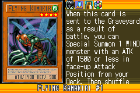](https://yugipedia.com/wiki/Flying_Kamakiri_1_(World_Championship_2006))|[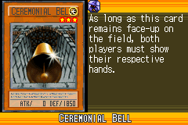](https://yugipedia.com/wiki/Ceremonial_Bell_(World_Championship_2006))|)|)|
|)|)|)|)