# Spell_Ruler_(World_Championship_2006)

|Secret| | | | |
|---|---|---|---|---|
|)|)|)|||

|Ultra| | | | |
|---|---|---|---|---|
|)|)|)|)||

|Super| | | | |
|---|---|---|---|---|
|)|[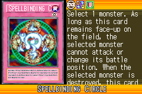](https://yugipedia.com/wiki/Spellbinding_Circle_(World_Championship_2006))|)|)|)|
|[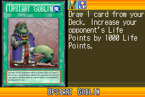](https://yugipedia.com/wiki/Upstart_Goblin_(World_Championship_2006))|[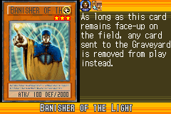](https://yugipedia.com/wiki/Banisher_of_the_Light_(World_Championship_2006))||||

|Rare| | | | |
|---|---|---|---|---|
|[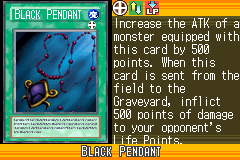](https://yugipedia.com/wiki/Black_Pendant_(World_Championship_2006))|)|)|)|)|
|)|)|[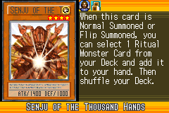](https://yugipedia.com/wiki/Senju_of_the_Thousand_Hands_(World_Championship_2006))|)|[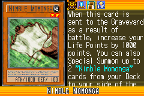](https://yugipedia.com/wiki/Nimble_Momonga_(World_Championship_2006))|
|[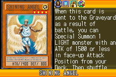](https://yugipedia.com/wiki/Shining_Angel_(World_Championship_2006))|)|)|)|)|

|Common| | | | |
|---|---|---|---|---|
|)|)|)|)|)|
|)|[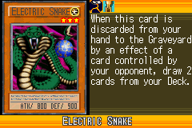](https://yugipedia.com/wiki/Electric_Snake_(World_Championship_2006))|[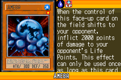](https://yugipedia.com/wiki/Ameba_(World_Championship_2006))|)|)|
|)|)|[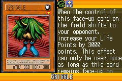](https://yugipedia.com/wiki/Griggle_(World_Championship_2006))|)|)|
|)|)|)|[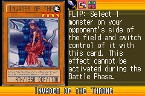](https://yugipedia.com/wiki/Invader_of_the_Throne_(World_Championship_2006))|)|
|)|)|)|)|)|
|)|[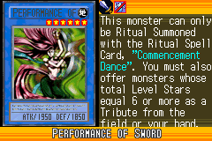](https://yugipedia.com/wiki/Performance_of_Sword_(World_Championship_2006))|)|)|)|
|)|)|)|)|[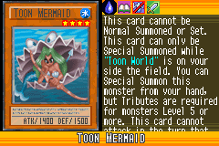](https://yugipedia.com/wiki/Toon_Mermaid_(World_Championship_2006))|
|)|)|[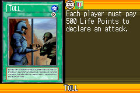](https://yugipedia.com/wiki/Toll_(World_Championship_2006))|)|)|
|[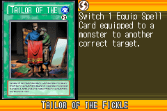](https://yugipedia.com/wiki/Tailor_of_the_Fickle_(World_Championship_2006))|[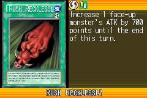](https://yugipedia.com/wiki/Rush_Recklessly_(World_Championship_2006))|[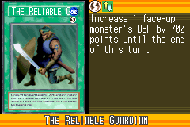](https://yugipedia.com/wiki/The_Reliable_Guardian_(World_Championship_2006))|)|)|
|)|)|)|)|)|
|)|)|)|[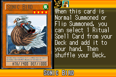](https://yugipedia.com/wiki/Sonic_Bird_(World_Championship_2006))|[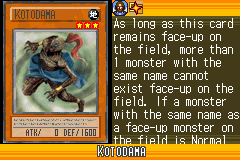](https://yugipedia.com/wiki/Kotodama_(World_Championship_2006))|
|)|)|)|)