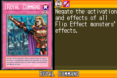
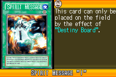
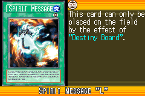
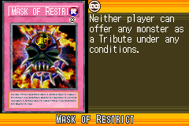
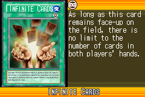
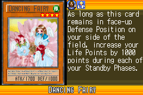
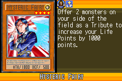
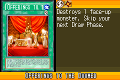
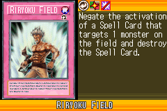
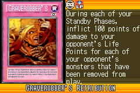

# Labyrinth_of_Nightmare_(World_Championship_2006)

|Ultra| | | | |
|---|---|---|---|---|
|)|)|)|)|)|

|Super| | | | |
|---|---|---|---|---|
|)|)|)|)|)|
|)|)|)|||

|Rare| | | | |
|---|---|---|---|---|
|)|)|)|)|)|
|)|)|)|)|)|
|)|)|)|||

|Common| | | | |
|---|---|---|---|---|
|)|)|)|)|)|
|)|)|)|)|)|
|)|)|)|)|)|
|)|)|)|)|)|
|)|)|)|)|)|
|)|)|)|)|)|
|)|)|)|)|)|
|)|)|)|)|)|
|)|)|)|)|)|
|)|)|)|)|)|
|)|)|)|)|)|
|)|)|)|)|)|
|)|)|)|)|)|
|)|)|)|)|)|
