# Legacy_of_Darkness_(World_Championship_2006)

|Secret| | | | |
|---|---|---|---|---|
|[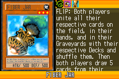](https://yugipedia.com/wiki/Fiber_Jar_(World_Championship_2006))|[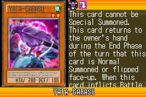](https://yugipedia.com/wiki/Yata-Garasu_(World_Championship_2006))||||

|Ultra| | | | |
|---|---|---|---|---|
|[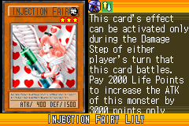](https://yugipedia.com/wiki/Injection_Fairy_Lily_(World_Championship_2006))|)|[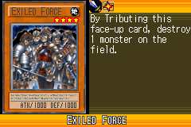](https://yugipedia.com/wiki/Exiled_Force_(World_Championship_2006))|)|)|

|Super| | | | |
|---|---|---|---|---|
|)|[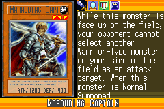](https://yugipedia.com/wiki/Marauding_Captain_(World_Championship_2006))|)|)|)|
|)|[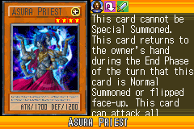](https://yugipedia.com/wiki/Asura_Priest_(World_Championship_2006))|)|||

|Rare| | | | |
|---|---|---|---|---|
|)|)|)|[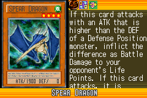](https://yugipedia.com/wiki/Spear_Dragon_(World_Championship_2006))|)|
|)|[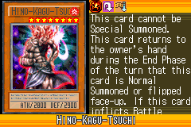](https://yugipedia.com/wiki/Hino-Kagu-Tsuchi_(World_Championship_2006))|[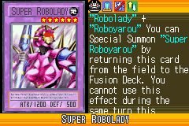](https://yugipedia.com/wiki/Super_Robolady_(World_Championship_2006))|)|)|
|)|)||||

|Common| | | | |
|---|---|---|---|---|
|)|)|[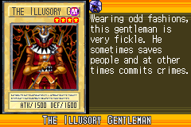](https://yugipedia.com/wiki/The_Illusory_Gentleman_(World_Championship_2006))|[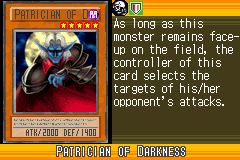](https://yugipedia.com/wiki/Patrician_of_Darkness_(World_Championship_2006))|)|
|)|)|[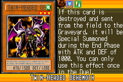](https://yugipedia.com/wiki/Twin-Headed_Behemoth_(World_Championship_2006))|[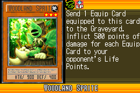](https://yugipedia.com/wiki/Woodland_Sprite_(World_Championship_2006))|)|
|)|[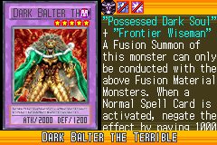](https://yugipedia.com/wiki/Dark_Balter_the_Terrible_(World_Championship_2006))|)|)|)|
|[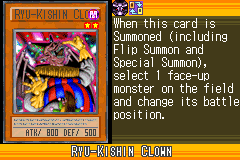](https://yugipedia.com/wiki/Ryu-Kishin_Clown_(World_Championship_2006))|)|[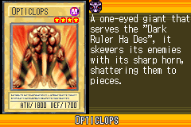](https://yugipedia.com/wiki/Opticlops_(World_Championship_2006))|)|)|
|)|)|)|)|[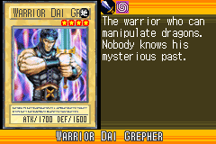](https://yugipedia.com/wiki/Warrior_Dai_Grepher_(World_Championship_2006))|
|)|)|)|)|[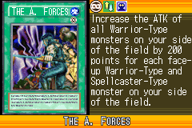](https://yugipedia.com/wiki/The_A._Forces_(World_Championship_2006))|
|)|)|)|)|)|
|)|)|)|)|[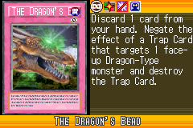](https://yugipedia.com/wiki/The_Dragon%27s_Bead_(World_Championship_2006))|
|)|)|[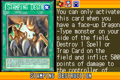](https://yugipedia.com/wiki/Stamping_Destruction_(World_Championship_2006))|)|[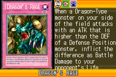](https://yugipedia.com/wiki/Dragon%27s_Rage_(World_Championship_2006))|
|)|)|)|)|[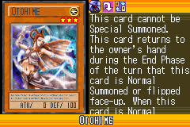](https://yugipedia.com/wiki/Otohime_(World_Championship_2006))|
|)|)|)|)|[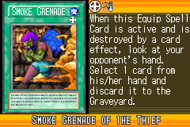](https://yugipedia.com/wiki/Smoke_Grenade_of_the_Thief_(World_Championship_2006))|
|)|[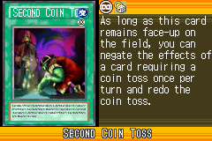](https://yugipedia.com/wiki/Second_Coin_Toss_(World_Championship_2006))|)|[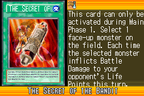](https://yugipedia.com/wiki/The_Secret_of_the_Bandit_(World_Championship_2006))|)|
|)|)|[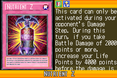](https://yugipedia.com/wiki/Nutrient_Z_(World_Championship_2006))|[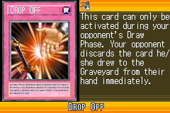](https://yugipedia.com/wiki/Drop_Off_(World_Championship_2006))|)|
