# Magician%27s_Force_(World_Championship_2006)

|Secret| | | | |
|---|---|---|---|---|
|)|||||

|Ultra| | | | |
|---|---|---|---|---|
|)|)|[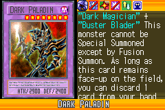](https://yugipedia.com/wiki/Dark_Paladin_(World_Championship_2006))|)|[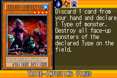](https://yugipedia.com/wiki/Tribe-Infecting_Virus_(World_Championship_2006))|

|Super| | | | |
|---|---|---|---|---|
|[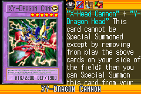](https://yugipedia.com/wiki/XY-Dragon_Cannon_(World_Championship_2006))|[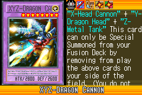](https://yugipedia.com/wiki/XYZ-Dragon_Cannon_(World_Championship_2006))|[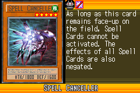](https://yugipedia.com/wiki/Spell_Canceller_(World_Championship_2006))|[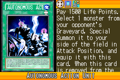](https://yugipedia.com/wiki/Autonomous_Action_Unit_(World_Championship_2006))|[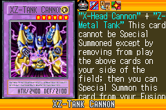](https://yugipedia.com/wiki/XZ-Tank_Cannon_(World_Championship_2006))|
|[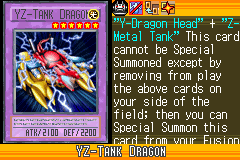](https://yugipedia.com/wiki/YZ-Tank_Dragon_(World_Championship_2006))|[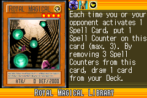](https://yugipedia.com/wiki/Royal_Magical_Library_(World_Championship_2006))||||

|Rare| | | | |
|---|---|---|---|---|
|[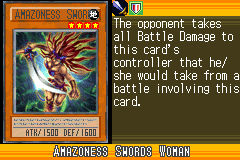](https://yugipedia.com/wiki/Amazoness_Swords_Woman_(World_Championship_2006))|)|)|)|)|
|[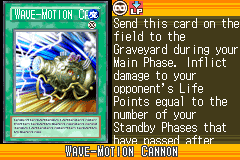](https://yugipedia.com/wiki/Wave-Motion_Cannon_(World_Championship_2006))|[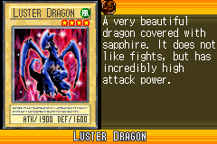](https://yugipedia.com/wiki/Luster_Dragon_(World_Championship_2006))|)|)|[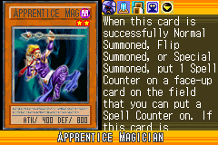](https://yugipedia.com/wiki/Apprentice_Magician_(World_Championship_2006))|
|)|)|[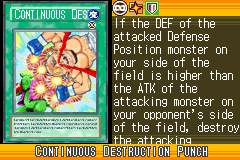](https://yugipedia.com/wiki/Continuous_Destruction_Punch_(World_Championship_2006))|||

|Common| | | | |
|---|---|---|---|---|
|[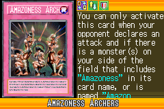](https://yugipedia.com/wiki/Amazoness_Archers_(World_Championship_2006))|[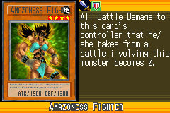](https://yugipedia.com/wiki/Amazoness_Fighter_(World_Championship_2006))|[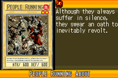](https://yugipedia.com/wiki/People_Running_About_(World_Championship_2006))|[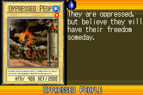](https://yugipedia.com/wiki/Oppressed_People_(World_Championship_2006))|[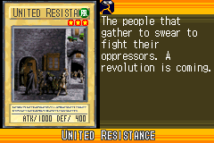](https://yugipedia.com/wiki/United_Resistance_(World_Championship_2006))|
|)|)|)|)|)|
|)|)|)|)|)|
|)|[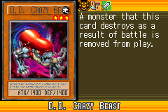](https://yugipedia.com/wiki/D.D._Crazy_Beast_(World_Championship_2006))|)|)|)|
|)|[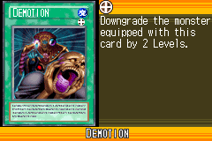](https://yugipedia.com/wiki/Demotion_(World_Championship_2006))|)|)|[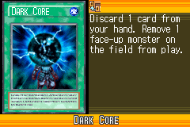](https://yugipedia.com/wiki/Dark_Core_(World_Championship_2006))|
|[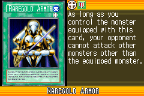](https://yugipedia.com/wiki/Raregold_Armor_(World_Championship_2006))|[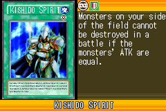](https://yugipedia.com/wiki/Kishido_Spirit_(World_Championship_2006))|)|[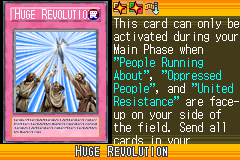](https://yugipedia.com/wiki/Huge_Revolution_(World_Championship_2006))|[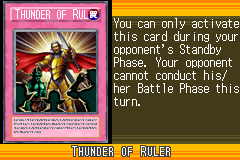](https://yugipedia.com/wiki/Thunder_of_Ruler_(World_Championship_2006))|
|)|)|[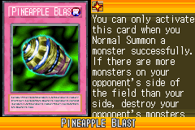](https://yugipedia.com/wiki/Pineapple_Blast_(World_Championship_2006))|[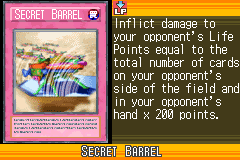](https://yugipedia.com/wiki/Secret_Barrel_(World_Championship_2006))|)|
|[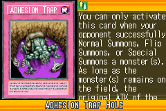](https://yugipedia.com/wiki/Adhesion_Trap_Hole_(World_Championship_2006))|[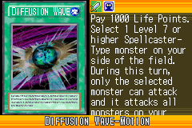](https://yugipedia.com/wiki/Diffusion_Wave-Motion_(World_Championship_2006))|[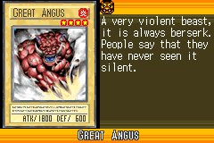](https://yugipedia.com/wiki/Great_Angus_(World_Championship_2006))|)|[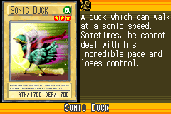](https://yugipedia.com/wiki/Sonic_Duck_(World_Championship_2006))|
|[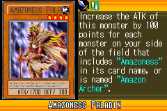](https://yugipedia.com/wiki/Amazoness_Paladin_(World_Championship_2006))|[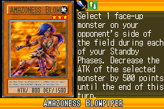](https://yugipedia.com/wiki/Amazoness_Blowpiper_(World_Championship_2006))|[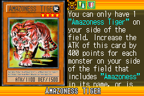](https://yugipedia.com/wiki/Amazoness_Tiger_(World_Championship_2006))|)|[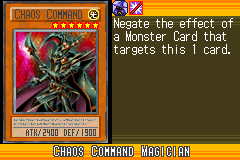](https://yugipedia.com/wiki/Chaos_Command_Magician_(World_Championship_2006))|
|[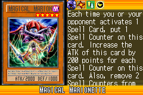](https://yugipedia.com/wiki/Magical_Marionette_(World_Championship_2006))|)|[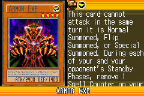](https://yugipedia.com/wiki/Armor_Exe_(World_Championship_2006))|[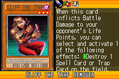](https://yugipedia.com/wiki/Cliff_the_Trap_Remover_(World_Championship_2006))|)|
|)|[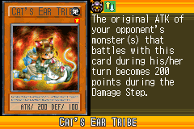](https://yugipedia.com/wiki/Cat%27s_Ear_Tribe_(World_Championship_2006))|[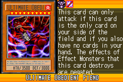](https://yugipedia.com/wiki/Ultimate_Obedient_Fiend_(World_Championship_2006))|[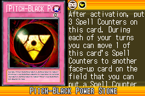](https://yugipedia.com/wiki/Pitch-Black_Power_Stone_(World_Championship_2006))|[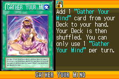](https://yugipedia.com/wiki/Gather_Your_Mind_(World_Championship_2006))|
|)|[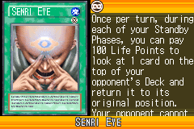](https://yugipedia.com/wiki/Senri_Eye_(World_Championship_2006))|)|)|[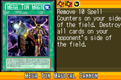](https://yugipedia.com/wiki/Mega_Ton_Magical_Cannon_(World_Championship_2006))|
|[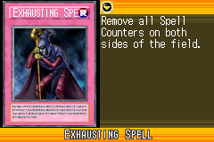](https://yugipedia.com/wiki/Exhausting_Spell_(World_Championship_2006))|[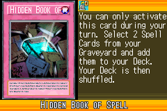](https://yugipedia.com/wiki/Hidden_Book_of_Spell_(World_Championship_2006))|)|[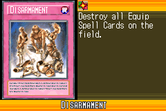](https://yugipedia.com/wiki/Disarmament_(World_Championship_2006))|)|
|)