# Magician%27s_Force_(World_Championship_2006)

|Secret| | | | |
|---|---|---|---|---|
|)|||||

|Ultra| | | | |
|---|---|---|---|---|
|[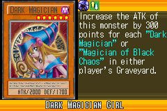](https://yugipedia.com/wiki/Dark_Magician_Girl_(World_Championship_2006))|[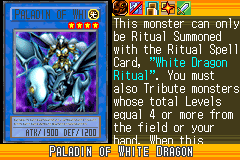](https://yugipedia.com/wiki/Paladin_of_White_Dragon_(World_Championship_2006))|)|)|)|

|Super| | | | |
|---|---|---|---|---|
|)|)|)|)|)|
|)|)||||

|Rare| | | | |
|---|---|---|---|---|
|)|)|)|)|[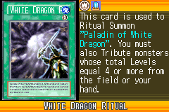](https://yugipedia.com/wiki/White_Dragon_Ritual_(World_Championship_2006))|
|)|)|)|)|)|
|)|)|)|||

|Common| | | | |
|---|---|---|---|---|
|)|)|)|)|)|
|)|[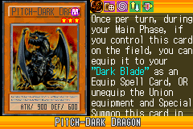](https://yugipedia.com/wiki/Pitch-Dark_Dragon_(World_Championship_2006))|)|)|)|
|[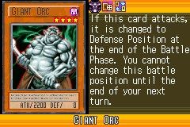](https://yugipedia.com/wiki/Giant_Orc_(World_Championship_2006))|)|)|[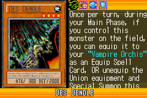](https://yugipedia.com/wiki/Des_Dendle_(World_Championship_2006))|[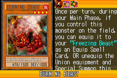](https://yugipedia.com/wiki/Burning_Beast_(World_Championship_2006))|
|[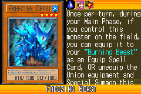](https://yugipedia.com/wiki/Freezing_Beast_(World_Championship_2006))|)|)|)|[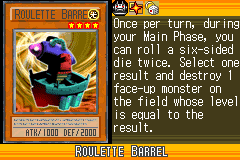](https://yugipedia.com/wiki/Roulette_Barrel_(World_Championship_2006))|
|[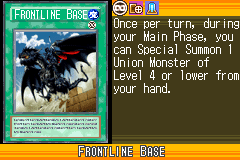](https://yugipedia.com/wiki/Frontline_Base_(World_Championship_2006))|)|[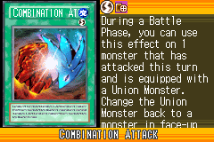](https://yugipedia.com/wiki/Combination_Attack_(World_Championship_2006))|[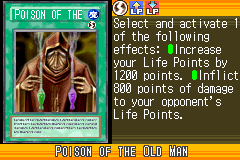](https://yugipedia.com/wiki/Poison_of_the_Old_Man_(World_Championship_2006))|)|
|)|)|)|)|)|
|[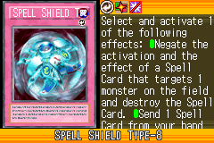](https://yugipedia.com/wiki/Spell_Shield_Type-8_(World_Championship_2006))|)|)|)|[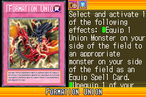](https://yugipedia.com/wiki/Formation_Union_(World_Championship_2006))|
|)|)|)|[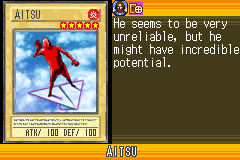](https://yugipedia.com/wiki/Aitsu_(World_Championship_2006))|)|
|)|)|)|[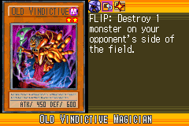](https://yugipedia.com/wiki/Old_Vindictive_Magician_(World_Championship_2006))|)|
|)|[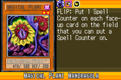](https://yugipedia.com/wiki/Magical_Plant_Mandragola_(World_Championship_2006))|)|)|[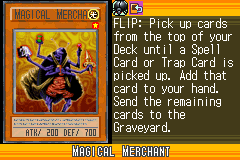](https://yugipedia.com/wiki/Magical_Merchant_(World_Championship_2006))|
|)|)|)|)|)|
|[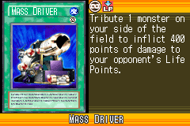](https://yugipedia.com/wiki/Mass_Driver_(World_Championship_2006))|)|[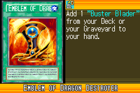](https://yugipedia.com/wiki/Emblem_of_Dragon_Destroyer_(World_Championship_2006))|)|)|
|)|)|)|)|)|
|[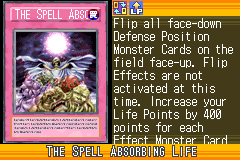](https://yugipedia.com/wiki/The_Spell_Absorbing_Life_(World_Championship_2006))