# Dark_Crisis_(World_Championship_2006)

|Secret| | | | |
|---|---|---|---|---|
|)|||||

|Ultra| | | | |
|---|---|---|---|---|
|)|)|[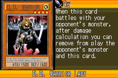](https://yugipedia.com/wiki/D.D._Warrior_Lady_(World_Championship_2006))|)||

|Super| | | | |
|---|---|---|---|---|
|[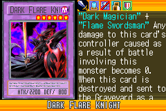](https://yugipedia.com/wiki/Dark_Flare_Knight_(World_Championship_2006))|)|[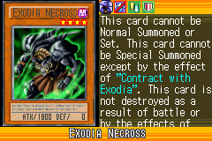](https://yugipedia.com/wiki/Exodia_Necross_(World_Championship_2006))|[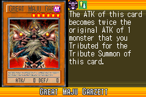](https://yugipedia.com/wiki/Great_Maju_Garzett_(World_Championship_2006))|)|
|)|)||||

|Rare| | | | |
|---|---|---|---|---|
|[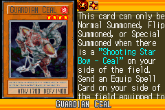](https://yugipedia.com/wiki/Guardian_Ceal_(World_Championship_2006))|)|)|)|[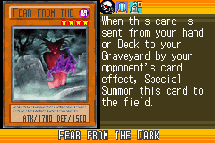](https://yugipedia.com/wiki/Fear_from_the_Dark_(World_Championship_2006))|
|)|)|)|[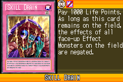](https://yugipedia.com/wiki/Skill_Drain_(World_Championship_2006))|)|
|)|)|[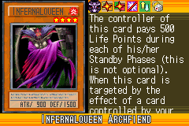](https://yugipedia.com/wiki/Infernalqueen_Archfiend_(World_Championship_2006))|)|[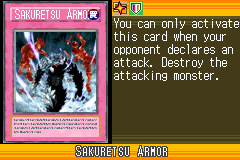](https://yugipedia.com/wiki/Sakuretsu_Armor_(World_Championship_2006))|

|Common| | | | |
|---|---|---|---|---|
|)|)|)|)|)|
|)|)|[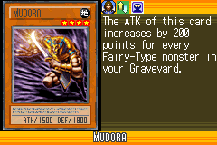](https://yugipedia.com/wiki/Mudora_(World_Championship_2006))|)|)|
|[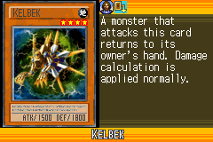](https://yugipedia.com/wiki/Kelbek_(World_Championship_2006))|[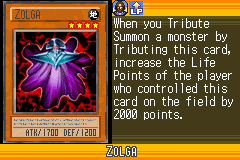](https://yugipedia.com/wiki/Zolga_(World_Championship_2006))|)|)|)|
|)|)|)|[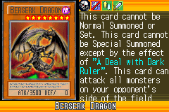](https://yugipedia.com/wiki/Berserk_Dragon_(World_Championship_2006))|[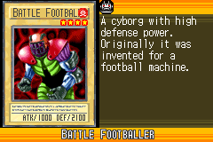](https://yugipedia.com/wiki/Battle_Footballer_(World_Championship_2006))|
|)|)|)|)|)|
|)|)|[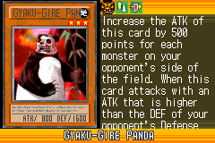](https://yugipedia.com/wiki/Gyaku-Gire_Panda_(World_Championship_2006))|)|[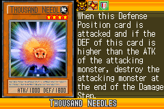](https://yugipedia.com/wiki/Thousand_Needles_(World_Championship_2006))|
|)|)|)|)|)|
|)|[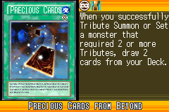](https://yugipedia.com/wiki/Precious_Cards_from_Beyond_(World_Championship_2006))|[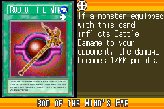](https://yugipedia.com/wiki/Rod_of_the_Mind%27s_Eye_(World_Championship_2006))|)|)|
|[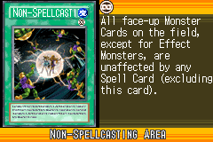](https://yugipedia.com/wiki/Non-Spellcasting_Area_(World_Championship_2006))|)|)|)|)|
|)|[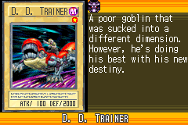](https://yugipedia.com/wiki/D._D._Trainer_(World_Championship_2006))|)|[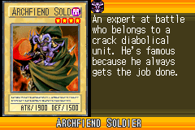](https://yugipedia.com/wiki/Archfiend_Soldier_(World_Championship_2006))|)|
|)|)|[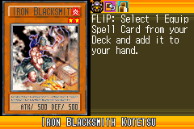](https://yugipedia.com/wiki/Iron_Blacksmith_Kotetsu_(World_Championship_2006))|)|[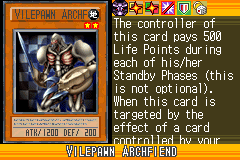](https://yugipedia.com/wiki/Vilepawn_Archfiend_(World_Championship_2006))|
|)|[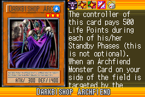](https://yugipedia.com/wiki/Darkbishop_Archfiend_(World_Championship_2006))|)|)|)|
|)|)|)|[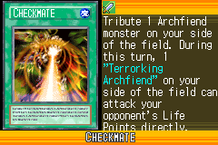](https://yugipedia.com/wiki/Checkmate_(World_Championship_2006))|)|
|)|)|)|)|)|
|[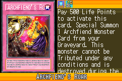](https://yugipedia.com/wiki/Archfiend%27s_Roar_(World_Championship_2006))|)|)|)