# Invasion_of_Chaos_(World_Championship_2006)

|Secret| | | | |
|---|---|---|---|---|
|)|)||||

|Ultra| | | | |
|---|---|---|---|---|
|)|[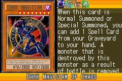](https://yugipedia.com/wiki/Dark_Magician_of_Chaos_(World_Championship_2006))|[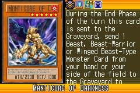](https://yugipedia.com/wiki/Manticore_of_Darkness_(World_Championship_2006))|)||

|Super| | | | |
|---|---|---|---|---|
|)|)|)|)|)|
|[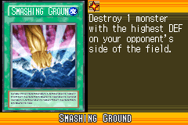](https://yugipedia.com/wiki/Smashing_Ground_(World_Championship_2006))|[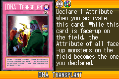](https://yugipedia.com/wiki/DNA_Transplant_(World_Championship_2006))||||

|Rare| | | | |
|---|---|---|---|---|
|[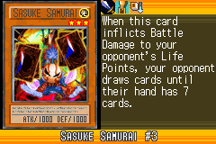](https://yugipedia.com/wiki/Sasuke_Samurai_3_(World_Championship_2006))|)|[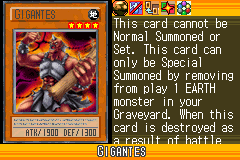](https://yugipedia.com/wiki/Gigantes_(World_Championship_2006))|)|)|
|)|)|)|[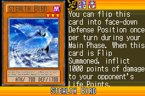](https://yugipedia.com/wiki/Stealth_Bird_(World_Championship_2006))|)|
|)|[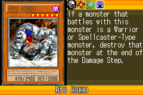](https://yugipedia.com/wiki/Ryu_Kokki_(World_Championship_2006))|)|)|[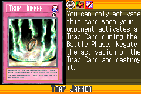](https://yugipedia.com/wiki/Trap_Jammer_(World_Championship_2006))|

|Common| | | | |
|---|---|---|---|---|
|[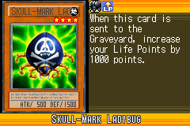](https://yugipedia.com/wiki/Skull-Mark_Ladybug_(World_Championship_2006))|)|)|)|)|
|)|)|)|)|)|
|)|)|)|)|)|
|[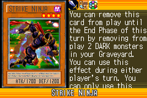](https://yugipedia.com/wiki/Strike_Ninja_(World_Championship_2006))|[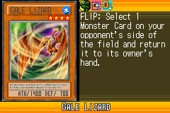](https://yugipedia.com/wiki/Gale_Lizard_(World_Championship_2006))|)|)|)|
|)|[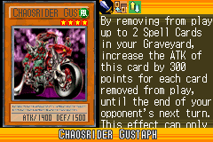](https://yugipedia.com/wiki/Chaosrider_Gustaph_(World_Championship_2006))|[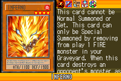](https://yugipedia.com/wiki/Inferno_(World_Championship_2006))|)|[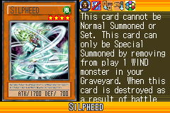](https://yugipedia.com/wiki/Silpheed_(World_Championship_2006))|
|)|[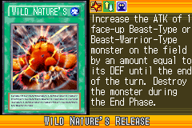](https://yugipedia.com/wiki/Wild_Nature%27s_Release_(World_Championship_2006))|)|[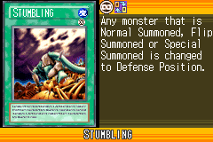](https://yugipedia.com/wiki/Stumbling_(World_Championship_2006))|)|
|[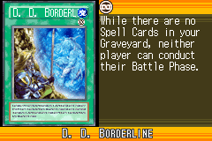](https://yugipedia.com/wiki/D._D._Borderline_(World_Championship_2006))|[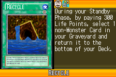](https://yugipedia.com/wiki/Recycle_(World_Championship_2006))|)|)|[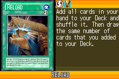](https://yugipedia.com/wiki/Reload_(World_Championship_2006))|
|[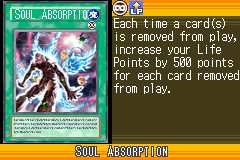](https://yugipedia.com/wiki/Soul_Absorption_(World_Championship_2006))|)|)|[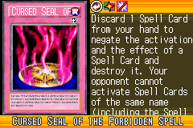](https://yugipedia.com/wiki/Cursed_Seal_of_the_Forbidden_Spell_(World_Championship_2006))|)|
|)|)|)|)|)|
|)|)|[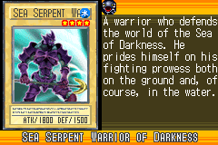](https://yugipedia.com/wiki/Sea_Serpent_Warrior_of_Darkness_(World_Championship_2006))|)|)|
|)|)|)|)|)|
|[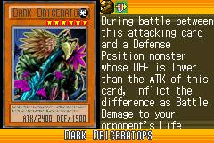](https://yugipedia.com/wiki/Dark_Driceratops_(World_Championship_2006))|)|[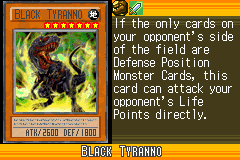](https://yugipedia.com/wiki/Black_Tyranno_(World_Championship_2006))|)|)|
|)|[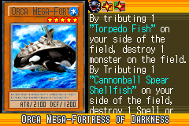](https://yugipedia.com/wiki/Orca_Mega-Fortress_of_Darkness_(World_Championship_2006))|)|[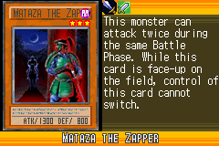](https://yugipedia.com/wiki/Mataza_the_Zapper_(World_Championship_2006))|[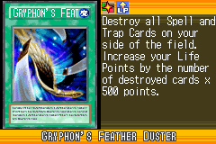](https://yugipedia.com/wiki/Gryphon%27s_Feather_Duster_(World_Championship_2006))|
|[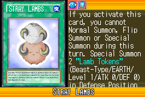](https://yugipedia.com/wiki/Stray_Lambs_(World_Championship_2006))|)|)|)|)|
|)|)|)|)|)|
|)|)|[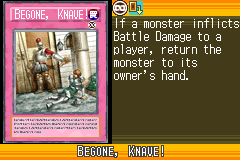](https://yugipedia.com/wiki/Begone,_Knave!_(World_Championship_2006))|)