# Ancient_Sanctuary_(World_Championship_2006)

|Ultra| | | | |
|---|---|---|---|---|
|)|)|)|)||

|Super| | | | |
|---|---|---|---|---|
|)|[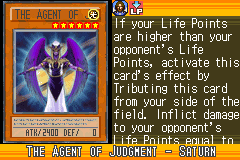](https://yugipedia.com/wiki/The_Agent_of_Judgment_-_Saturn_(World_Championship_2006))|)|)|)|
|)|[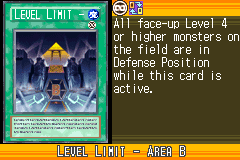](https://yugipedia.com/wiki/Level_Limit_-_Area_B_(World_Championship_2006))||||

|Rare| | | | |
|---|---|---|---|---|
|)|)|[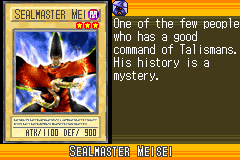](https://yugipedia.com/wiki/Sealmaster_Meisei_(World_Championship_2006))|)|)|
|)|)|)|)|[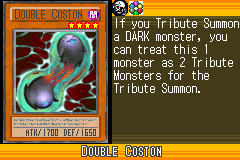](https://yugipedia.com/wiki/Double_Coston_(World_Championship_2006))|
|)|)|)|)|)|

|Common| | | | |
|---|---|---|---|---|
|)|)|)|)|[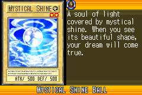](https://yugipedia.com/wiki/Mystical_Shine_Ball_(World_Championship_2006))|
|[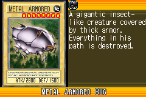](https://yugipedia.com/wiki/Metal_Armored_Bug_(World_Championship_2006))|[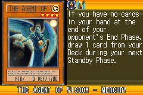](https://yugipedia.com/wiki/The_Agent_of_Wisdom_-_Mercury_(World_Championship_2006))|)|[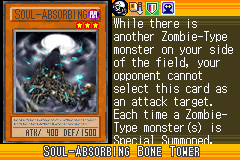](https://yugipedia.com/wiki/Soul-Absorbing_Bone_Tower_(World_Championship_2006))|)|
|[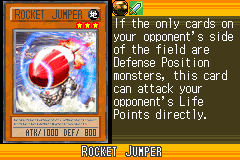](https://yugipedia.com/wiki/Rocket_Jumper_(World_Championship_2006))|)|)|)|)|
|)|)|)|)|)|
|[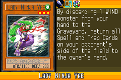](https://yugipedia.com/wiki/Lady_Ninja_Yae_(World_Championship_2006))|)|)|)|)|
|)|)|)|)|)|
|)|)|)|)|[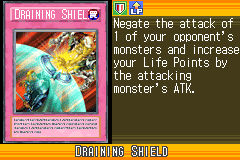](https://yugipedia.com/wiki/Draining_Shield_(World_Championship_2006))|
|)|)|)|)|)|
|)|)|)|[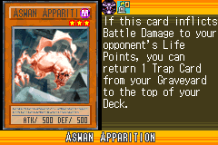](https://yugipedia.com/wiki/Aswan_Apparition_(World_Championship_2006))|[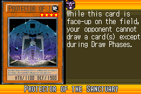](https://yugipedia.com/wiki/Protector_of_the_Sanctuary_(World_Championship_2006))|
|[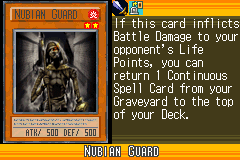](https://yugipedia.com/wiki/Nubian_Guard_(World_Championship_2006))|[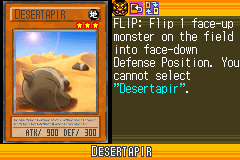](https://yugipedia.com/wiki/Desertapir_(World_Championship_2006))|[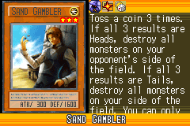](https://yugipedia.com/wiki/Sand_Gambler_(World_Championship_2006))|)|)|
|[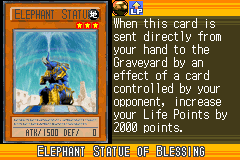](https://yugipedia.com/wiki/Elephant_Statue_of_Blessing_(World_Championship_2006))|)|)|[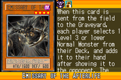](https://yugipedia.com/wiki/Emissary_of_the_Afterlife_(World_Championship_2006))|)|
|)|)|)|)|)|
|[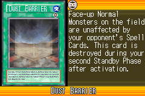](https://yugipedia.com/wiki/Dust_Barrier_(World_Championship_2006))|)|)|)|)|
|)|)|[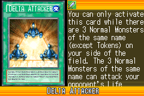](https://yugipedia.com/wiki/Delta_Attacker_(World_Championship_2006))|)|)|
|)|)|)|)|)|
|[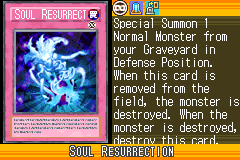](https://yugipedia.com/wiki/Soul_Resurrection_(World_Championship_2006))|)