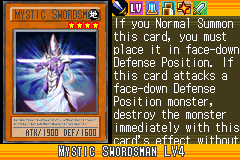
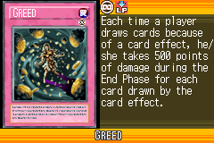
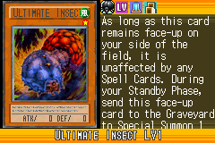
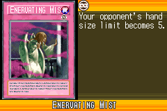
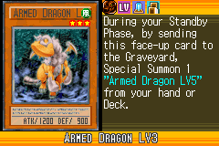
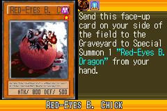
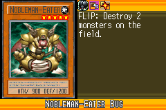
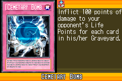

# Soul_of_the_Duelist_(World_Championship_2006)

|Ultra| | | | |
|---|---|---|---|---|
|)|)|)|)|)|

|Super| | | | |
|---|---|---|---|---|
|)|)|)|)|)|
|)|||||

|Rare| | | | |
|---|---|---|---|---|
|)|)|)|)|)|
|)|)|)|)|)|
|)|)|)|||

|Common| | | | |
|---|---|---|---|---|
|)|)|)|)|)|
|)|)|)|)|)|
|)|)|)|)|)|
|)|)|)|)|)|
|)|)|)|)|)|
|)|)|)|)|)|
|)|)|)