# Rise_of_Destiny_(World_Championship_2006)

|Ultra| | | | |
|---|---|---|---|---|
|)|)|)|)||

|Super| | | | |
|---|---|---|---|---|
|)|)|)|)|)|
|[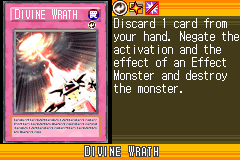](https://yugipedia.com/wiki/Divine_Wrath_(World_Championship_2006))|)||||

|Rare| | | | |
|---|---|---|---|---|
|)|)|)|[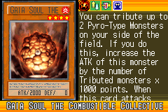](https://yugipedia.com/wiki/Gaia_Soul_the_Combustible_Collective_(World_Championship_2006))|)|
|[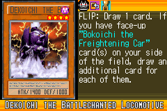](https://yugipedia.com/wiki/Dekoichi_the_Battlechanted_Locomotive_(World_Championship_2006))|)|)|)|)|
|)|[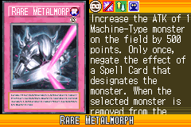](https://yugipedia.com/wiki/Rare_Metalmorph_(World_Championship_2006))|[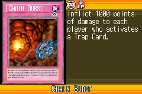](https://yugipedia.com/wiki/Chain_Burst_(World_Championship_2006))|)||

|Common| | | | |
|---|---|---|---|---|
|)|)|)|)|)|
|[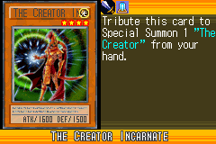](https://yugipedia.com/wiki/The_Creator_Incarnate_(World_Championship_2006))|)|[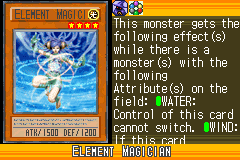](https://yugipedia.com/wiki/Element_Magician_(World_Championship_2006))|)|)|
|)|)|)|)|)|
|)|)|)|)|)|
|)|)|)|[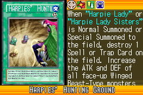](https://yugipedia.com/wiki/Harpies%27_Hunting_Ground_(World_Championship_2006))|[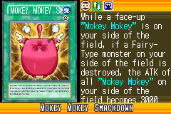](https://yugipedia.com/wiki/Mokey_Mokey_Smackdown_(World_Championship_2006))|
|)|)|)|[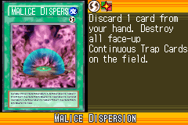](https://yugipedia.com/wiki/Malice_Dispersion_(World_Championship_2006))|[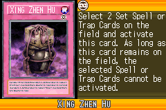](https://yugipedia.com/wiki/Xing_Zhen_Hu_(World_Championship_2006))|
|)|)|[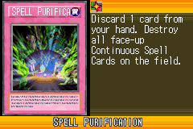](https://yugipedia.com/wiki/Spell_Purification_(World_Championship_2006))|)