# Flaming_Eternity_(World_Championship_2006)

|Ultra| | | | |
|---|---|---|---|---|
|)|)|)|)||

|Super| | | | |
|---|---|---|---|---|
|)|)|)|)|)|
|)|[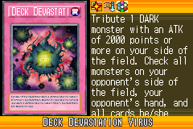](https://yugipedia.com/wiki/Deck_Devastation_Virus_(World_Championship_2006))||||

|Rare| | | | |
|---|---|---|---|---|
|)|[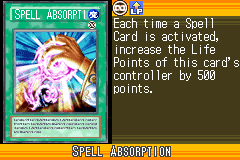](https://yugipedia.com/wiki/Spell_Absorption_(World_Championship_2006))|)|[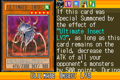](https://yugipedia.com/wiki/Ultimate_Insect_LV5_(World_Championship_2006))|)|
|[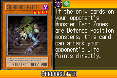](https://yugipedia.com/wiki/Shadowslayer_(World_Championship_2006))|)|[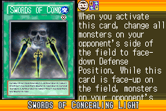](https://yugipedia.com/wiki/Swords_of_Concealing_Light_(World_Championship_2006))|[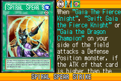](https://yugipedia.com/wiki/Spiral_Spear_Strike_(World_Championship_2006))|)|
|)|)|)|||

|Common| | | | |
|---|---|---|---|---|
|)|)|)|)|)|
|[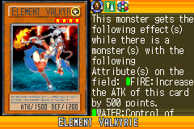](https://yugipedia.com/wiki/Element_Valkyrie_(World_Championship_2006))|)|)|)|)|
|[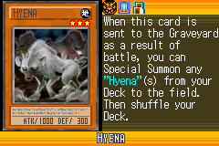](https://yugipedia.com/wiki/Hyena_(World_Championship_2006))|)|[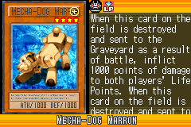](https://yugipedia.com/wiki/Mecha-Dog_Marron_(World_Championship_2006))|)|)|
|[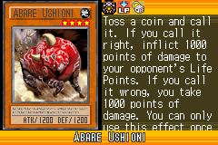](https://yugipedia.com/wiki/Abare_Ushioni_(World_Championship_2006))|[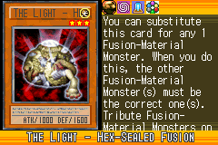](https://yugipedia.com/wiki/The_Light_-_Hex-Sealed_Fusion_(World_Championship_2006))|)|)|)|
|)|)|[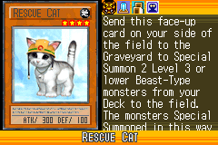](https://yugipedia.com/wiki/Rescue_Cat_(World_Championship_2006))|)|)|
|[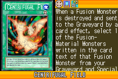](https://yugipedia.com/wiki/Centrifugal_Field_(World_Championship_2006))|)|)|)|)|
|)|)|)|)