# The_Lost_Millennium_(World_Championship_2006)

|Ultra| | | | |
|---|---|---|---|---|
|)|)|)|)||

|Super| | | | |
|---|---|---|---|---|
|)|)|[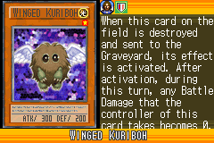](https://yugipedia.com/wiki/Winged_Kuriboh_(World_Championship_2006))|[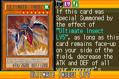](https://yugipedia.com/wiki/Ultimate_Insect_LV7_(World_Championship_2006))|)|
|)|)||||

|Rare| | | | |
|---|---|---|---|---|
|)|)|)|[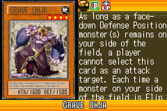](https://yugipedia.com/wiki/Grave_Ohja_(World_Championship_2006))|[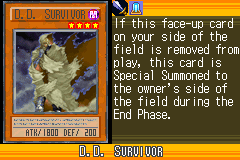](https://yugipedia.com/wiki/D.D._Survivor_(World_Championship_2006))|
|[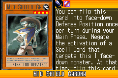](https://yugipedia.com/wiki/Mid_Shield_Gardna_(World_Championship_2006))|[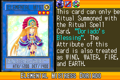](https://yugipedia.com/wiki/Elemental_Mistress_Doriado_(World_Championship_2006))|)|)|)|
|[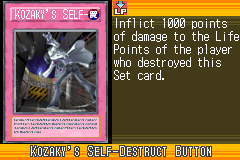](https://yugipedia.com/wiki/Kozaky%27s_Self-Destruct_Button_(World_Championship_2006))|[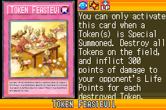](https://yugipedia.com/wiki/Token_Feastevil_(World_Championship_2006))|)|)||

|Common| | | | |
|---|---|---|---|---|
|[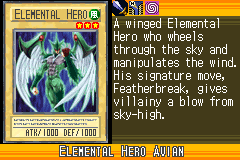](https://yugipedia.com/wiki/Elemental_Hero_Avian_(World_Championship_2006))|)|[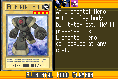](https://yugipedia.com/wiki/Elemental_Hero_Clayman_(World_Championship_2006))|)|)|
|)|)|)|[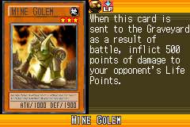](https://yugipedia.com/wiki/Mine_Golem_(World_Championship_2006))|)|
|)|[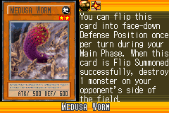](https://yugipedia.com/wiki/Medusa_Worm_(World_Championship_2006))|)|[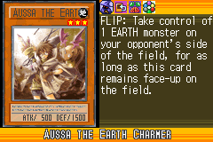](https://yugipedia.com/wiki/Aussa_the_Earth_Charmer_(World_Championship_2006))|)|
|)|[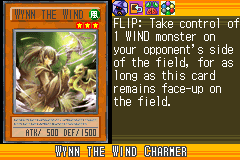](https://yugipedia.com/wiki/Wynn_the_Wind_Charmer_(World_Championship_2006))|)|)|)|
|)|)|)|)|)|
|)|[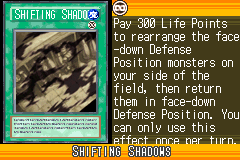](https://yugipedia.com/wiki/Shifting_Shadows_(World_Championship_2006))|)|)|)|
|)|)|)