# Elemental_Energy_(World_Championship_2006)

|Ultra| | | | |
|---|---|---|---|---|
|[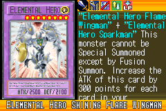](https://yugipedia.com/wiki/Elemental_Hero_Shining_Flare_Wingman_(World_Championship_2006))|[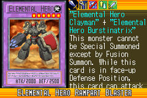](https://yugipedia.com/wiki/Elemental_Hero_Rampart_Blaster_(World_Championship_2006))|)|)||

|Super| | | | |
|---|---|---|---|---|
|)|)|[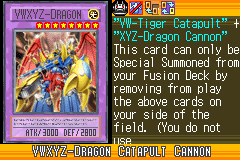](https://yugipedia.com/wiki/VWXYZ-Dragon_Catapult_Cannon_(World_Championship_2006))|)|)|
|[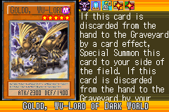](https://yugipedia.com/wiki/Goldd,_Wu-Lord_of_Dark_World_(World_Championship_2006))|)||||

|Rare| | | | |
|---|---|---|---|---|
|)|)|[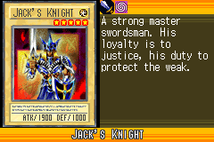](https://yugipedia.com/wiki/Jack%27s_Knight_(World_Championship_2006))|)|[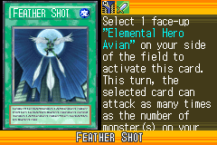](https://yugipedia.com/wiki/Feather_Shot_(World_Championship_2006))|
|[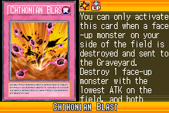](https://yugipedia.com/wiki/Chthonian_Blast_(World_Championship_2006))|)|[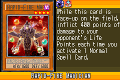](https://yugipedia.com/wiki/Rapid-Fire_Magician_(World_Championship_2006))|)|[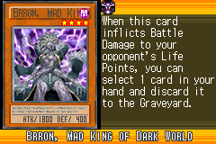](https://yugipedia.com/wiki/Brron,_Mad_King_of_Dark_World_(World_Championship_2006))|
|)|[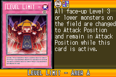](https://yugipedia.com/wiki/Level_Limit_-_Area_A_(World_Championship_2006))|[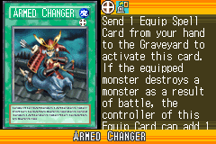](https://yugipedia.com/wiki/Armed_Changer_(World_Championship_2006))|||

|Common| | | | |
|---|---|---|---|---|
|)|)|)|)|[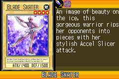](https://yugipedia.com/wiki/Blade_Skater_(World_Championship_2006))|
|[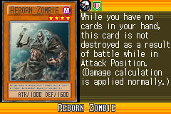](https://yugipedia.com/wiki/Reborn_Zombie_(World_Championship_2006))|)|)|)|[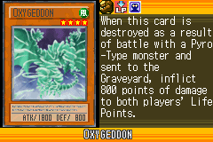](https://yugipedia.com/wiki/Oxygeddon_(World_Championship_2006))|
|)|)|)|)|[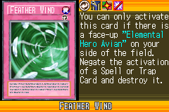](https://yugipedia.com/wiki/Feather_Wind_(World_Championship_2006))|
|)|)|[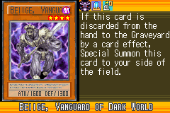](https://yugipedia.com/wiki/Beiige,_Vanguard_of_Dark_World_(World_Championship_2006))|)|)|
|)|)|)|)|)|
|)|)|[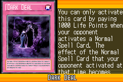](https://yugipedia.com/wiki/Dark_Deal_(World_Championship_2006))|)|)|
|)|[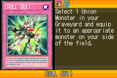](https://yugipedia.com/wiki/Roll_Out!_(World_Championship_2006))|[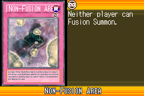](https://yugipedia.com/wiki/Non-Fusion_Area_(World_Championship_2006))