# Shadow_of_Infinity_(World_Championship_2006)

|Ultra| | | | |
|---|---|---|---|---|
|)|)|)|[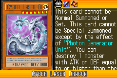](https://yugipedia.com/wiki/Cyber_Laser_Dragon_(World_Championship_2006))||

|Super| | | | |
|---|---|---|---|---|
|[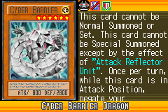](https://yugipedia.com/wiki/Cyber_Barrier_Dragon_(World_Championship_2006))|)|[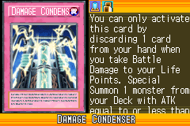](https://yugipedia.com/wiki/Damage_Condenser_(World_Championship_2006))|[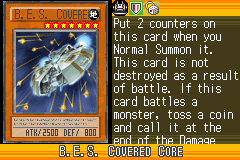](https://yugipedia.com/wiki/B.E.S._Covered_Core_(World_Championship_2006))|[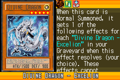](https://yugipedia.com/wiki/Divine_Dragon_-_Excelion_(World_Championship_2006))|
|[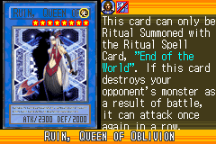](https://yugipedia.com/wiki/Ruin,_Queen_of_Oblivion_(World_Championship_2006))|)||||

|Rare| | | | |
|---|---|---|---|---|
|[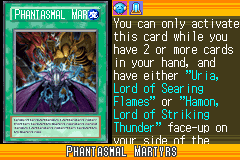](https://yugipedia.com/wiki/Phantasmal_Martyrs_(World_Championship_2006))|[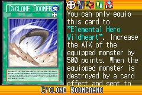](https://yugipedia.com/wiki/Cyclone_Boomerang_(World_Championship_2006))|[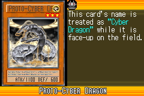](https://yugipedia.com/wiki/Proto-Cyber_Dragon_(World_Championship_2006))|[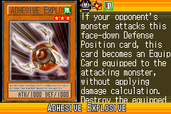](https://yugipedia.com/wiki/Adhesive_Explosive_(World_Championship_2006))|[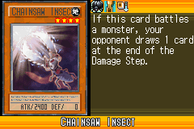](https://yugipedia.com/wiki/Chainsaw_Insect_(World_Championship_2006))|
|[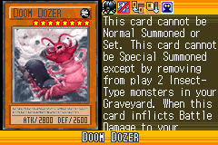](https://yugipedia.com/wiki/Doom_Dozer_(World_Championship_2006))|[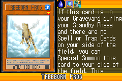](https://yugipedia.com/wiki/Treeborn_Frog_(World_Championship_2006))|)|)|)|
|[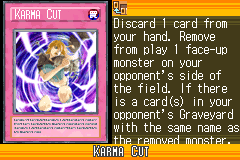](https://yugipedia.com/wiki/Karma_Cut_(World_Championship_2006))|)|)|)||

|Common| | | | |
|---|---|---|---|---|
|)|[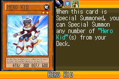](https://yugipedia.com/wiki/Hero_Kid_(World_Championship_2006))|[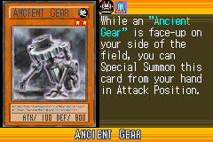](https://yugipedia.com/wiki/Ancient_Gear_(World_Championship_2006))|[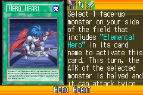](https://yugipedia.com/wiki/Hero_Heart_(World_Championship_2006))|[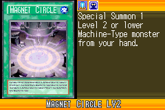](https://yugipedia.com/wiki/Magnet_Circle_LV2_(World_Championship_2006))|
|[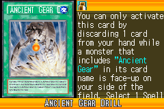](https://yugipedia.com/wiki/Ancient_Gear_Drill_(World_Championship_2006))|)|[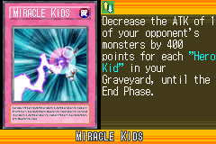](https://yugipedia.com/wiki/Miracle_Kids_(World_Championship_2006))|[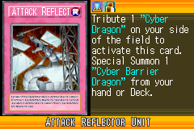](https://yugipedia.com/wiki/Attack_Reflector_Unit_(World_Championship_2006))|[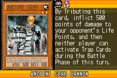](https://yugipedia.com/wiki/Ancient_Gear_Cannon_(World_Championship_2006))|
|[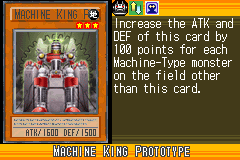](https://yugipedia.com/wiki/Machine_King_Prototype_(World_Championship_2006))|[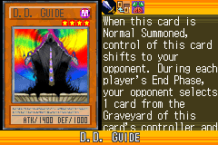](https://yugipedia.com/wiki/D.D._Guide_(World_Championship_2006))|[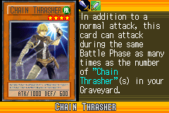](https://yugipedia.com/wiki/Chain_Thrasher_(World_Championship_2006))|[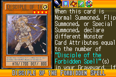](https://yugipedia.com/wiki/Disciple_of_the_Forbidden_Spell_(World_Championship_2006))|[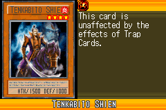](https://yugipedia.com/wiki/Tenkabito_Shien_(World_Championship_2006))|
|[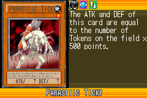](https://yugipedia.com/wiki/Parasitic_Ticky_(World_Championship_2006))|[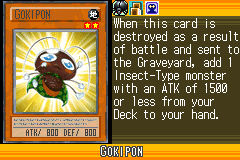](https://yugipedia.com/wiki/Gokipon_(World_Championship_2006))|)|[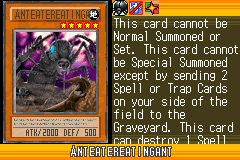](https://yugipedia.com/wiki/Anteatereatingant_(World_Championship_2006))|)|
|[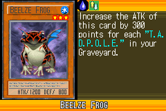](https://yugipedia.com/wiki/Beelze_Frog_(World_Championship_2006))|)|[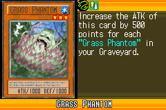](https://yugipedia.com/wiki/Grass_Phantom_(World_Championship_2006))|[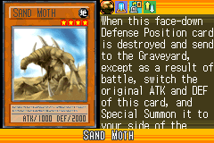](https://yugipedia.com/wiki/Sand_Moth_(World_Championship_2006))|[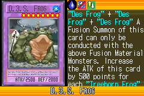](https://yugipedia.com/wiki/D.3.S._Frog_(World_Championship_2006))|
|[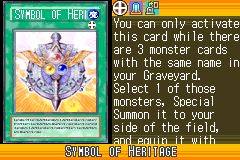](https://yugipedia.com/wiki/Symbol_of_Heritage_(World_Championship_2006))|[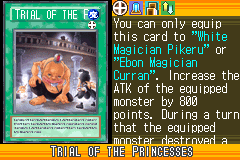](https://yugipedia.com/wiki/Trial_of_the_Princesses_(World_Championship_2006))|[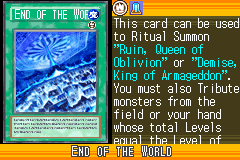](https://yugipedia.com/wiki/End_of_the_World_(World_Championship_2006))|)|[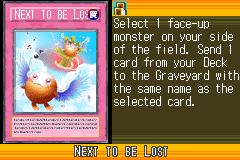](https://yugipedia.com/wiki/Next_to_be_Lost_(World_Championship_2006))|
|[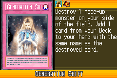](https://yugipedia.com/wiki/Generation_Shift_(World_Championship_2006))|[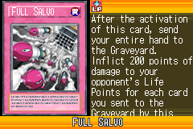](https://yugipedia.com/wiki/Full_Salvo_(World_Championship_2006))|[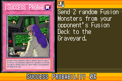](https://yugipedia.com/wiki/Success_Probability_0%25_(World_Championship_2006))