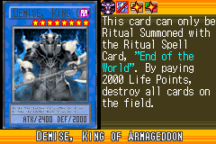
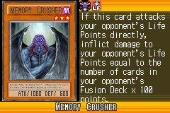
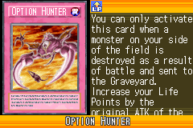
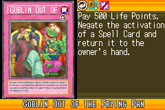
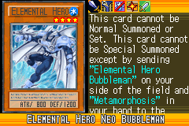
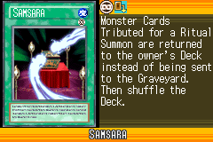

# Shadow_of_Infinity_(World_Championship_2006)

|Ultra| | | | |
|---|---|---|---|---|
|)|)|)|)||

|Super| | | | |
|---|---|---|---|---|
|)|)|)|)|)|
|)|)||||

|Rare| | | | |
|---|---|---|---|---|
|)|)|)|)|)|
|)|)|)|)|)|
|)|)|)|)||

|Common| | | | |
|---|---|---|---|---|
|)|)|)|)|)|
|)|)|)|)|)|
|)|)|)|)|)|
|)|)|)|)|)|
|)|)|)|)|)|
|)|)|)|)|)|
|)|)|)