# Game_Gift_Collection

|Secret| | | | |
|---|---|---|---|---|
|)|)||||

|Ultra| | | | |
|---|---|---|---|---|
|[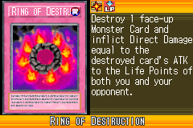](https://yugipedia.com/wiki/Ring_of_Destruction_(World_Championship_2006))|)|)|[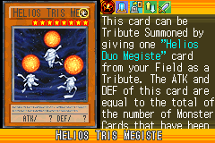](https://yugipedia.com/wiki/Helios_Tris_Megiste_(World_Championship_2006))||

|Super| | | | |
|---|---|---|---|---|
|)|[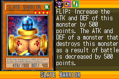](https://yugipedia.com/wiki/Slate_Warrior_(World_Championship_2006))|)|)|)|
|)|)||||

|Rare| | | | |
|---|---|---|---|---|
|)|)|)|)|[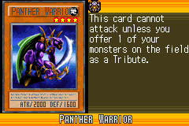](https://yugipedia.com/wiki/Panther_Warrior_(World_Championship_2006))|
|)|)|)|)|)|
|[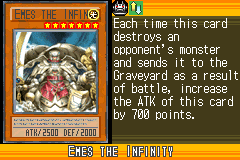](https://yugipedia.com/wiki/Emes_the_Infinity_(World_Championship_2006))|)|[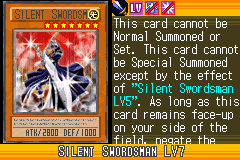](https://yugipedia.com/wiki/Silent_Swordsman_LV7_(World_Championship_2006))|)|[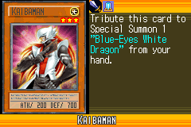](https://yugipedia.com/wiki/Kaibaman_(World_Championship_2006))|
|[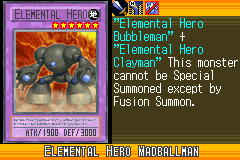](https://yugipedia.com/wiki/Elemental_Hero_Madballman_(World_Championship_2006))|||||

|Common| | | | |
|---|---|---|---|---|
|)|)|)|)|[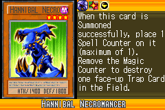](https://yugipedia.com/wiki/Hannibal_Necromancer_(World_Championship_2006))|
|)|)|)|)|[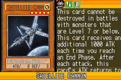](https://yugipedia.com/wiki/Satellite_Cannon_(World_Championship_2006))|
|)|[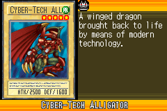](https://yugipedia.com/wiki/Cyber-Tech_Alligator_(World_Championship_2006))|)|)|)|
|)|)|)|)|)|
|)|)|)|[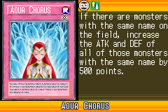](https://yugipedia.com/wiki/Aqua_Chorus_(World_Championship_2006))|)|
|[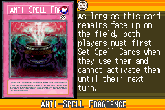](https://yugipedia.com/wiki/Anti-Spell_Fragrance_(World_Championship_2006))|)|)|)|[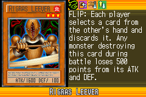](https://yugipedia.com/wiki/Rigras_Leever_(World_Championship_2006))|
|[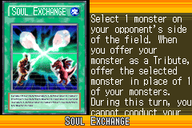](https://yugipedia.com/wiki/Soul_Exchange_(World_Championship_2006))|)|)|)|[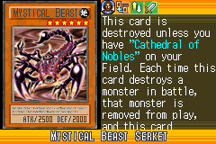](https://yugipedia.com/wiki/Mystical_Beast_Serket_(World_Championship_2006))|
|)|)|)|[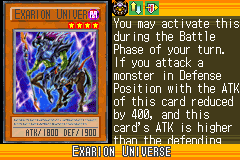](https://yugipedia.com/wiki/Exarion_Universe_(World_Championship_2006))|)|
|)|)|[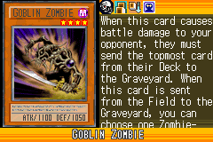](https://yugipedia.com/wiki/Goblin_Zombie_(World_Championship_2006))|)|[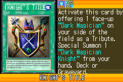](https://yugipedia.com/wiki/Knight%27s_Title_(World_Championship_2006))|
|)|)|)|)|)|
|)|[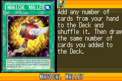](https://yugipedia.com/wiki/Magical_Mallet_(World_Championship_2006))|)