# Special_Gift_Collection

|Secret| | | | |
|---|---|---|---|---|
|)|||||

|Ultra| | | | |
|---|---|---|---|---|
|)|[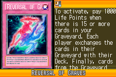](https://yugipedia.com/wiki/Reversal_of_Graves_(World_Championship_2006))|[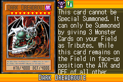](https://yugipedia.com/wiki/Dark_Dreadroute_(World_Championship_2006))|)||

|Super| | | | |
|---|---|---|---|---|
|)|[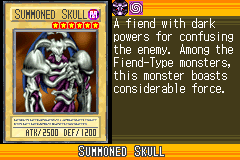](https://yugipedia.com/wiki/Summoned_Skull_(World_Championship_2006))|[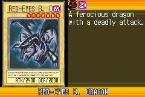](https://yugipedia.com/wiki/Red-Eyes_B._Dragon_(World_Championship_2006))|)|)|
|)|||||

|Rare| | | | |
|---|---|---|---|---|
|)|[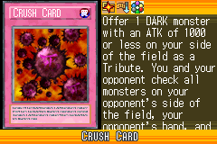](https://yugipedia.com/wiki/Crush_Card_(World_Championship_2006))|[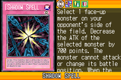](https://yugipedia.com/wiki/Shadow_Spell_(World_Championship_2006))|)|[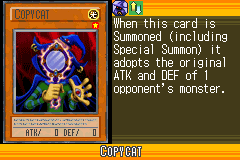](https://yugipedia.com/wiki/Copycat_(World_Championship_2006))|
|)|)|)|)|)|
|)|)|)|)||

|Common| | | | |
|---|---|---|---|---|
|)|)|[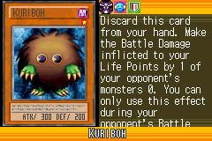](https://yugipedia.com/wiki/Kuriboh_(World_Championship_2006))|)|)|
|)|)|[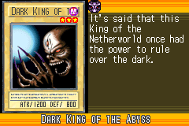](https://yugipedia.com/wiki/Dark_King_of_the_Abyss_(World_Championship_2006))|)|)|
|)|)|)|[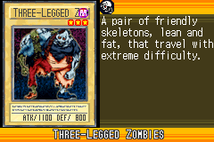](https://yugipedia.com/wiki/Three-Legged_Zombies_(World_Championship_2006))|)|
|[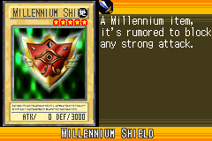](https://yugipedia.com/wiki/Millennium_Shield_(World_Championship_2006))|[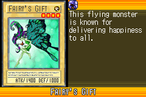](https://yugipedia.com/wiki/Fairy%27s_Gift_(World_Championship_2006))|)|)|)|
|)|)|)|)|)|
|)|)|[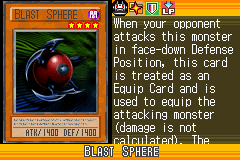](https://yugipedia.com/wiki/Blast_Sphere_(World_Championship_2006))|)|)|
|[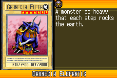](https://yugipedia.com/wiki/Garnecia_Elefantis_(World_Championship_2006))|)|)|)|[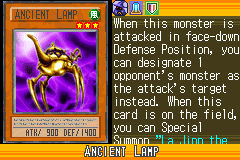](https://yugipedia.com/wiki/Ancient_Lamp_(World_Championship_2006))|
|[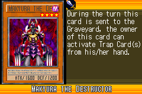](https://yugipedia.com/wiki/Makyura_the_Destructor_(World_Championship_2006))|[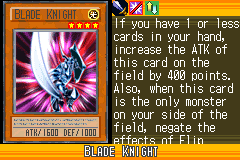](https://yugipedia.com/wiki/Blade_Knight_(World_Championship_2006))|)|)|)|
|[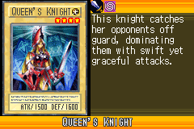](https://yugipedia.com/wiki/Queen%27s_Knight_(World_Championship_2006))|)|)|)|)|
|)|)