# Dragon_Collection_(World_Championship_2006)

|Secret| | | | |
|---|---|---|---|---|
|)|||||

|Ultra| | | | |
|---|---|---|---|---|
|[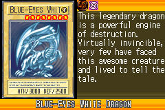](https://yugipedia.com/wiki/Blue-Eyes_White_Dragon_(World_Championship_2006))|[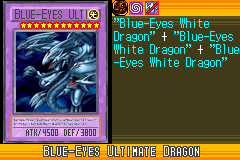](https://yugipedia.com/wiki/Blue-Eyes_Ultimate_Dragon_(World_Championship_2006))|)|)|[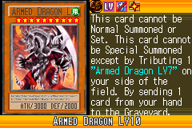](https://yugipedia.com/wiki/Armed_Dragon_LV10_(World_Championship_2006))|

|Super| | | | |
|---|---|---|---|---|
|)|[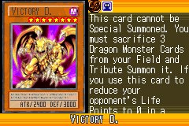](https://yugipedia.com/wiki/Victory_D._(World_Championship_2006))|)|)|)|
|[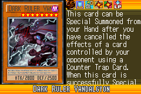](https://yugipedia.com/wiki/Dark_Ruler_Vandalgyon_(World_Championship_2006))|||||

|Rare| | | | |
|---|---|---|---|---|
|)|)|)|[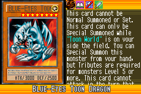](https://yugipedia.com/wiki/Blue-Eyes_Toon_Dragon_(World_Championship_2006))|[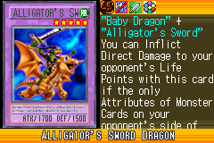](https://yugipedia.com/wiki/Alligator%27s_Sword_Dragon_(World_Championship_2006))|
|)|[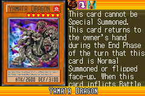](https://yugipedia.com/wiki/Yamata_Dragon_(World_Championship_2006))|)|)|)|
|)|[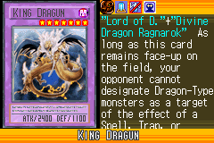](https://yugipedia.com/wiki/King_Dragun_(World_Championship_2006))|)|[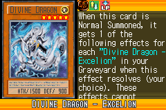](https://yugipedia.com/wiki/Divine_Dragon_-_Excelion_(World_Championship_2006))||

|Common| | | | |
|---|---|---|---|---|
|[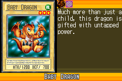](https://yugipedia.com/wiki/Baby_Dragon_(World_Championship_2006))|[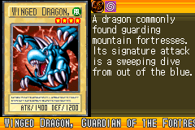](https://yugipedia.com/wiki/Winged_Dragon,_Guardian_of_the_Fortress_1_(World_Championship_2006))|)|)|[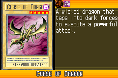](https://yugipedia.com/wiki/Curse_of_Dragon_(World_Championship_2006))|
|)|)|)|)|[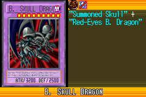](https://yugipedia.com/wiki/B._Skull_Dragon_(World_Championship_2006))|
|)|)|)|)|[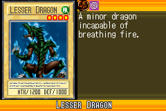](https://yugipedia.com/wiki/Lesser_Dragon_(World_Championship_2006))|
|)|)|)|[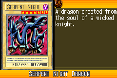](https://yugipedia.com/wiki/Serpent_Night_Dragon_(World_Championship_2006))|)|
|)|)|[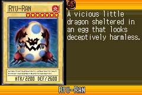](https://yugipedia.com/wiki/Ryu-Ran_(World_Championship_2006))|)|)|
|)|)|)|[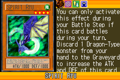](https://yugipedia.com/wiki/Spirit_Ryu_(World_Championship_2006))|)|
|[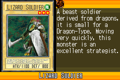](https://yugipedia.com/wiki/Lizard_Soldier_(World_Championship_2006))|)|)|)|[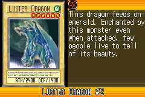](https://yugipedia.com/wiki/Luster_Dragon_2_(World_Championship_2006))|
|[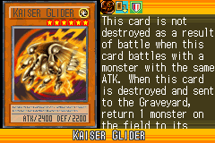](https://yugipedia.com/wiki/Kaiser_Glider_(World_Championship_2006))|)|)|)|)|
|)|[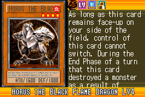](https://yugipedia.com/wiki/Horus_the_Black_Flame_Dragon_LV4_(World_Championship_2006))|)|)|)|
|[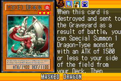](https://yugipedia.com/wiki/Masked_Dragon_(World_Championship_2006))|)|)|)|)|
