# Warrior_Collection_A

|Ultra| | | | |
|---|---|---|---|---|
|)|[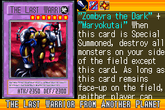](https://yugipedia.com/wiki/The_Last_Warrior_from_Another_Planet_(World_Championship_2006))|)|)||

|Super| | | | |
|---|---|---|---|---|
|)|)|)|)|)|
|[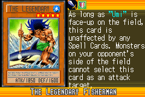](https://yugipedia.com/wiki/The_Legendary_Fisherman_(World_Championship_2006))|||||

|Rare| | | | |
|---|---|---|---|---|
|)|[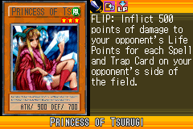](https://yugipedia.com/wiki/Princess_of_Tsurugi_(World_Championship_2006))|)|[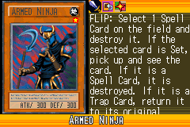](https://yugipedia.com/wiki/Armed_Ninja_(World_Championship_2006))|)|
|)|)|)|)|[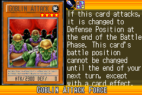](https://yugipedia.com/wiki/Goblin_Attack_Force_(World_Championship_2006))|
|)|)||||

|Common| | | | |
|---|---|---|---|---|
|)|)|)|)|)|
|)|)|)|)|)|
|[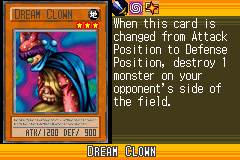](https://yugipedia.com/wiki/Dream_Clown_(World_Championship_2006))|)|)|)|)|
|)|)|)|)|)|
|)|)|)|)|)|
|)|)|)|)|)|
|)|)|)|)|)|
|)|)|)|)|)|
|)|[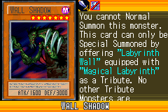](https://yugipedia.com/wiki/Wall_Shadow_(World_Championship_2006))|)|[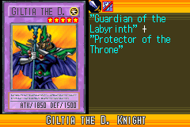](https://yugipedia.com/wiki/Giltia_the_D._Knight_(World_Championship_2006))|)|
|)|[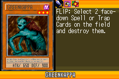](https://yugipedia.com/wiki/Greenkappa_(World_Championship_2006))|)|)|)|
|)|[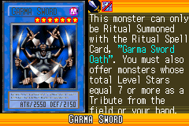](https://yugipedia.com/wiki/Garma_Sword_(World_Championship_2006))|)|[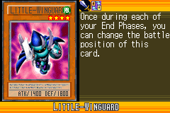](https://yugipedia.com/wiki/Little-Winguard_(World_Championship_2006))|[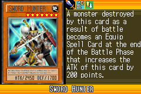](https://yugipedia.com/wiki/Sword_Hunter_(World_Championship_2006))|
|)|[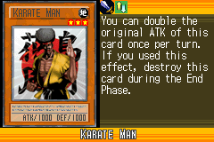](https://yugipedia.com/wiki/Karate_Man_(World_Championship_2006))|)|)|)|
