# Warrior_Collection_B

|Secret| | | | |
|---|---|---|---|---|
|[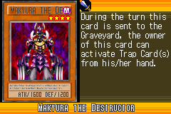](https://yugipedia.com/wiki/Makyura_the_Destructor_(World_Championship_2006))|)||||

|Ultra| | | | |
|---|---|---|---|---|
|[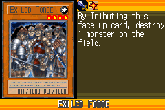](https://yugipedia.com/wiki/Exiled_Force_(World_Championship_2006))|[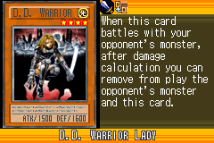](https://yugipedia.com/wiki/D.D._Warrior_Lady_(World_Championship_2006))|[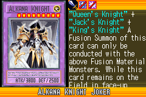](https://yugipedia.com/wiki/Alkana_Knight_Joker_(World_Championship_2006))|[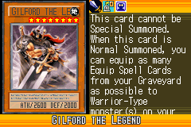](https://yugipedia.com/wiki/Gilford_the_Legend_(World_Championship_2006))||

|Super| | | | |
|---|---|---|---|---|
|[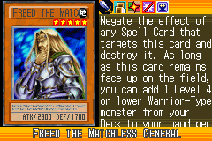](https://yugipedia.com/wiki/Freed_the_Matchless_General_(World_Championship_2006))|[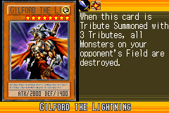](https://yugipedia.com/wiki/Gilford_the_Lightning_(World_Championship_2006))|)|[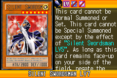](https://yugipedia.com/wiki/Silent_Swordsman_LV7_(World_Championship_2006))|[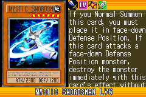](https://yugipedia.com/wiki/Mystic_Swordsman_LV6_(World_Championship_2006))|
|[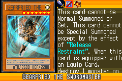](https://yugipedia.com/wiki/Gearfried_the_Swordmaster_(World_Championship_2006))|[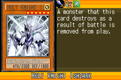](https://yugipedia.com/wiki/Holy_Knight_Ishzark_(World_Championship_2006))|[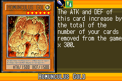](https://yugipedia.com/wiki/Homunculus_Gold_(World_Championship_2006))|||

|Rare| | | | |
|---|---|---|---|---|
|)|)|[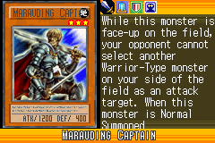](https://yugipedia.com/wiki/Marauding_Captain_(World_Championship_2006))|[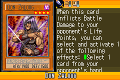](https://yugipedia.com/wiki/Don_Zaloog_(World_Championship_2006))|)|
|)|)|[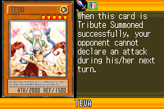](https://yugipedia.com/wiki/Teva_(World_Championship_2006))|[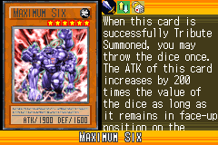](https://yugipedia.com/wiki/Maximum_Six_(World_Championship_2006))|[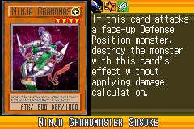](https://yugipedia.com/wiki/Ninja_Grandmaster_Sasuke_(World_Championship_2006))|
|)|[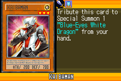](https://yugipedia.com/wiki/Kaibaman_(World_Championship_2006))|)|[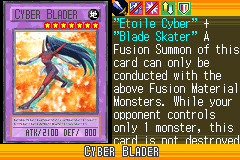](https://yugipedia.com/wiki/Cyber_Blader_(World_Championship_2006))||

|Common| | | | |
|---|---|---|---|---|
|)|[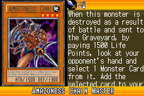](https://yugipedia.com/wiki/Amazoness_Chain_Master_(World_Championship_2006))|)|[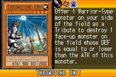](https://yugipedia.com/wiki/Throwstone_Unit_(World_Championship_2006))|[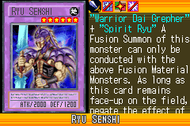](https://yugipedia.com/wiki/Ryu_Senshi_(World_Championship_2006))|
|[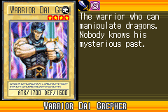](https://yugipedia.com/wiki/Warrior_Dai_Grepher_(World_Championship_2006))|[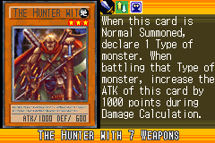](https://yugipedia.com/wiki/The_Hunter_with_7_Weapons_(World_Championship_2006))|)|)|[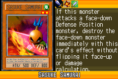](https://yugipedia.com/wiki/Sasuke_Samurai_(World_Championship_2006))|
|[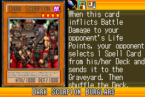](https://yugipedia.com/wiki/Dark_Scorpion_Burglars_(World_Championship_2006))|)|)|[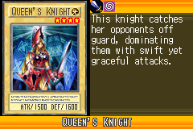](https://yugipedia.com/wiki/Queen%27s_Knight_(World_Championship_2006))|[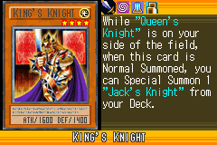](https://yugipedia.com/wiki/King%27s_Knight_(World_Championship_2006))|
|[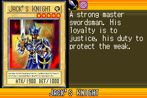](https://yugipedia.com/wiki/Jack%27s_Knight_(World_Championship_2006))|)|)|)|)|
|[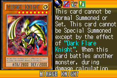](https://yugipedia.com/wiki/Mirage_Knight_(World_Championship_2006))|[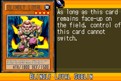](https://yugipedia.com/wiki/Blindly_Loyal_Goblin_(World_Championship_2006))|[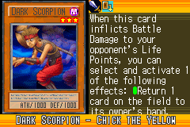](https://yugipedia.com/wiki/Dark_Scorpion_-_Chick_the_Yellow_(World_Championship_2006))|[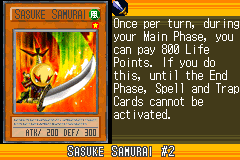](https://yugipedia.com/wiki/Sasuke_Samurai_2_(World_Championship_2006))|[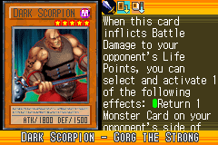](https://yugipedia.com/wiki/Dark_Scorpion_-_Gorg_the_Strong_(World_Championship_2006))|
|[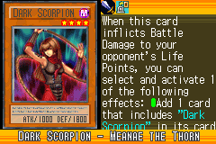](https://yugipedia.com/wiki/Dark_Scorpion_-_Meanae_the_Thorn_(World_Championship_2006))|)|[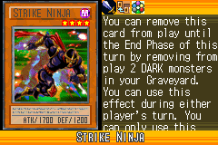](https://yugipedia.com/wiki/Strike_Ninja_(World_Championship_2006))|[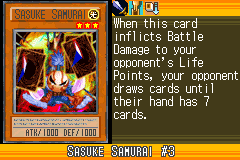](https://yugipedia.com/wiki/Sasuke_Samurai_3_(World_Championship_2006))|[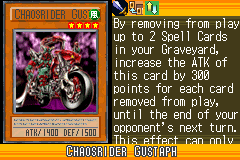](https://yugipedia.com/wiki/Chaosrider_Gustaph_(World_Championship_2006))|
|[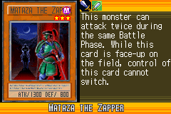](https://yugipedia.com/wiki/Mataza_the_Zapper_(World_Championship_2006))|[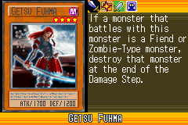](https://yugipedia.com/wiki/Getsu_Fuhma_(World_Championship_2006))|[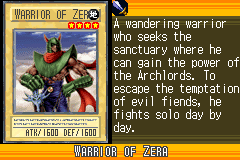](https://yugipedia.com/wiki/Warrior_of_Zera_(World_Championship_2006))|[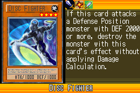](https://yugipedia.com/wiki/Disc_Fighter_(World_Championship_2006))|[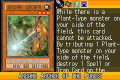](https://yugipedia.com/wiki/Arcane_Archer_of_the_Forest_(World_Championship_2006))|
|[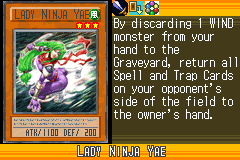](https://yugipedia.com/wiki/Lady_Ninja_Yae_(World_Championship_2006))|)|)|)|)|
|)|[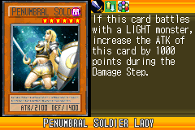](https://yugipedia.com/wiki/Penumbral_Soldier_Lady_(World_Championship_2006))|[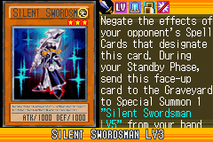](https://yugipedia.com/wiki/Silent_Swordsman_LV3_(World_Championship_2006))|[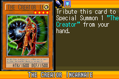](https://yugipedia.com/wiki/The_Creator_Incarnate_(World_Championship_2006))|[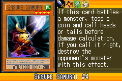](https://yugipedia.com/wiki/Sasuke_Samurai_4_(World_Championship_2006))|
|[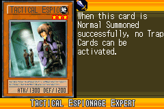](https://yugipedia.com/wiki/Tactical_Espionage_Expert_(World_Championship_2006))|)|[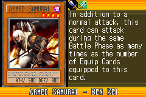](https://yugipedia.com/wiki/Armed_Samurai_-_Ben_Kei_(World_Championship_2006))|)|)|
|)|)|)|)|)|
|)|)