# Warrior_Collection_B

|Secret| | | | |
|---|---|---|---|---|
|)|[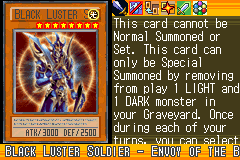](https://yugipedia.com/wiki/Black_Luster_Soldier_-_Envoy_of_the_Beginning_(World_Championship_2006))||||

|Ultra| | | | |
|---|---|---|---|---|
|)|)|)|)||

|Super| | | | |
|---|---|---|---|---|
|)|)|[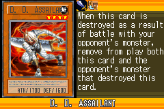](https://yugipedia.com/wiki/D._D._Assailant_(World_Championship_2006))|)|)|
|)|)|)|||

|Rare| | | | |
|---|---|---|---|---|
|[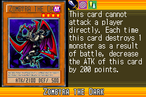](https://yugipedia.com/wiki/Zombyra_the_Dark_(World_Championship_2006))|[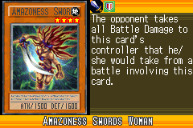](https://yugipedia.com/wiki/Amazoness_Swords_Woman_(World_Championship_2006))|)|)|)|
|)|)|)|)|)|
|)|)|)|)||

|Common| | | | |
|---|---|---|---|---|
|)|)|[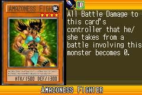](https://yugipedia.com/wiki/Amazoness_Fighter_(World_Championship_2006))|)|)|
|)|)|)|)|)|
|)|)|)|)|)|
|)|[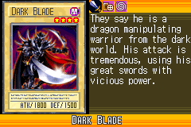](https://yugipedia.com/wiki/Dark_Blade_(World_Championship_2006))|)|[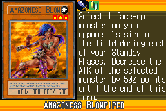](https://yugipedia.com/wiki/Amazoness_Blowpiper_(World_Championship_2006))|[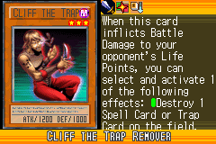](https://yugipedia.com/wiki/Cliff_the_Trap_Remover_(World_Championship_2006))|
|)|)|)|)|)|
|)|)|)|)|)|
|)|)|)|)|)|
|)|)|[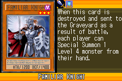](https://yugipedia.com/wiki/Familiar_Knight_(World_Championship_2006))|)|)|
|)|)|)|)|)|
|)|[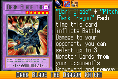](https://yugipedia.com/wiki/Dark_Blade_the_Dragon_Knight_(World_Championship_2006))|)|)|)|
|)|)|)|)|)|
|[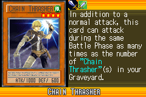](https://yugipedia.com/wiki/Chain_Thrasher_(World_Championship_2006))|)