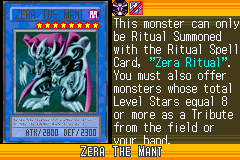
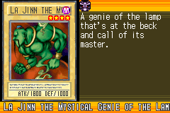
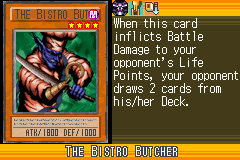
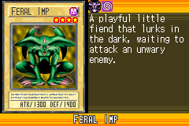
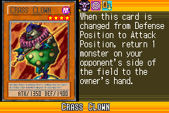
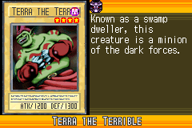
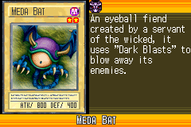
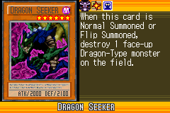
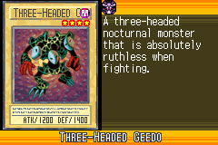
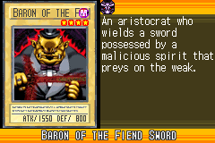

# Fiend_Collection_A

|Ultra| | | | |
|---|---|---|---|---|
|)|)|)|||

|Super| | | | |
|---|---|---|---|---|
|)|)|)|)|)|

|Rare| | | | |
|---|---|---|---|---|
|)|)|)|)|)|
|)|||||

|Common| | | | |
|---|---|---|---|---|
|)|)|)|)|)|
|)|)|)|)|)|
|)|)|)|)|)|
|)|)|)|)|)|
|)|)|)|)|)|
|)|)|)|)|)|
|)|)|)|)|)|
|)|)|)|)|)|
|)|)|)|)|)|
|)|)|)|)|)|
|)|)|)