# Fiend_Collection_B

|Secret| | | | |
|---|---|---|---|---|
|)|||||

|Ultra| | | | |
|---|---|---|---|---|
|[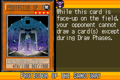](https://yugipedia.com/wiki/Protector_of_the_Sanctuary_(World_Championship_2006))|[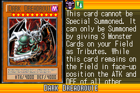](https://yugipedia.com/wiki/Dark_Dreadroute_(World_Championship_2006))|[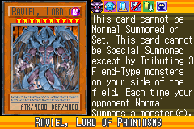](https://yugipedia.com/wiki/Raviel,_Lord_of_Phantasms_(World_Championship_2006))|[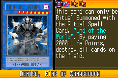](https://yugipedia.com/wiki/Demise,_King_of_Armageddon_(World_Championship_2006))||

|Super| | | | |
|---|---|---|---|---|
|[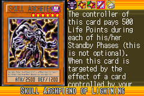](https://yugipedia.com/wiki/Skull_Archfiend_of_Lightning_(World_Championship_2006))|[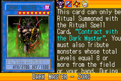](https://yugipedia.com/wiki/Dark_Master_-_Zorc_(World_Championship_2006))|[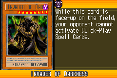](https://yugipedia.com/wiki/Invader_of_Darkness_(World_Championship_2006))|)|[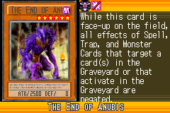](https://yugipedia.com/wiki/The_End_of_Anubis_(World_Championship_2006))|
|[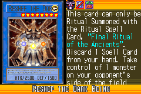](https://yugipedia.com/wiki/Reshef_the_Dark_Being_(World_Championship_2006))|[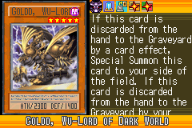](https://yugipedia.com/wiki/Goldd,_Wu-Lord_of_Dark_World_(World_Championship_2006))||||

|Rare| | | | |
|---|---|---|---|---|
|)|)|)|)|)|
|[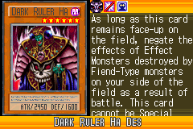](https://yugipedia.com/wiki/Dark_Ruler_Ha_Des_(World_Championship_2006))|[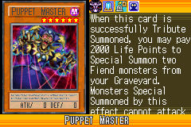](https://yugipedia.com/wiki/Puppet_Master_(World_Championship_2006))|[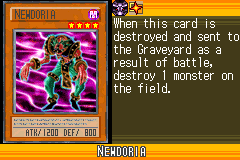](https://yugipedia.com/wiki/Newdoria_(World_Championship_2006))|[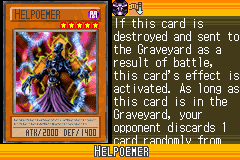](https://yugipedia.com/wiki/Helpoemer_(World_Championship_2006))|)|
|[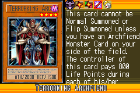](https://yugipedia.com/wiki/Terrorking_Archfiend_(World_Championship_2006))|[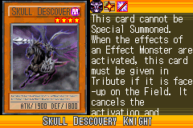](https://yugipedia.com/wiki/Skull_Descovery_Knight_(World_Championship_2006))|[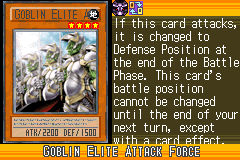](https://yugipedia.com/wiki/Goblin_Elite_Attack_Force_(World_Championship_2006))|||

|Common| | | | |
|---|---|---|---|---|
|)|)|)|)|)|
|)|)|)|)|)|
|)|[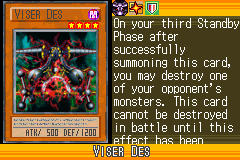](https://yugipedia.com/wiki/Viser_Des_(World_Championship_2006))|[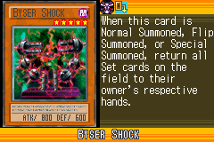](https://yugipedia.com/wiki/Byser_Shock_(World_Championship_2006))|[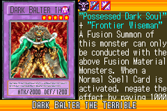](https://yugipedia.com/wiki/Dark_Balter_the_Terrible_(World_Championship_2006))|[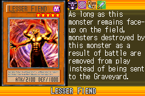](https://yugipedia.com/wiki/Lesser_Fiend_(World_Championship_2006))|
|[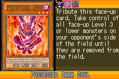](https://yugipedia.com/wiki/Possessed_Dark_Soul_(World_Championship_2006))|[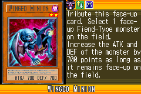](https://yugipedia.com/wiki/Winged_Minion_(World_Championship_2006))|)|[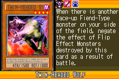](https://yugipedia.com/wiki/Twin-Headed_Wolf_(World_Championship_2006))|[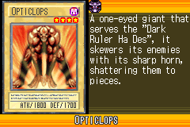](https://yugipedia.com/wiki/Opticlops_(World_Championship_2006))|
|[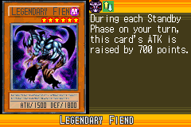](https://yugipedia.com/wiki/Legendary_Fiend_(World_Championship_2006))|[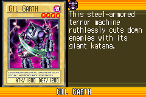](https://yugipedia.com/wiki/Gil_Garth_(World_Championship_2006))|[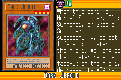](https://yugipedia.com/wiki/Dark_Jeroid_(World_Championship_2006))|)|)|
|)|)|)|[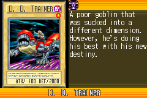](https://yugipedia.com/wiki/D._D._Trainer_(World_Championship_2006))|[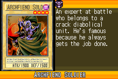](https://yugipedia.com/wiki/Archfiend_Soldier_(World_Championship_2006))|
|[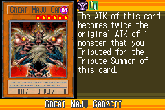](https://yugipedia.com/wiki/Great_Maju_Garzett_(World_Championship_2006))|)|[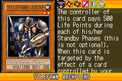](https://yugipedia.com/wiki/Vilepawn_Archfiend_(World_Championship_2006))|[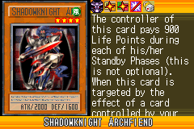](https://yugipedia.com/wiki/Shadowknight_Archfiend_(World_Championship_2006))|[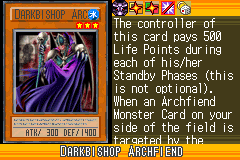](https://yugipedia.com/wiki/Darkbishop_Archfiend_(World_Championship_2006))|
|)|[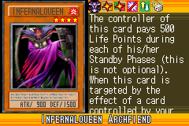](https://yugipedia.com/wiki/Infernalqueen_Archfiend_(World_Championship_2006))|[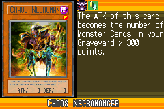](https://yugipedia.com/wiki/Chaos_Necromancer_(World_Championship_2006))|[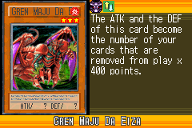](https://yugipedia.com/wiki/Gren_Maju_Da_Eiza_(World_Championship_2006))|[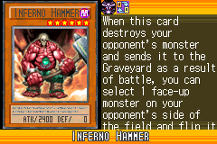](https://yugipedia.com/wiki/Inferno_Hammer_(World_Championship_2006))|
|)|[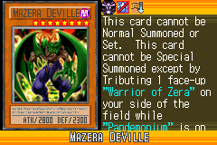](https://yugipedia.com/wiki/Mazera_DeVille_(World_Championship_2006))|[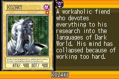](https://yugipedia.com/wiki/Kozaky_(World_Championship_2006))|[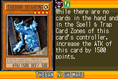](https://yugipedia.com/wiki/Theban_Nightmare_(World_Championship_2006))|[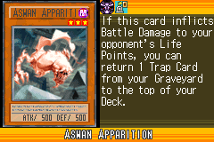](https://yugipedia.com/wiki/Aswan_Apparition_(World_Championship_2006))|
|[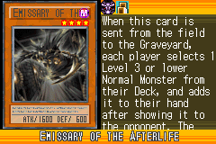](https://yugipedia.com/wiki/Emissary_of_the_Afterlife_(World_Championship_2006))|)|)|[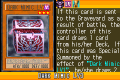](https://yugipedia.com/wiki/Dark_Mimic_LV3_(World_Championship_2006))|[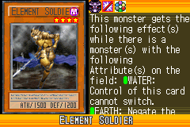](https://yugipedia.com/wiki/Element_Soldier_(World_Championship_2006))|
|[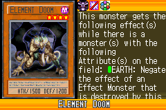](https://yugipedia.com/wiki/Element_Doom_(World_Championship_2006))|)|)|[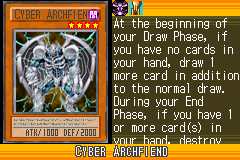](https://yugipedia.com/wiki/Cyber_Archfiend_(World_Championship_2006))|)|
|[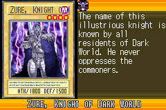](https://yugipedia.com/wiki/Zure,_Knight_of_Dark_World_(World_Championship_2006))|[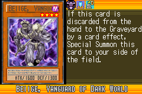](https://yugipedia.com/wiki/Beiige,_Vanguard_of_Dark_World_(World_Championship_2006))|[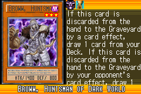](https://yugipedia.com/wiki/Broww,_Huntsman_of_Dark_World_(World_Championship_2006))|)|)|
|)|)