# Fiend_Collection_B

|Secret| | | | |
|---|---|---|---|---|
|)|||||

|Ultra| | | | |
|---|---|---|---|---|
|)|)|)|)||

|Super| | | | |
|---|---|---|---|---|
|)|)|)|[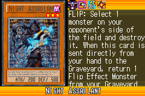](https://yugipedia.com/wiki/Night_Assailant_(World_Championship_2006))|)|
|)|)||||

|Rare| | | | |
|---|---|---|---|---|
|)|[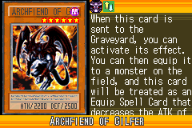](https://yugipedia.com/wiki/Archfiend_of_Gilfer_(World_Championship_2006))|[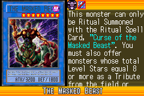](https://yugipedia.com/wiki/The_Masked_Beast_(World_Championship_2006))|)|)|
|)|)|)|)|[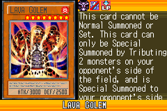](https://yugipedia.com/wiki/Lava_Golem_(World_Championship_2006))|
|)|)|)|||

|Common| | | | |
|---|---|---|---|---|
|)|)|[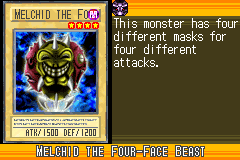](https://yugipedia.com/wiki/Melchid_the_Four-Face_Beast_(World_Championship_2006))|)|)|
|)|)|[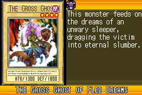](https://yugipedia.com/wiki/The_Gross_Ghost_of_Fled_Dreams_(World_Championship_2006))|[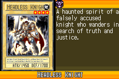](https://yugipedia.com/wiki/Headless_Knight_(World_Championship_2006))|)|
|)|)|)|)|)|
|)|)|)|)|)|
|)|)|)|)|)|
|[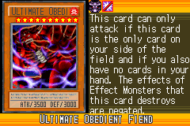](https://yugipedia.com/wiki/Ultimate_Obedient_Fiend_(World_Championship_2006))|)|[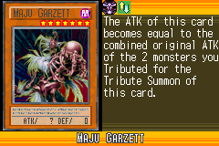](https://yugipedia.com/wiki/Maju_Garzett_(World_Championship_2006))|)|)|
|)|[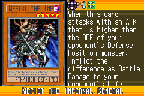](https://yugipedia.com/wiki/Mefist_the_Infernal_General_(World_Championship_2006))|)|)|)|
|)|)|)|)|)|
|[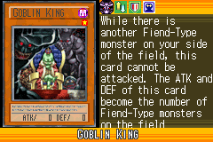](https://yugipedia.com/wiki/Goblin_King_(World_Championship_2006))|)|)|)|)|
|)|[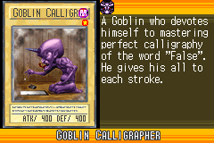](https://yugipedia.com/wiki/Goblin_Calligrapher_(World_Championship_2006))|)|)|)|
|)|)|)|)|)|
|)|)|)|)|)|
|)|)