# Machine_Collection_A

|Ultra| | | | |
|---|---|---|---|---|
|)|)|)|[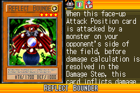](https://yugipedia.com/wiki/Reflect_Bounder_(World_Championship_2006))||

|Super| | | | |
|---|---|---|---|---|
|)|)|[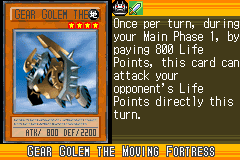](https://yugipedia.com/wiki/Gear_Golem_the_Moving_Fortress_(World_Championship_2006))|)|)|

|Rare| | | | |
|---|---|---|---|---|
|)|[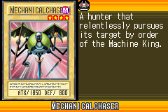](https://yugipedia.com/wiki/Mechanicalchaser_(World_Championship_2006))|)|)|)|
|[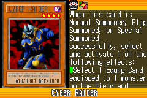](https://yugipedia.com/wiki/Cyber_Raider_(World_Championship_2006))|)|)|[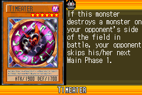](https://yugipedia.com/wiki/Timeater_(World_Championship_2006))|[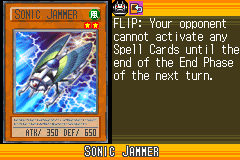](https://yugipedia.com/wiki/Sonic_Jammer_(World_Championship_2006))|
|[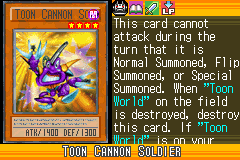](https://yugipedia.com/wiki/Toon_Cannon_Soldier_(World_Championship_2006))|||||

|Common| | | | |
|---|---|---|---|---|
|[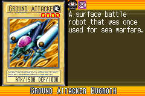](https://yugipedia.com/wiki/Ground_Attacker_Bugroth_(World_Championship_2006))|[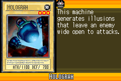](https://yugipedia.com/wiki/Holograh_(World_Championship_2006))|)|[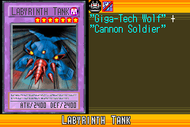](https://yugipedia.com/wiki/Labyrinth_Tank_(World_Championship_2006))|)|
|)|)|[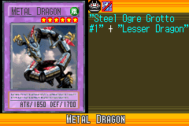](https://yugipedia.com/wiki/Metal_Dragon_(World_Championship_2006))|)|)|
|)|)|)|)|)|
|)|)|)|)|[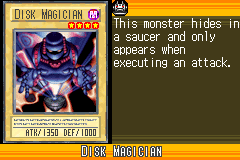](https://yugipedia.com/wiki/Disk_Magician_(World_Championship_2006))|
|)|[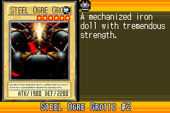](https://yugipedia.com/wiki/Steel_Ogre_Grotto_2_(World_Championship_2006))|)|[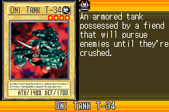](https://yugipedia.com/wiki/Oni_Tank_T-34_(World_Championship_2006))|[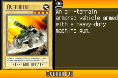](https://yugipedia.com/wiki/Overdrive_(World_Championship_2006))|
|[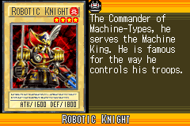](https://yugipedia.com/wiki/Robotic_Knight_(World_Championship_2006))|)|)|[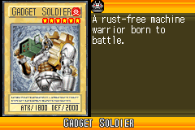](https://yugipedia.com/wiki/Gadget_Soldier_(World_Championship_2006))|[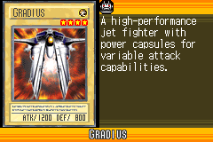](https://yugipedia.com/wiki/Gradius_(World_Championship_2006))|
|)|)|[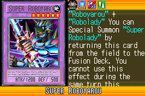](https://yugipedia.com/wiki/Super_Roboyarou_(World_Championship_2006))