# Machine_Collection_B

|Ultra| | | | |
|---|---|---|---|---|
|[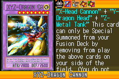](https://yugipedia.com/wiki/XYZ-Dragon_Cannon_(World_Championship_2006))|)|)|[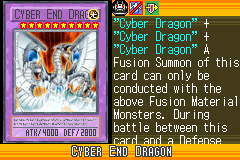](https://yugipedia.com/wiki/Cyber_End_Dragon_(World_Championship_2006))||

|Super| | | | |
|---|---|---|---|---|
|)|)|)|)|)|
|)|)||||

|Rare| | | | |
|---|---|---|---|---|
|)|[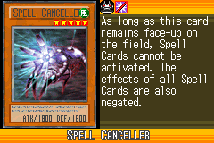](https://yugipedia.com/wiki/Spell_Canceller_(World_Championship_2006))|)|)|)|
|)|[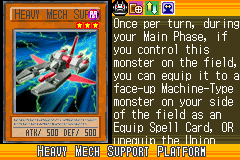](https://yugipedia.com/wiki/Heavy_Mech_Support_Platform_(World_Championship_2006))|)|[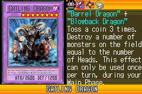](https://yugipedia.com/wiki/Gatling_Dragon_(World_Championship_2006))|)|
|)|)|[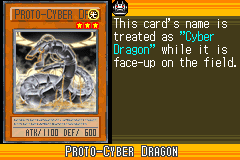](https://yugipedia.com/wiki/Proto-Cyber_Dragon_(World_Championship_2006))|||

|Common| | | | |
|---|---|---|---|---|
|[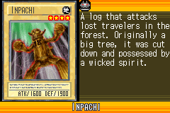](https://yugipedia.com/wiki/Inpachi_(World_Championship_2006))|)|)|[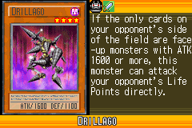](https://yugipedia.com/wiki/Drillago_(World_Championship_2006))|)|
|)|)|)|)|)|
|)|)|)|)|)|
|)|[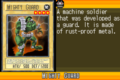](https://yugipedia.com/wiki/Mighty_Guard_(World_Championship_2006))|[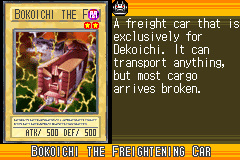](https://yugipedia.com/wiki/Bokoichi_the_Freightening_Car_(World_Championship_2006))|[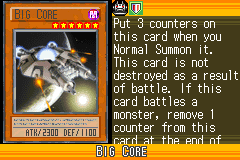](https://yugipedia.com/wiki/Big_Core_(World_Championship_2006))|)|
|[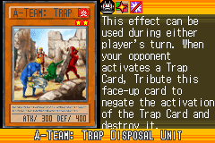](https://yugipedia.com/wiki/A-Team:_Trap_Disposal_Unit_(World_Championship_2006))|)|)|)|)|
|[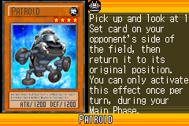](https://yugipedia.com/wiki/Patroid_(World_Championship_2006))|)|[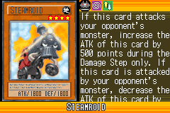](https://yugipedia.com/wiki/Steamroid_(World_Championship_2006))|[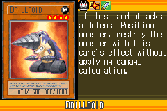](https://yugipedia.com/wiki/Drillroid_(World_Championship_2006))|)|
|)|)|[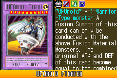](https://yugipedia.com/wiki/UFOroid_Fighter_(World_Championship_2006))|)|)|
|[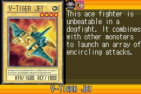](https://yugipedia.com/wiki/V-Tiger_Jet_(World_Championship_2006))|)|)|)|[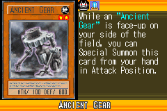](https://yugipedia.com/wiki/Ancient_Gear_(World_Championship_2006))|
|)|)|)|)