# Spellcaster_Collection_B

|Secret| | | | |
|---|---|---|---|---|
|[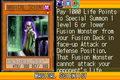](https://yugipedia.com/wiki/Magical_Scientist_(World_Championship_2006))|||||

|Ultra| | | | |
|---|---|---|---|---|
|)|)|[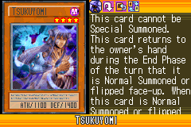](https://yugipedia.com/wiki/Tsukuyomi_(World_Championship_2006))|)|[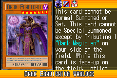](https://yugipedia.com/wiki/Dark_Eradicator_Warlock_(World_Championship_2006))|

|Super| | | | |
|---|---|---|---|---|
|)|)|)|)|)|
|)|)|)|||

|Rare| | | | |
|---|---|---|---|---|
|)|[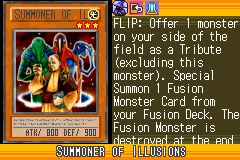](https://yugipedia.com/wiki/Summoner_of_Illusions_(World_Championship_2006))|)|[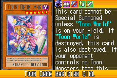](https://yugipedia.com/wiki/Toon_Dark_Magician_Girl_(World_Championship_2006))|[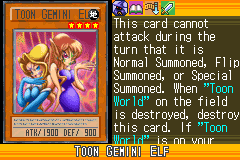](https://yugipedia.com/wiki/Toon_Gemini_Elf_(World_Championship_2006))|
|[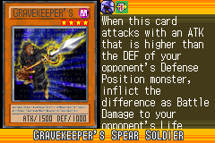](https://yugipedia.com/wiki/Gravekeeper%27s_Spear_Soldier_(World_Championship_2006))|[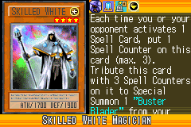](https://yugipedia.com/wiki/Skilled_White_Magician_(World_Championship_2006))|)|[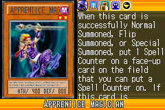](https://yugipedia.com/wiki/Apprentice_Magician_(World_Championship_2006))|)|
|)|)|)|||

|Common| | | | |
|---|---|---|---|---|
|)|)|)|)|)|
|)|[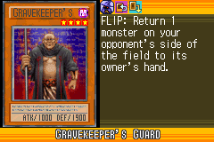](https://yugipedia.com/wiki/Gravekeeper%27s_Guard_(World_Championship_2006))|[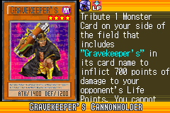](https://yugipedia.com/wiki/Gravekeeper%27s_Cannonholder_(World_Championship_2006))|)|)|
|[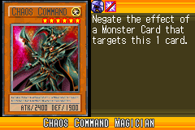](https://yugipedia.com/wiki/Chaos_Command_Magician_(World_Championship_2006))|)|)|[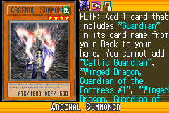](https://yugipedia.com/wiki/Arsenal_Summoner_(World_Championship_2006))|)|
|[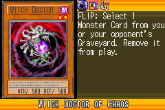](https://yugipedia.com/wiki/Witch_Doctor_of_Chaos_(World_Championship_2006))|)|)|)|)|
|[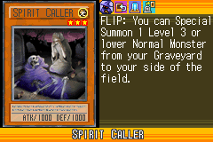](https://yugipedia.com/wiki/Spirit_Caller_(World_Championship_2006))|)|)|)|)|
|)|)|)|)|)|
|)|)|)|)|)|
|)|)|)|[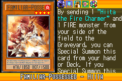](https://yugipedia.com/wiki/Familiar-Possessed_-_Hiita_(World_Championship_2006))|)|
|)|)|)