# Special_Monsters_A

|Secret| | | | |
|---|---|---|---|---|
|)|||||

|Ultra| | | | |
|---|---|---|---|---|
|)|)|[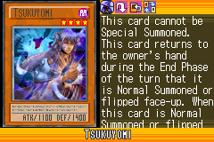](https://yugipedia.com/wiki/Tsukuyomi_(World_Championship_2006))|||

|Super| | | | |
|---|---|---|---|---|
|)|)|)|[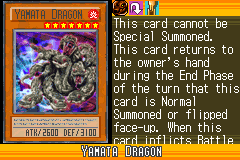](https://yugipedia.com/wiki/Yamata_Dragon_(World_Championship_2006))|[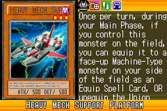](https://yugipedia.com/wiki/Heavy_Mech_Support_Platform_(World_Championship_2006))|

|Rare| | | | |
|---|---|---|---|---|
|)|[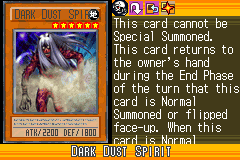](https://yugipedia.com/wiki/Dark_Dust_Spirit_(World_Championship_2006))|)|[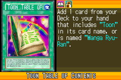](https://yugipedia.com/wiki/Toon_Table_of_Contents_(World_Championship_2006))|)|
|)|)|[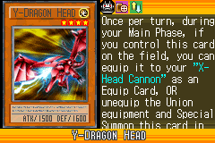](https://yugipedia.com/wiki/Y-Dragon_Head_(World_Championship_2006))|[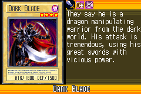](https://yugipedia.com/wiki/Dark_Blade_(World_Championship_2006))|[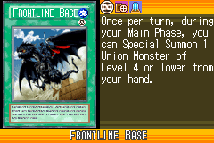](https://yugipedia.com/wiki/Frontline_Base_(World_Championship_2006))|
|)|[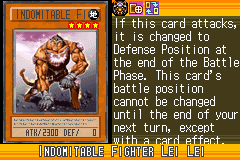](https://yugipedia.com/wiki/Indomitable_Fighter_Lei_Lei_(World_Championship_2006))|[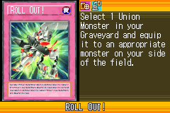](https://yugipedia.com/wiki/Roll_Out!_(World_Championship_2006))|||

|Common| | | | |
|---|---|---|---|---|
|)|[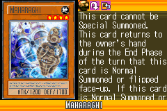](https://yugipedia.com/wiki/Maharaghi_(World_Championship_2006))|)|[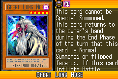](https://yugipedia.com/wiki/Great_Long_Nose_(World_Championship_2006))|[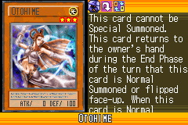](https://yugipedia.com/wiki/Otohime_(World_Championship_2006))|
|[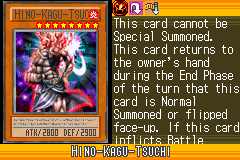](https://yugipedia.com/wiki/Hino-Kagu-Tsuchi_(World_Championship_2006))|[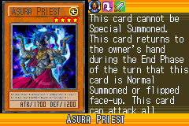](https://yugipedia.com/wiki/Asura_Priest_(World_Championship_2006))|)|[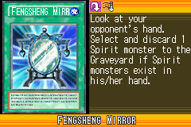](https://yugipedia.com/wiki/Fengsheng_Mirror_(World_Championship_2006))|)|
|)|[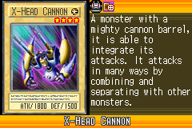](https://yugipedia.com/wiki/X-Head_Cannon_(World_Championship_2006))|[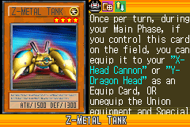](https://yugipedia.com/wiki/Z-Metal_Tank_(World_Championship_2006))|[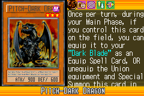](https://yugipedia.com/wiki/Pitch-Dark_Dragon_(World_Championship_2006))|)|
|)|[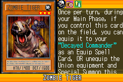](https://yugipedia.com/wiki/Zombie_Tiger_(World_Championship_2006))|[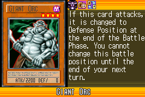](https://yugipedia.com/wiki/Giant_Orc_(World_Championship_2006))|[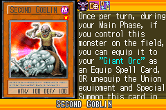](https://yugipedia.com/wiki/Second_Goblin_(World_Championship_2006))|[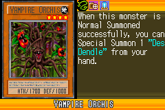](https://yugipedia.com/wiki/Vampire_Orchis_(World_Championship_2006))|
|[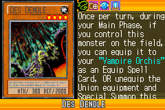](https://yugipedia.com/wiki/Des_Dendle_(World_Championship_2006))|)|[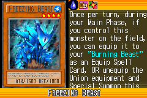](https://yugipedia.com/wiki/Freezing_Beast_(World_Championship_2006))|)|[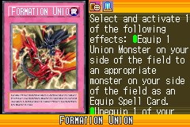](https://yugipedia.com/wiki/Formation_Union_(World_Championship_2006))|
|[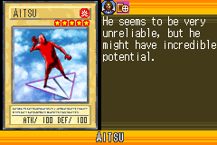](https://yugipedia.com/wiki/Aitsu_(World_Championship_2006))|[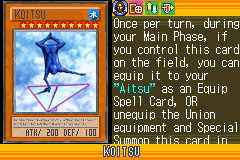](https://yugipedia.com/wiki/Koitsu_(World_Championship_2006))|[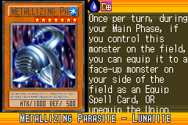](https://yugipedia.com/wiki/Metallizing_Parasite_-_Lunatite_(World_Championship_2006))|[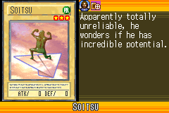](https://yugipedia.com/wiki/Soitsu_(World_Championship_2006))|[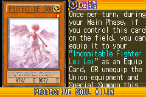](https://yugipedia.com/wiki/Protective_Soul_Ailin_(World_Championship_2006))|
|[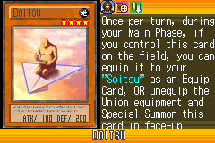](https://yugipedia.com/wiki/Doitsu_(World_Championship_2006))|[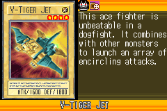](https://yugipedia.com/wiki/V-Tiger_Jet_(World_Championship_2006))|[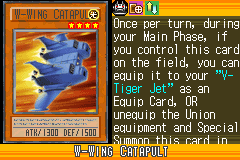](https://yugipedia.com/wiki/W-Wing_Catapult_(World_Championship_2006))