# Special_Monsters_B

|Ultra| | | | |
|---|---|---|---|---|
|[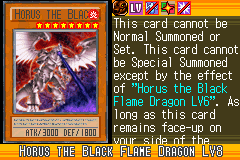](https://yugipedia.com/wiki/Horus_the_Black_Flame_Dragon_LV8_(World_Championship_2006))|)|)|)|)|

|Super| | | | |
|---|---|---|---|---|
|[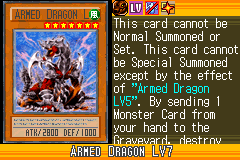](https://yugipedia.com/wiki/Armed_Dragon_LV7_(World_Championship_2006))|)|)|)|)|
|)|)|)|||

|Rare| | | | |
|---|---|---|---|---|
|)|[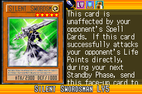](https://yugipedia.com/wiki/Silent_Swordsman_LV5_(World_Championship_2006))|)|)|)|
|[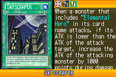](https://yugipedia.com/wiki/Skyscraper_(World_Championship_2006))|)|)|)|[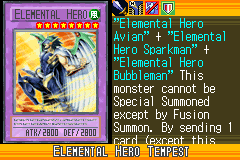](https://yugipedia.com/wiki/Elemental_Hero_Tempest_(World_Championship_2006))|
|)|)|)|||

|Common| | | | |
|---|---|---|---|---|
|)|)|)|)|)|
|)|)|)|)|)|
|)|)|)|[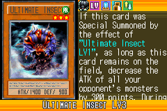](https://yugipedia.com/wiki/Ultimate_Insect_LV3_(World_Championship_2006))|)|
|)|)|)|[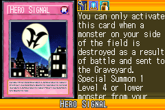](https://yugipedia.com/wiki/Hero_Signal_(World_Championship_2006))|[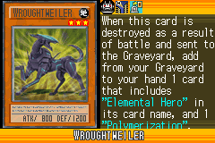](https://yugipedia.com/wiki/Wroughtweiler_(World_Championship_2006))|
|)|)|)|[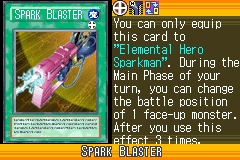](https://yugipedia.com/wiki/Spark_Blaster_(World_Championship_2006))|)|
|[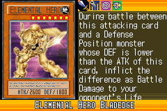](https://yugipedia.com/wiki/Elemental_Hero_Bladedge_(World_Championship_2006))|)|[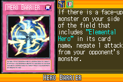](https://yugipedia.com/wiki/Hero_Barrier_(World_Championship_2006))|)|)|
|)|)|[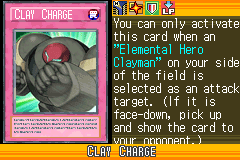](https://yugipedia.com/wiki/Clay_Charge_(World_Championship_2006))|)|[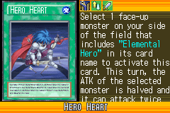](https://yugipedia.com/wiki/Hero_Heart_(World_Championship_2006))|
|)