# Reverse_Collection

|Secret| | | | |
|---|---|---|---|---|
|[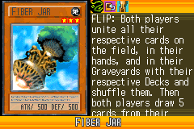](https://yugipedia.com/wiki/Fiber_Jar_(World_Championship_2006))|||||

|Ultra| | | | |
|---|---|---|---|---|
|[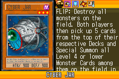](https://yugipedia.com/wiki/Cyber_Jar_(World_Championship_2006))|[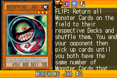](https://yugipedia.com/wiki/Morphing_Jar_2_(World_Championship_2006))|[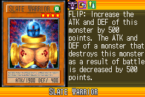](https://yugipedia.com/wiki/Slate_Warrior_(World_Championship_2006))|[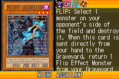](https://yugipedia.com/wiki/Night_Assailant_(World_Championship_2006))||

|Super| | | | |
|---|---|---|---|---|
|[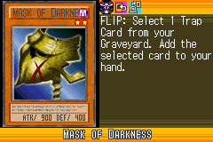](https://yugipedia.com/wiki/Mask_of_Darkness_(World_Championship_2006))|[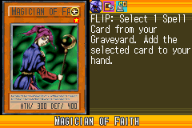](https://yugipedia.com/wiki/Magician_of_Faith_(World_Championship_2006))|[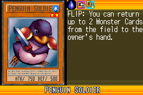](https://yugipedia.com/wiki/Penguin_Soldier_(World_Championship_2006))|[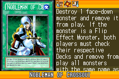](https://yugipedia.com/wiki/Nobleman_of_Crossout_(World_Championship_2006))|[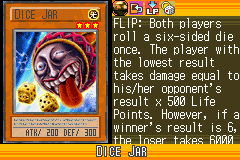](https://yugipedia.com/wiki/Dice_Jar_(World_Championship_2006))|
|[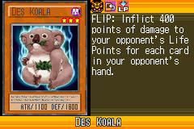](https://yugipedia.com/wiki/Des_Koala_(World_Championship_2006))|||||

|Rare| | | | |
|---|---|---|---|---|
|)|[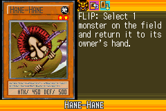](https://yugipedia.com/wiki/Hane-Hane_(World_Championship_2006))|[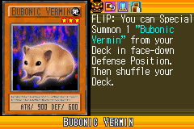](https://yugipedia.com/wiki/Bubonic_Vermin_(World_Championship_2006))|[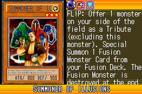](https://yugipedia.com/wiki/Summoner_of_Illusions_(World_Championship_2006))|[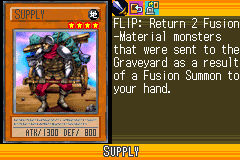](https://yugipedia.com/wiki/Supply_(World_Championship_2006))|
|)|[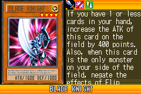](https://yugipedia.com/wiki/Blade_Knight_(World_Championship_2006))|[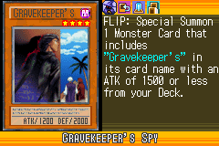](https://yugipedia.com/wiki/Gravekeeper%27s_Spy_(World_Championship_2006))|[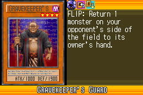](https://yugipedia.com/wiki/Gravekeeper%27s_Guard_(World_Championship_2006))|)|
|[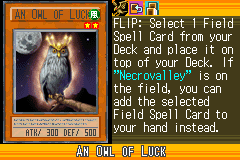](https://yugipedia.com/wiki/An_Owl_of_Luck_(World_Championship_2006))|[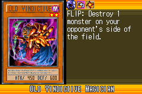](https://yugipedia.com/wiki/Old_Vindictive_Magician_(World_Championship_2006))|[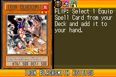](https://yugipedia.com/wiki/Iron_Blacksmith_Kotetsu_(World_Championship_2006))|[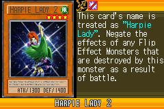](https://yugipedia.com/wiki/Harpie_Lady_2_(World_Championship_2006))||

|Common| | | | |
|---|---|---|---|---|
|[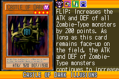](https://yugipedia.com/wiki/Castle_of_Dark_Illusions_(World_Championship_2006))|[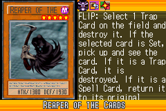](https://yugipedia.com/wiki/Reaper_of_the_Cards_(World_Championship_2006))|[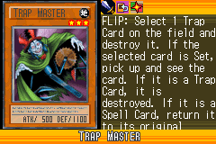](https://yugipedia.com/wiki/Trap_Master_(World_Championship_2006))|[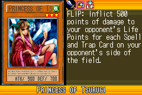](https://yugipedia.com/wiki/Princess_of_Tsurugi_(World_Championship_2006))|)|
|[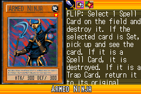](https://yugipedia.com/wiki/Armed_Ninja_(World_Championship_2006))|[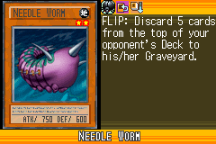](https://yugipedia.com/wiki/Needle_Worm_(World_Championship_2006))|[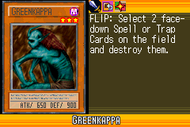](https://yugipedia.com/wiki/Greenkappa_(World_Championship_2006))|[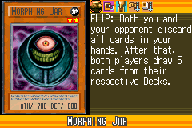](https://yugipedia.com/wiki/Morphing_Jar_(World_Championship_2006))|[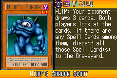](https://yugipedia.com/wiki/Hiro%27s_Shadow_Scout_(World_Championship_2006))|
|[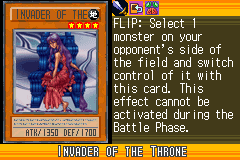](https://yugipedia.com/wiki/Invader_of_the_Throne_(World_Championship_2006))|[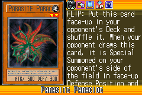](https://yugipedia.com/wiki/Parasite_Paracide_(World_Championship_2006))|[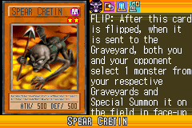](https://yugipedia.com/wiki/Spear_Cretin_(World_Championship_2006))|)|[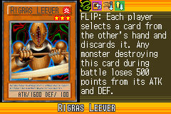](https://yugipedia.com/wiki/Rigras_Leever_(World_Championship_2006))|
|[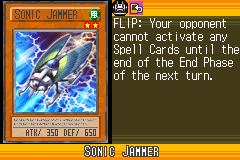](https://yugipedia.com/wiki/Sonic_Jammer_(World_Championship_2006))|)|[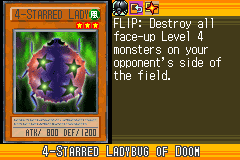](https://yugipedia.com/wiki/4-Starred_Ladybug_of_Doom_(World_Championship_2006))|[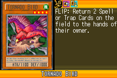](https://yugipedia.com/wiki/Tornado_Bird_(World_Championship_2006))|[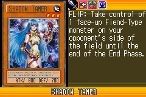](https://yugipedia.com/wiki/Shadow_Tamer_(World_Championship_2006))|
|[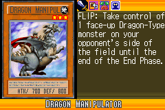](https://yugipedia.com/wiki/Dragon_Manipulator_(World_Championship_2006))|[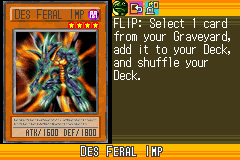](https://yugipedia.com/wiki/Des_Feral_Imp_(World_Championship_2006))|[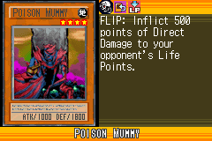](https://yugipedia.com/wiki/Poison_Mummy_(World_Championship_2006))|[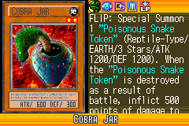](https://yugipedia.com/wiki/Cobra_Jar_(World_Championship_2006))|[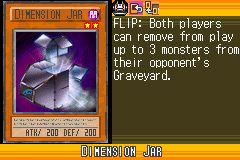](https://yugipedia.com/wiki/Dimension_Jar_(World_Championship_2006))|
|[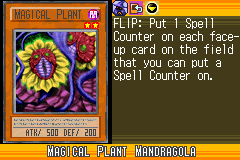](https://yugipedia.com/wiki/Magical_Plant_Mandragola_(World_Championship_2006))|[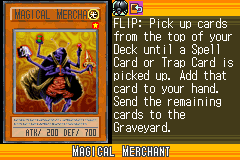](https://yugipedia.com/wiki/Magical_Merchant_(World_Championship_2006))|[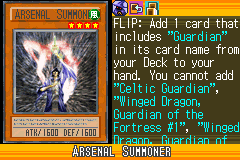](https://yugipedia.com/wiki/Arsenal_Summoner_(World_Championship_2006))|[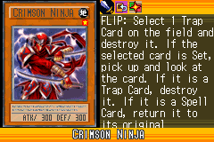](https://yugipedia.com/wiki/Crimson_Ninja_(World_Championship_2006))|[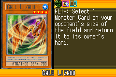](https://yugipedia.com/wiki/Gale_Lizard_(World_Championship_2006))|
|[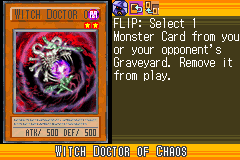](https://yugipedia.com/wiki/Witch_Doctor_of_Chaos_(World_Championship_2006))|)|)|)|)|
|)|)|)|)|)|
|)|)|)|)|)|
|)