# LP_Recovery_Collection

|Ultra| | | | |
|---|---|---|---|---|
|[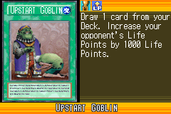](https://yugipedia.com/wiki/Upstart_Goblin_(World_Championship_2006))|[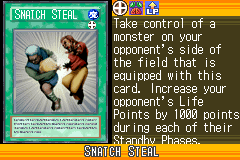](https://yugipedia.com/wiki/Snatch_Steal_(World_Championship_2006))|[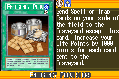](https://yugipedia.com/wiki/Emergency_Provisions_(World_Championship_2006))|[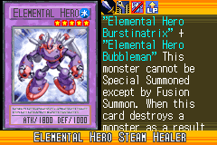](https://yugipedia.com/wiki/Elemental_Hero_Steam_Healer_(World_Championship_2006))||

|Super| | | | |
|---|---|---|---|---|
|)|[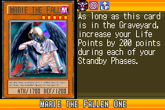](https://yugipedia.com/wiki/Marie_the_Fallen_One_(World_Championship_2006))|)|[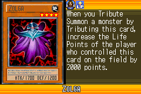](https://yugipedia.com/wiki/Zolga_(World_Championship_2006))|[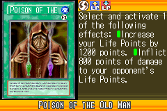](https://yugipedia.com/wiki/Poison_of_the_Old_Man_(World_Championship_2006))|
|[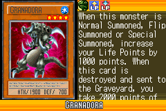](https://yugipedia.com/wiki/Granadora_(World_Championship_2006))|||||

|Rare| | | | |
|---|---|---|---|---|
|)|[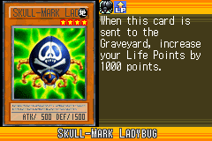](https://yugipedia.com/wiki/Skull-Mark_Ladybug_(World_Championship_2006))|[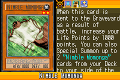](https://yugipedia.com/wiki/Nimble_Momonga_(World_Championship_2006))|[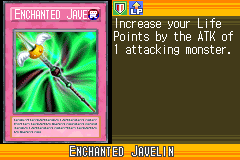](https://yugipedia.com/wiki/Enchanted_Javelin_(World_Championship_2006))|)|
|[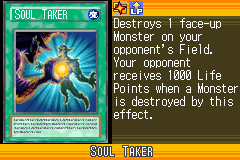](https://yugipedia.com/wiki/Soul_Taker_(World_Championship_2006))|[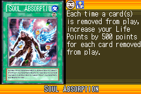](https://yugipedia.com/wiki/Soul_Absorption_(World_Championship_2006))|[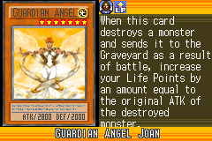](https://yugipedia.com/wiki/Guardian_Angel_Joan_(World_Championship_2006))|[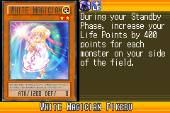](https://yugipedia.com/wiki/White_Magician_Pikeru_(World_Championship_2006))|[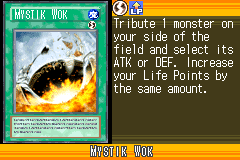](https://yugipedia.com/wiki/Mystik_Wok_(World_Championship_2006))|
|[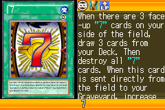](https://yugipedia.com/wiki/7_(World_Championship_2006))|)|[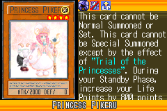](https://yugipedia.com/wiki/Princess_Pikeru_(World_Championship_2006))|||

|Common| | | | |
|---|---|---|---|---|
|[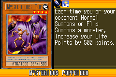](https://yugipedia.com/wiki/Mysterious_Puppeteer_(World_Championship_2006))|[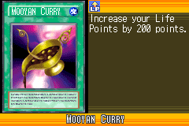](https://yugipedia.com/wiki/Mooyan_Curry_(World_Championship_2006))|[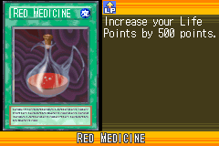](https://yugipedia.com/wiki/Red_Medicine_(World_Championship_2006))|[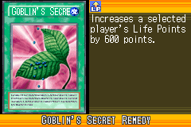](https://yugipedia.com/wiki/Goblin%27s_Secret_Remedy_(World_Championship_2006))|[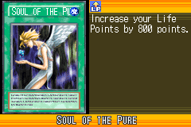](https://yugipedia.com/wiki/Soul_of_the_Pure_(World_Championship_2006))|
|)|[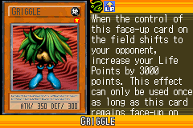](https://yugipedia.com/wiki/Griggle_(World_Championship_2006))|)|[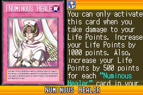](https://yugipedia.com/wiki/Numinous_Healer_(World_Championship_2006))|[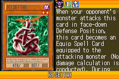](https://yugipedia.com/wiki/Kiseitai_(World_Championship_2006))|
|[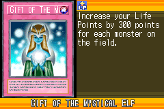](https://yugipedia.com/wiki/Gift_of_The_Mystical_Elf_(World_Championship_2006))|)|)|[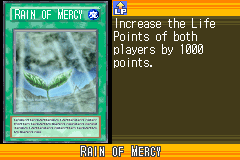](https://yugipedia.com/wiki/Rain_of_Mercy_(World_Championship_2006))|[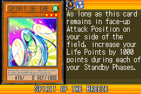](https://yugipedia.com/wiki/Spirit_of_the_Breeze_(World_Championship_2006))|
|[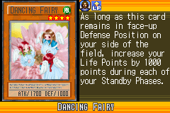](https://yugipedia.com/wiki/Dancing_Fairy_(World_Championship_2006))|[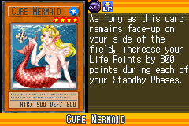](https://yugipedia.com/wiki/Cure_Mermaid_(World_Championship_2006))|[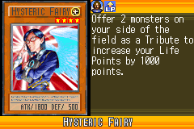](https://yugipedia.com/wiki/Hysteric_Fairy_(World_Championship_2006))|[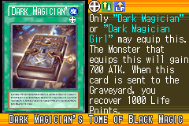](https://yugipedia.com/wiki/Dark_Magician%27s_Tome_of_Black_Magic_(World_Championship_2006))|)|
|[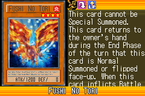](https://yugipedia.com/wiki/Fushi_No_Tori_(World_Championship_2006))|[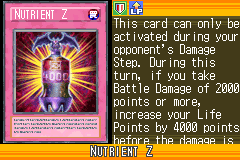](https://yugipedia.com/wiki/Nutrient_Z_(World_Championship_2006))|)|[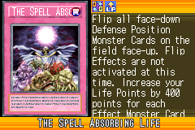](https://yugipedia.com/wiki/The_Spell_Absorbing_Life_(World_Championship_2006))|[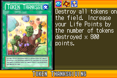](https://yugipedia.com/wiki/Token_Thanksgiving_(World_Championship_2006))|
|[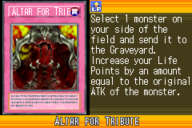](https://yugipedia.com/wiki/Altar_for_Tribute_(World_Championship_2006))|[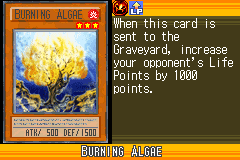](https://yugipedia.com/wiki/Burning_Algae_(World_Championship_2006))|[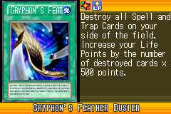](https://yugipedia.com/wiki/Gryphon%27s_Feather_Duster_(World_Championship_2006))|[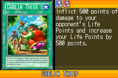](https://yugipedia.com/wiki/Goblin_Thief_(World_Championship_2006))|[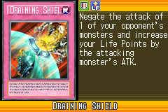](https://yugipedia.com/wiki/Draining_Shield_(World_Championship_2006))|
|)|[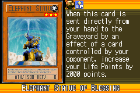](https://yugipedia.com/wiki/Elephant_Statue_of_Blessing_(World_Championship_2006))|[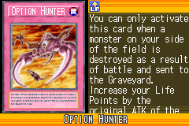](https://yugipedia.com/wiki/Option_Hunter_(World_Championship_2006))