# Special_Summon_Collection_A

|Ultra| | | | |
|---|---|---|---|---|
|[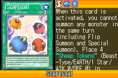](https://yugipedia.com/wiki/Scapegoat_(World_Championship_2006))|[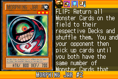](https://yugipedia.com/wiki/Morphing_Jar_2_(World_Championship_2006))|[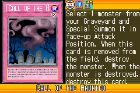](https://yugipedia.com/wiki/Call_of_the_Haunted_(World_Championship_2006))|)||

|Super| | | | |
|---|---|---|---|---|
|)|[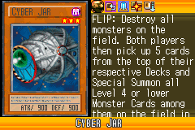](https://yugipedia.com/wiki/Cyber_Jar_(World_Championship_2006))|[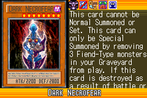](https://yugipedia.com/wiki/Dark_Necrofear_(World_Championship_2006))|)|)|
|[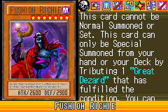](https://yugipedia.com/wiki/Fushioh_Richie_(World_Championship_2006))|)||||

|Rare| | | | |
|---|---|---|---|---|
|)|)|)|[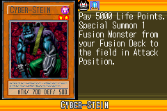](https://yugipedia.com/wiki/Cyber-Stein_(World_Championship_2006))|[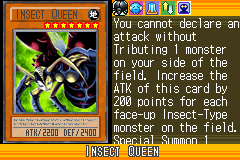](https://yugipedia.com/wiki/Insect_Queen_(World_Championship_2006))|
|)|)|[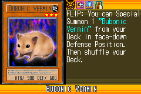](https://yugipedia.com/wiki/Bubonic_Vermin_(World_Championship_2006))|)|)|
|[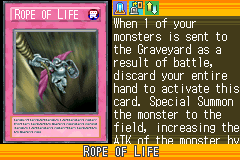](https://yugipedia.com/wiki/Rope_of_Life_(World_Championship_2006))|[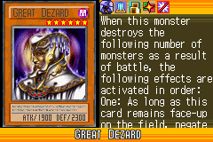](https://yugipedia.com/wiki/Great_Dezard_(World_Championship_2006))|)|||

|Common| | | | |
|---|---|---|---|---|
|[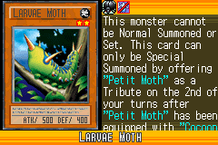](https://yugipedia.com/wiki/Larvae_Moth_(World_Championship_2006))|[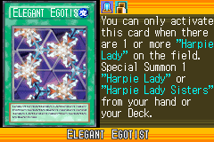](https://yugipedia.com/wiki/Elegant_Egotist_(World_Championship_2006))|)|)|)|
|)|)|)|)|)|
|)|)|[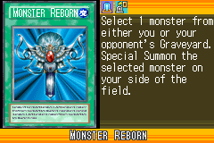](https://yugipedia.com/wiki/Monster_Reborn_(World_Championship_2006))|)|)|
|[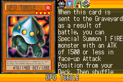](https://yugipedia.com/wiki/UFO_Turtle_(World_Championship_2006))|[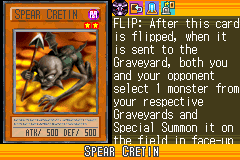](https://yugipedia.com/wiki/Spear_Cretin_(World_Championship_2006))|)|[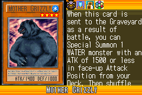](https://yugipedia.com/wiki/Mother_Grizzly_(World_Championship_2006))|[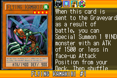](https://yugipedia.com/wiki/Flying_Kamakiri_1_(World_Championship_2006))|
|)|[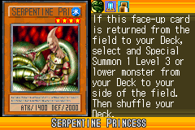](https://yugipedia.com/wiki/Serpentine_Princess_(World_Championship_2006))|)|[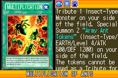](https://yugipedia.com/wiki/Multiplication_of_Ants_(World_Championship_2006))|[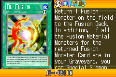](https://yugipedia.com/wiki/De-Fusion_(World_Championship_2006))|
|)|)|)|)|[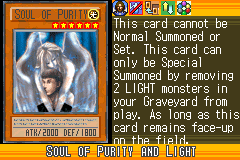](https://yugipedia.com/wiki/Soul_of_Purity_and_Light_(World_Championship_2006))|
|)|)|)|)|[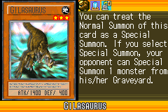](https://yugipedia.com/wiki/Gilasaurus_(World_Championship_2006))|
|[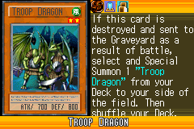](https://yugipedia.com/wiki/Troop_Dragon_(World_Championship_2006))|[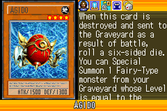](https://yugipedia.com/wiki/Agido_(World_Championship_2006))|)|[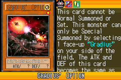](https://yugipedia.com/wiki/Gradius%27_Option_(World_Championship_2006))|[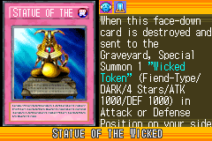](https://yugipedia.com/wiki/Statue_of_the_Wicked_(World_Championship_2006))|
|)|)|[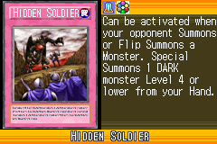](https://yugipedia.com/wiki/Hidden_Soldier_(World_Championship_2006))|[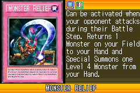](https://yugipedia.com/wiki/Monster_Relief_(World_Championship_2006))|[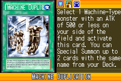](https://yugipedia.com/wiki/Machine_Duplication_(World_Championship_2006))|
|)|)|)|)|)|
|)|[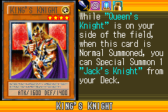](https://yugipedia.com/wiki/King%27s_Knight_(World_Championship_2006))|[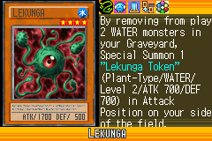](https://yugipedia.com/wiki/Lekunga_(World_Championship_2006))|)|)|
|)|)|)|)|)|
|)|)