# Special_Summon_Collection_B

|Secret| | | | |
|---|---|---|---|---|
|)|[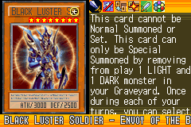](https://yugipedia.com/wiki/Black_Luster_Soldier_-_Envoy_of_the_Beginning_(World_Championship_2006))|[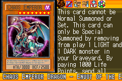](https://yugipedia.com/wiki/Chaos_Emperor_Dragon_-_Envoy_of_the_End_(World_Championship_2006))|||

|Ultra| | | | |
|---|---|---|---|---|
|[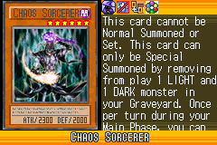](https://yugipedia.com/wiki/Chaos_Sorcerer_(World_Championship_2006))|[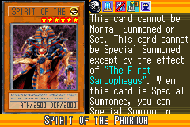](https://yugipedia.com/wiki/Spirit_of_the_Pharaoh_(World_Championship_2006))|[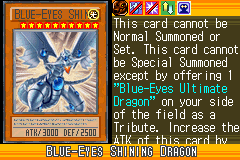](https://yugipedia.com/wiki/Blue-Eyes_Shining_Dragon_(World_Championship_2006))|[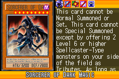](https://yugipedia.com/wiki/Sorcerer_of_Dark_Magic_(World_Championship_2006))||

|Super| | | | |
|---|---|---|---|---|
|[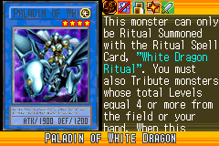](https://yugipedia.com/wiki/Paladin_of_White_Dragon_(World_Championship_2006))|[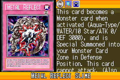](https://yugipedia.com/wiki/Metal_Reflect_Slime_(World_Championship_2006))|[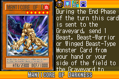](https://yugipedia.com/wiki/Manticore_of_Darkness_(World_Championship_2006))|[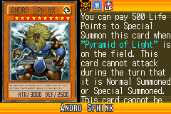](https://yugipedia.com/wiki/Andro_Sphinx_(World_Championship_2006))|[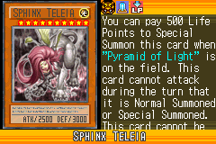](https://yugipedia.com/wiki/Sphinx_Teleia_(World_Championship_2006))|
|[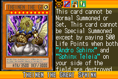](https://yugipedia.com/wiki/Theinen_the_Great_Sphinx_(World_Championship_2006))|[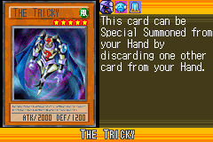](https://yugipedia.com/wiki/The_Tricky_(World_Championship_2006))||||

|Rare| | | | |
|---|---|---|---|---|
|[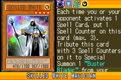](https://yugipedia.com/wiki/Skilled_White_Magician_(World_Championship_2006))|[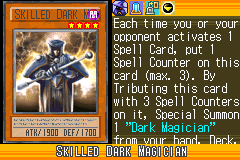](https://yugipedia.com/wiki/Skilled_Dark_Magician_(World_Championship_2006))|[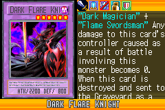](https://yugipedia.com/wiki/Dark_Flare_Knight_(World_Championship_2006))|[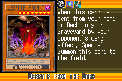](https://yugipedia.com/wiki/Despair_from_the_Dark_(World_Championship_2006))|[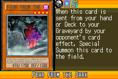](https://yugipedia.com/wiki/Fear_from_the_Dark_(World_Championship_2006))|
|[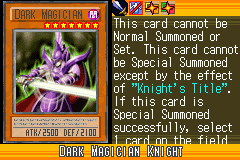](https://yugipedia.com/wiki/Dark_Magician_Knight_(World_Championship_2006))|[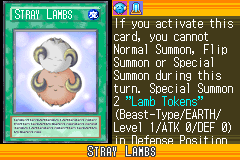](https://yugipedia.com/wiki/Stray_Lambs_(World_Championship_2006))|[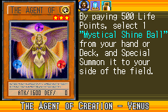](https://yugipedia.com/wiki/The_Agent_of_Creation_-_Venus_(World_Championship_2006))|[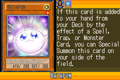](https://yugipedia.com/wiki/Watapon_(World_Championship_2006))|[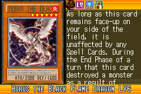](https://yugipedia.com/wiki/Horus_the_Black_Flame_Dragon_LV6_(World_Championship_2006))|
|[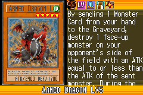](https://yugipedia.com/wiki/Armed_Dragon_LV5_(World_Championship_2006))|[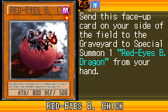](https://yugipedia.com/wiki/Red-Eyes_B._Chick_(World_Championship_2006))|[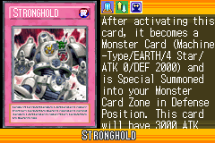](https://yugipedia.com/wiki/Stronghold_(World_Championship_2006))|)||

|Common| | | | |
|---|---|---|---|---|
|)|[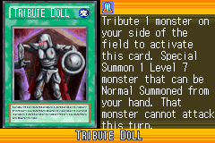](https://yugipedia.com/wiki/Tribute_Doll_(World_Championship_2006))|)|[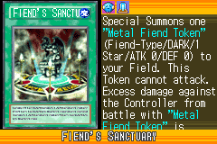](https://yugipedia.com/wiki/Fiend%27s_Sanctuary_(World_Championship_2006))|)|
|[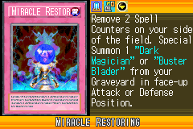](https://yugipedia.com/wiki/Miracle_Restoring_(World_Championship_2006))|)|[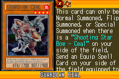](https://yugipedia.com/wiki/Guardian_Ceal_(World_Championship_2006))|[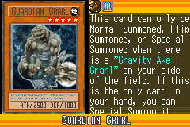](https://yugipedia.com/wiki/Guardian_Grarl_(World_Championship_2006))|[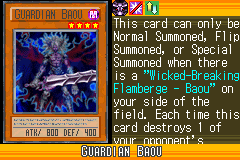](https://yugipedia.com/wiki/Guardian_Baou_(World_Championship_2006))|
|[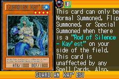](https://yugipedia.com/wiki/Guardian_Kay%27est_(World_Championship_2006))|[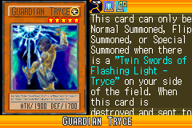](https://yugipedia.com/wiki/Guardian_Tryce_(World_Championship_2006))|)|[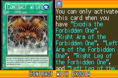](https://yugipedia.com/wiki/Contract_with_Exodia_(World_Championship_2006))|[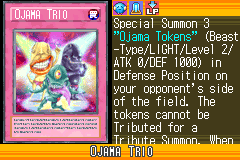](https://yugipedia.com/wiki/Ojama_Trio_(World_Championship_2006))|
|)|[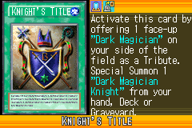](https://yugipedia.com/wiki/Knight%27s_Title_(World_Championship_2006))|)|[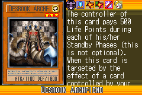](https://yugipedia.com/wiki/Desrook_Archfiend_(World_Championship_2006))|)|
|[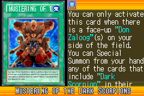](https://yugipedia.com/wiki/Mustering_of_the_Dark_Scorpions_(World_Championship_2006))|[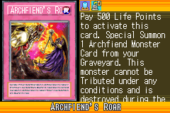](https://yugipedia.com/wiki/Archfiend%27s_Roar_(World_Championship_2006))|[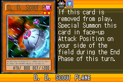](https://yugipedia.com/wiki/D._D._Scout_Plane_(World_Championship_2006))|)|[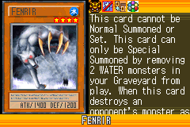](https://yugipedia.com/wiki/Fenrir_(World_Championship_2006))|
|[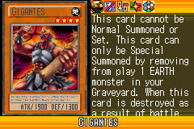](https://yugipedia.com/wiki/Gigantes_(World_Championship_2006))|[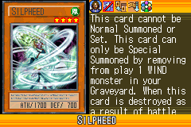](https://yugipedia.com/wiki/Silpheed_(World_Championship_2006))|[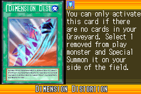](https://yugipedia.com/wiki/Dimension_Distortion_(World_Championship_2006))|[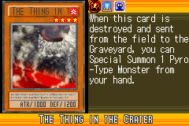](https://yugipedia.com/wiki/The_Thing_in_the_Crater_(World_Championship_2006))|[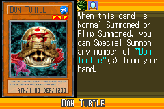](https://yugipedia.com/wiki/Don_Turtle_(World_Championship_2006))|
|[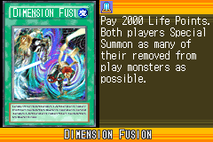](https://yugipedia.com/wiki/Dimension_Fusion_(World_Championship_2006))|)|[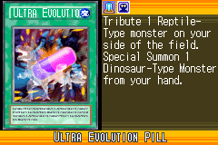](https://yugipedia.com/wiki/Ultra_Evolution_Pill_(World_Championship_2006))|[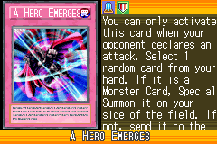](https://yugipedia.com/wiki/A_Hero_Emerges_(World_Championship_2006))|)|
|)|)|)|)|)|
|)|)|)|)|)|
|)|)|)|)|)|
|)|)|)|)|)|
|)|)