# Special_Summon_Collection_C

|Secret| | | | |
|---|---|---|---|---|
|[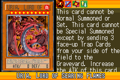](https://yugipedia.com/wiki/Uria,_Lord_of_Searing_Flames_(World_Championship_2006))|)|[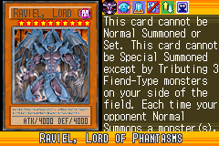](https://yugipedia.com/wiki/Raviel,_Lord_of_Phantasms_(World_Championship_2006))|||

|Ultra| | | | |
|---|---|---|---|---|
|)|)|)|)||

|Super| | | | |
|---|---|---|---|---|
|)|)|)|)|[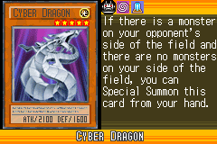](https://yugipedia.com/wiki/Cyber_Dragon_(World_Championship_2006))|
|)|)|)|)|)|
|)|||||

|Rare| | | | |
|---|---|---|---|---|
|[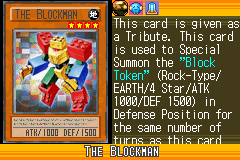](https://yugipedia.com/wiki/The_Blockman_(World_Championship_2006))|)|)|)|[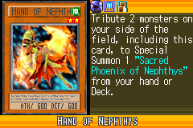](https://yugipedia.com/wiki/Hand_of_Nephthys_(World_Championship_2006))|
|[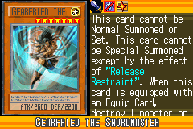](https://yugipedia.com/wiki/Gearfried_the_Swordmaster_(World_Championship_2006))|)|)|[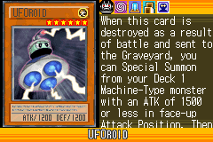](https://yugipedia.com/wiki/UFOroid_(World_Championship_2006))|)|
|[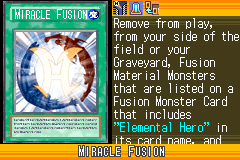](https://yugipedia.com/wiki/Miracle_Fusion_(World_Championship_2006))|)|)|)|[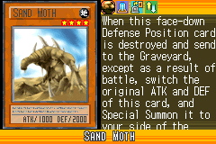](https://yugipedia.com/wiki/Sand_Moth_(World_Championship_2006))|

|Common| | | | |
|---|---|---|---|---|
|)|[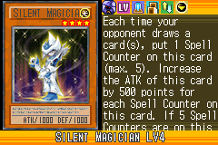](https://yugipedia.com/wiki/Silent_Magician_LV4_(World_Championship_2006))|)|[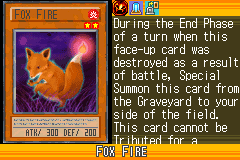](https://yugipedia.com/wiki/Fox_Fire_(World_Championship_2006))|)|
|)|)|)|)|)|
|)|)|)|)|)|
|)|[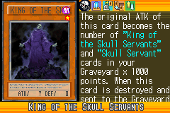](https://yugipedia.com/wiki/King_of_the_Skull_Servants_(World_Championship_2006))|)|)|)|
|)|[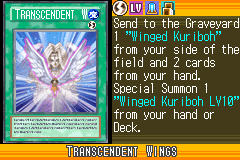](https://yugipedia.com/wiki/Transcendent_Wings_(World_Championship_2006))|)|)|)|
|)|[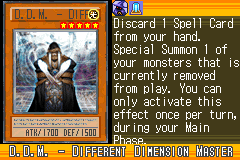](https://yugipedia.com/wiki/D.D.M._-_Different_Dimension_Master_(World_Championship_2006))|)|[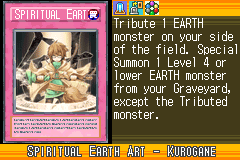](https://yugipedia.com/wiki/Spiritual_Earth_Art_-_Kurogane_(World_Championship_2006))|)|
|[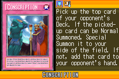](https://yugipedia.com/wiki/Conscription_(World_Championship_2006))|)|)|[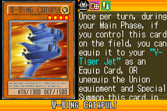](https://yugipedia.com/wiki/W-Wing_Catapult_(World_Championship_2006))|[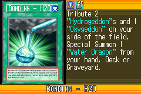](https://yugipedia.com/wiki/Bonding_-_H2O_(World_Championship_2006))|
|)|)|[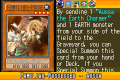](https://yugipedia.com/wiki/Familiar-Possessed_-_Aussa_(World_Championship_2006))|[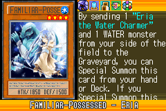](https://yugipedia.com/wiki/Familiar-Possessed_-_Eria_(World_Championship_2006))|)|
|[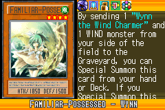](https://yugipedia.com/wiki/Familiar-Possessed_-_Wynn_(World_Championship_2006))|[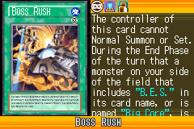](https://yugipedia.com/wiki/Boss_Rush_(World_Championship_2006))|)|[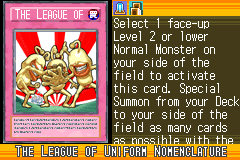](https://yugipedia.com/wiki/The_League_of_Uniform_Nomenclature_(World_Championship_2006))|)|
|)|)|)|)|)|
|[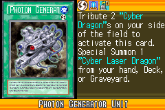](https://yugipedia.com/wiki/Photon_Generator_Unit_(World_Championship_2006))|[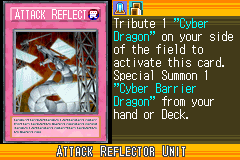](https://yugipedia.com/wiki/Attack_Reflector_Unit_(World_Championship_2006))|)|)|[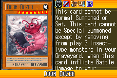](https://yugipedia.com/wiki/Doom_Dozer_(World_Championship_2006))|
|[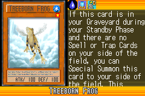](https://yugipedia.com/wiki/Treeborn_Frog_(World_Championship_2006))|[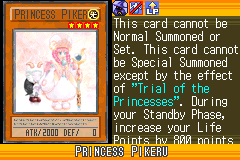](https://yugipedia.com/wiki/Princess_Pikeru_(World_Championship_2006))|[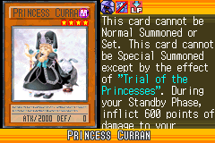](https://yugipedia.com/wiki/Princess_Curran_(World_Championship_2006))|)|)|
