# Equipment_Collection

|Secret| | | | |
|---|---|---|---|---|
|[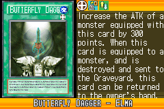](https://yugipedia.com/wiki/Butterfly_Dagger_-_Elma_(World_Championship_2006))|||||

|Ultra| | | | |
|---|---|---|---|---|
|)|)|[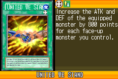](https://yugipedia.com/wiki/United_We_Stand_(World_Championship_2006))|)||

|Super| | | | |
|---|---|---|---|---|
|[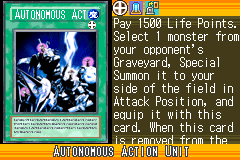](https://yugipedia.com/wiki/Autonomous_Action_Unit_(World_Championship_2006))|)|[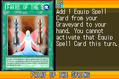](https://yugipedia.com/wiki/Fairy_of_the_Spring_(World_Championship_2006))|)|)|

|Rare| | | | |
|---|---|---|---|---|
|[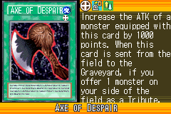](https://yugipedia.com/wiki/Axe_of_Despair_(World_Championship_2006))|)|[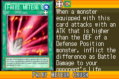](https://yugipedia.com/wiki/Fairy_Meteor_Crush_(World_Championship_2006))|[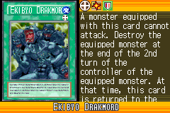](https://yugipedia.com/wiki/Ekibyo_Drakmord_(World_Championship_2006))|[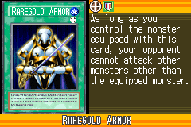](https://yugipedia.com/wiki/Raregold_Armor_(World_Championship_2006))|
|[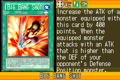](https://yugipedia.com/wiki/Big_Bang_Shot_(World_Championship_2006))|[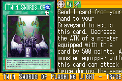](https://yugipedia.com/wiki/Twin_Swords_of_Flashing_Light_-_Tryce_(World_Championship_2006))|)|[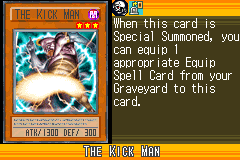](https://yugipedia.com/wiki/The_Kick_Man_(World_Championship_2006))|)|
|)|)|)|)||

|Common| | | | |
|---|---|---|---|---|
|)|)|[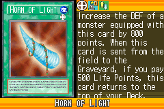](https://yugipedia.com/wiki/Horn_of_Light_(World_Championship_2006))|[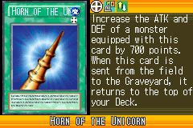](https://yugipedia.com/wiki/Horn_of_the_Unicorn_(World_Championship_2006))|[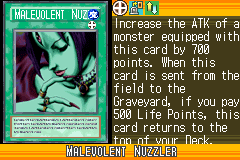](https://yugipedia.com/wiki/Malevolent_Nuzzler_(World_Championship_2006))|
|)|)|)|)|)|
|[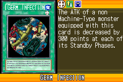](https://yugipedia.com/wiki/Germ_Infection_(World_Championship_2006))|)|[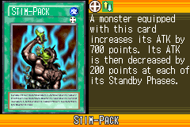](https://yugipedia.com/wiki/Stim-Pack_(World_Championship_2006))|)|)|
|[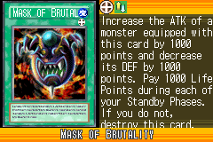](https://yugipedia.com/wiki/Mask_of_Brutality_(World_Championship_2006))|)|[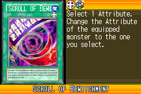](https://yugipedia.com/wiki/Scroll_of_Bewitchment_(World_Championship_2006))|[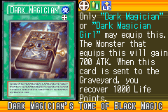](https://yugipedia.com/wiki/Dark_Magician%27s_Tome_of_Black_Magic_(World_Championship_2006))|)|
|[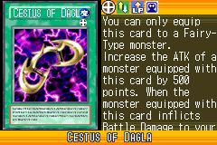](https://yugipedia.com/wiki/Cestus_of_Dagla_(World_Championship_2006))|)|[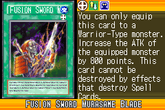](https://yugipedia.com/wiki/Fusion_Sword_Murasame_Blade_(World_Championship_2006))|)|)|
|)|)|)|[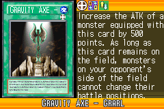](https://yugipedia.com/wiki/Gravity_Axe_-_Grarl_(World_Championship_2006))|)|
|)|)|)|)|[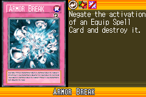](https://yugipedia.com/wiki/Armor_Break_(World_Championship_2006))|
|[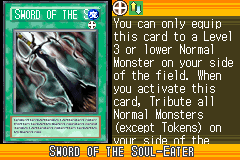](https://yugipedia.com/wiki/Sword_of_the_Soul-Eater_(World_Championship_2006))|[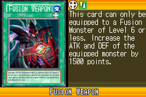](https://yugipedia.com/wiki/Fusion_Weapon_(World_Championship_2006))|)|[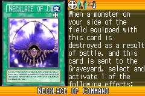](https://yugipedia.com/wiki/Necklace_of_Command_(World_Championship_2006))|)|
|)|)|)|)|)|
|)|[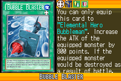](https://yugipedia.com/wiki/Bubble_Blaster_(World_Championship_2006))|[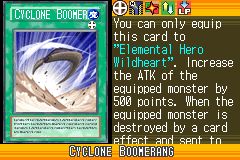](https://yugipedia.com/wiki/Cyclone_Boomerang_(World_Championship_2006))|[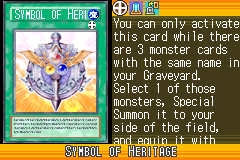](https://yugipedia.com/wiki/Symbol_of_Heritage_(World_Championship_2006))|[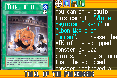](https://yugipedia.com/wiki/Trial_of_the_Princesses_(World_Championship_2006))|
