# Trap_A

|Secret| | | | |
|---|---|---|---|---|
|[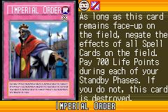](https://yugipedia.com/wiki/Imperial_Order_(World_Championship_2006))|[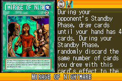](https://yugipedia.com/wiki/Mirage_of_Nightmare_(World_Championship_2006))||||

|Ultra| | | | |
|---|---|---|---|---|
|)|[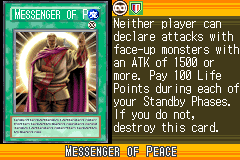](https://yugipedia.com/wiki/Messenger_of_Peace_(World_Championship_2006))|[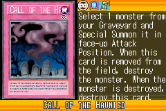](https://yugipedia.com/wiki/Call_of_the_Haunted_(World_Championship_2006))|)||

|Super| | | | |
|---|---|---|---|---|
|[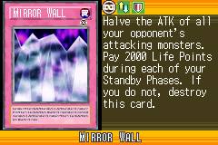](https://yugipedia.com/wiki/Mirror_Wall_(World_Championship_2006))|)|[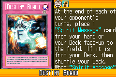](https://yugipedia.com/wiki/Destiny_Board_(World_Championship_2006))|[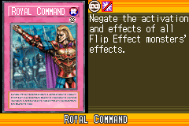](https://yugipedia.com/wiki/Royal_Command_(World_Championship_2006))|[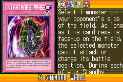](https://yugipedia.com/wiki/Nightmare_Wheel_(World_Championship_2006))|
|)|||||

|Rare| | | | |
|---|---|---|---|---|
|[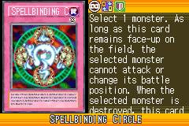](https://yugipedia.com/wiki/Spellbinding_Circle_(World_Championship_2006))|[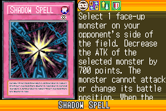](https://yugipedia.com/wiki/Shadow_Spell_(World_Championship_2006))|[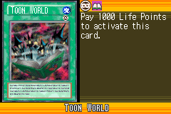](https://yugipedia.com/wiki/Toon_World_(World_Championship_2006))|[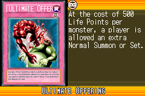](https://yugipedia.com/wiki/Ultimate_Offering_(World_Championship_2006))|[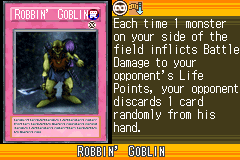](https://yugipedia.com/wiki/Robbin%27_Goblin_(World_Championship_2006))|
|[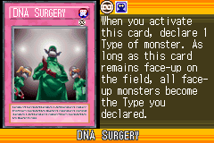](https://yugipedia.com/wiki/DNA_Surgery_(World_Championship_2006))|[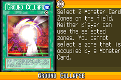](https://yugipedia.com/wiki/Ground_Collapse_(World_Championship_2006))|[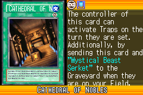](https://yugipedia.com/wiki/Cathedral_of_Nobles_(World_Championship_2006))|[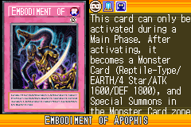](https://yugipedia.com/wiki/Embodiment_of_Apophis_(World_Championship_2006))|[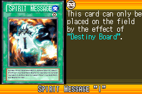](https://yugipedia.com/wiki/Spirit_Message_%22I%22_(World_Championship_2006))|
|[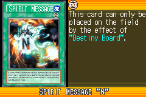](https://yugipedia.com/wiki/Spirit_Message_%22N%22_(World_Championship_2006))|[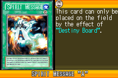](https://yugipedia.com/wiki/Spirit_Message_%22A%22_(World_Championship_2006))|)|[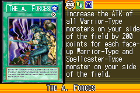](https://yugipedia.com/wiki/The_A._Forces_(World_Championship_2006))|[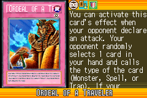](https://yugipedia.com/wiki/Ordeal_of_a_Traveler_(World_Championship_2006))|

|Common| | | | |
|---|---|---|---|---|
|[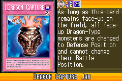](https://yugipedia.com/wiki/Dragon_Capture_Jar_(World_Championship_2006))|[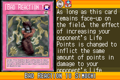](https://yugipedia.com/wiki/Bad_Reaction_to_Simochi_(World_Championship_2006))|[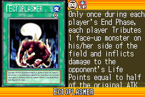](https://yugipedia.com/wiki/Ectoplasmer_(World_Championship_2006))|[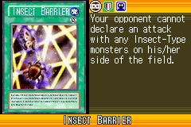](https://yugipedia.com/wiki/Insect_Barrier_(World_Championship_2006))|[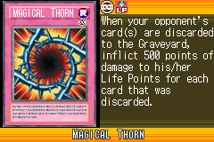](https://yugipedia.com/wiki/Magical_Thorn_(World_Championship_2006))|
|[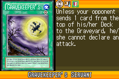](https://yugipedia.com/wiki/Gravekeeper%27s_Servant_(World_Championship_2006))|[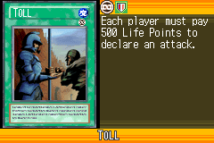](https://yugipedia.com/wiki/Toll_(World_Championship_2006))|[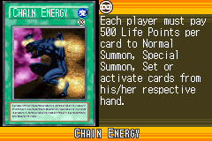](https://yugipedia.com/wiki/Chain_Energy_(World_Championship_2006))|[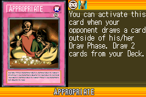](https://yugipedia.com/wiki/Appropriate_(World_Championship_2006))|[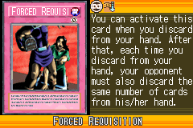](https://yugipedia.com/wiki/Forced_Requisition_(World_Championship_2006))|
|[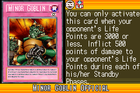](https://yugipedia.com/wiki/Minor_Goblin_Official_(World_Championship_2006))|[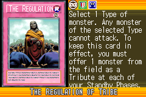](https://yugipedia.com/wiki/The_Regulation_of_Tribe_(World_Championship_2006))|[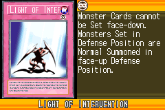](https://yugipedia.com/wiki/Light_of_Intervention_(World_Championship_2006))|[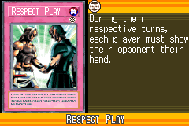](https://yugipedia.com/wiki/Respect_Play_(World_Championship_2006))|[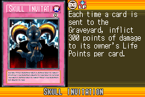](https://yugipedia.com/wiki/Skull_Invitation_(World_Championship_2006))|
|[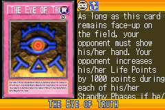](https://yugipedia.com/wiki/The_Eye_of_Truth_(World_Championship_2006))|[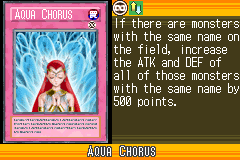](https://yugipedia.com/wiki/Aqua_Chorus_(World_Championship_2006))|[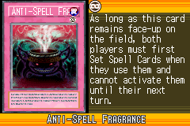](https://yugipedia.com/wiki/Anti-Spell_Fragrance_(World_Championship_2006))|[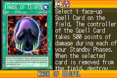](https://yugipedia.com/wiki/Mask_of_Dispel_(World_Championship_2006))|[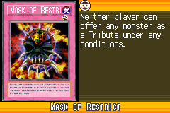](https://yugipedia.com/wiki/Mask_of_Restrict_(World_Championship_2006))|
|[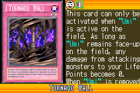](https://yugipedia.com/wiki/Tornado_Wall_(World_Championship_2006))|[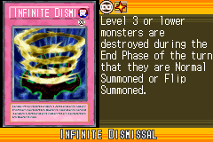](https://yugipedia.com/wiki/Infinite_Dismissal_(World_Championship_2006))|[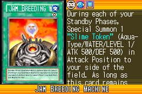](https://yugipedia.com/wiki/Jam_Breeding_Machine_(World_Championship_2006))|[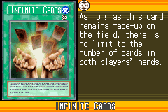](https://yugipedia.com/wiki/Infinite_Cards_(World_Championship_2006))|[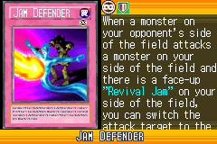](https://yugipedia.com/wiki/Jam_Defender_(World_Championship_2006))|
|[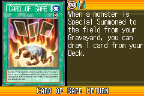](https://yugipedia.com/wiki/Card_of_Safe_Return_(World_Championship_2006))|)|[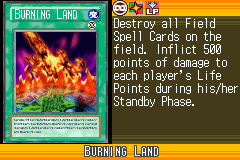](https://yugipedia.com/wiki/Burning_Land_(World_Championship_2006))|[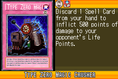](https://yugipedia.com/wiki/Type_Zero_Magic_Crusher_(World_Championship_2006))|)|
|)|)|)|)|)|
|)|)|)|)|)|
|)|)|)|)|)|
|)|)