# Trap_B

|Secret| | | | |
|---|---|---|---|---|
|[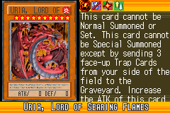](https://yugipedia.com/wiki/Uria,_Lord_of_Searing_Flames_(World_Championship_2006))|)||||

|Ultra| | | | |
|---|---|---|---|---|
|)|[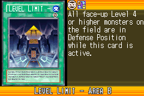](https://yugipedia.com/wiki/Level_Limit_-_Area_B_(World_Championship_2006))|[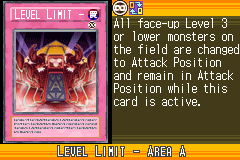](https://yugipedia.com/wiki/Level_Limit_-_Area_A_(World_Championship_2006))|||

|Super| | | | |
|---|---|---|---|---|
|)|)|[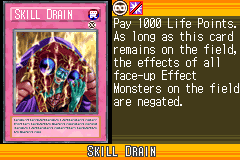](https://yugipedia.com/wiki/Skill_Drain_(World_Championship_2006))|[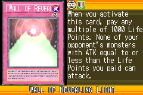](https://yugipedia.com/wiki/Wall_of_Revealing_Light_(World_Championship_2006))|[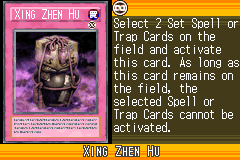](https://yugipedia.com/wiki/Xing_Zhen_Hu_(World_Championship_2006))|
|[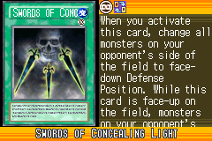](https://yugipedia.com/wiki/Swords_of_Concealing_Light_(World_Championship_2006))|||||

|Rare| | | | |
|---|---|---|---|---|
|)|)|)|[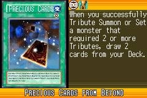](https://yugipedia.com/wiki/Precious_Cards_from_Beyond_(World_Championship_2006))|[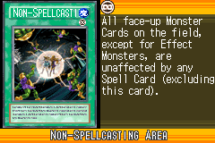](https://yugipedia.com/wiki/Non-Spellcasting_Area_(World_Championship_2006))|
|[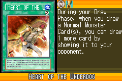](https://yugipedia.com/wiki/Heart_of_the_Underdog_(World_Championship_2006))|[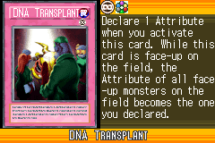](https://yugipedia.com/wiki/DNA_Transplant_(World_Championship_2006))|)|[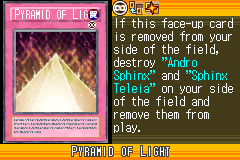](https://yugipedia.com/wiki/Pyramid_of_Light_(World_Championship_2006))|[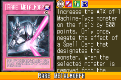](https://yugipedia.com/wiki/Rare_Metalmorph_(World_Championship_2006))|
|[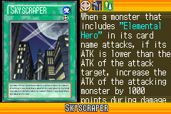](https://yugipedia.com/wiki/Skyscraper_(World_Championship_2006))|[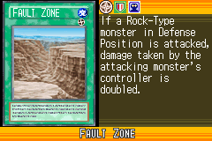](https://yugipedia.com/wiki/Fault_Zone_(World_Championship_2006))||||

|Common| | | | |
|---|---|---|---|---|
|[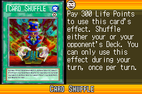](https://yugipedia.com/wiki/Card_Shuffle_(World_Championship_2006))|)|[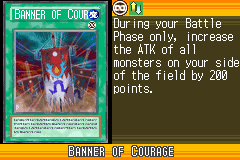](https://yugipedia.com/wiki/Banner_of_Courage_(World_Championship_2006))|)|)|
|[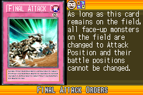](https://yugipedia.com/wiki/Final_Attack_Orders_(World_Championship_2006))|)|)|[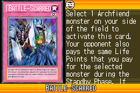](https://yugipedia.com/wiki/Battle-Scarred_(World_Championship_2006))|[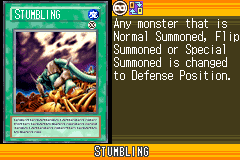](https://yugipedia.com/wiki/Stumbling_(World_Championship_2006))|
|[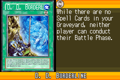](https://yugipedia.com/wiki/D._D._Borderline_(World_Championship_2006))|[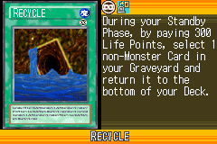](https://yugipedia.com/wiki/Recycle_(World_Championship_2006))|)|[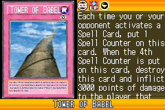](https://yugipedia.com/wiki/Tower_of_Babel_(World_Championship_2006))|[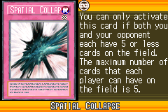](https://yugipedia.com/wiki/Spatial_Collapse_(World_Championship_2006))|
|[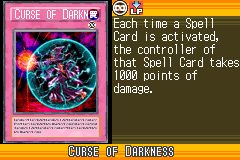](https://yugipedia.com/wiki/Curse_of_Darkness_(World_Championship_2006))|[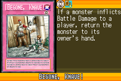](https://yugipedia.com/wiki/Begone,_Knave!_(World_Championship_2006))|)|[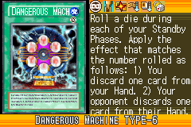](https://yugipedia.com/wiki/Dangerous_Machine_TYPE-6_(World_Championship_2006))|)|
|)|[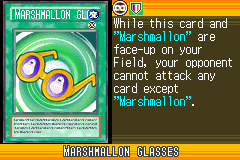](https://yugipedia.com/wiki/Marshmallon_glasses_(World_Championship_2006))|[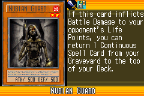](https://yugipedia.com/wiki/Nubian_Guard_(World_Championship_2006))|[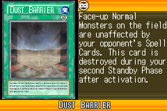](https://yugipedia.com/wiki/Dust_Barrier_(World_Championship_2006))|[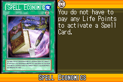](https://yugipedia.com/wiki/Spell_Economics_(World_Championship_2006))|
|)|[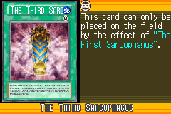](https://yugipedia.com/wiki/The_Third_Sarcophagus_(World_Championship_2006))|[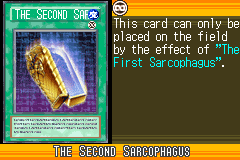](https://yugipedia.com/wiki/The_Second_Sarcophagus_(World_Championship_2006))|)|)|
|)|)|)|)|[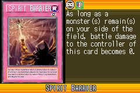](https://yugipedia.com/wiki/Spirit_Barrier_(World_Championship_2006))|
|[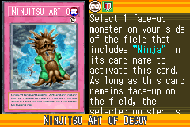](https://yugipedia.com/wiki/Ninjitsu_Art_of_Decoy_(World_Championship_2006))|[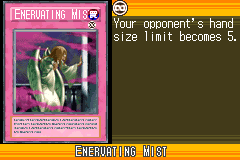](https://yugipedia.com/wiki/Enervating_Mist_(World_Championship_2006))|[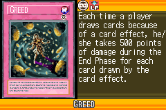](https://yugipedia.com/wiki/Greed_(World_Championship_2006))|)|[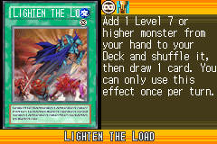](https://yugipedia.com/wiki/Lighten_the_Load_(World_Championship_2006))|
|)|)|[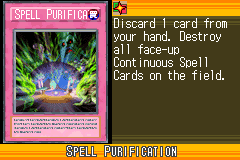](https://yugipedia.com/wiki/Spell_Purification_(World_Championship_2006))|)|)|
|)|[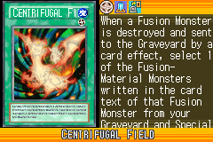](https://yugipedia.com/wiki/Centrifugal_Field_(World_Championship_2006))|[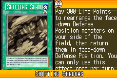](https://yugipedia.com/wiki/Shifting_Shadows_(World_Championship_2006))|[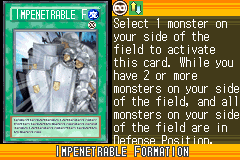](https://yugipedia.com/wiki/Impenetrable_Formation_(World_Championship_2006))|)|
|)|[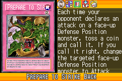](https://yugipedia.com/wiki/Prepare_to_Strike_Back_(World_Championship_2006))|[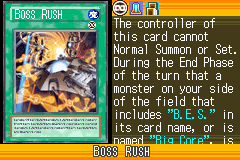](https://yugipedia.com/wiki/Boss_Rush_(World_Championship_2006))|[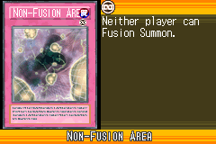](https://yugipedia.com/wiki/Non-Fusion_Area_(World_Championship_2006))|[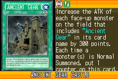](https://yugipedia.com/wiki/Ancient_Gear_Castle_(World_Championship_2006))|
|[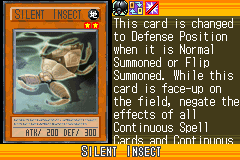](https://yugipedia.com/wiki/Silent_Insect_(World_Championship_2006))|[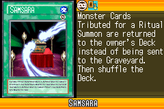](https://yugipedia.com/wiki/Samsara_(World_Championship_2006))