# Counter_Collection

|Ultra| | | | |
|---|---|---|---|---|
|[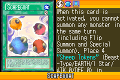](https://yugipedia.com/wiki/Scapegoat_(World_Championship_2006))|[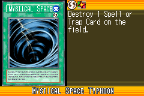](https://yugipedia.com/wiki/Mystical_Space_Typhoon_(World_Championship_2006))|)|)|[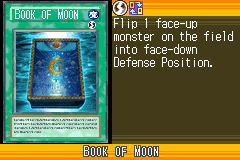](https://yugipedia.com/wiki/Book_of_Moon_(World_Championship_2006))|

|Super| | | | |
|---|---|---|---|---|
|[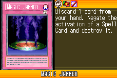](https://yugipedia.com/wiki/Magic_Jammer_(World_Championship_2006))|[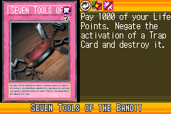](https://yugipedia.com/wiki/Seven_Tools_of_the_Bandit_(World_Championship_2006))|[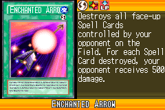](https://yugipedia.com/wiki/Enchanted_Arrow_(World_Championship_2006))|[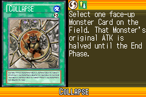](https://yugipedia.com/wiki/Collapse_(World_Championship_2006))|[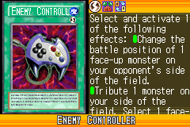](https://yugipedia.com/wiki/Enemy_Controller_(World_Championship_2006))|
|[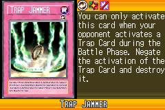](https://yugipedia.com/wiki/Trap_Jammer_(World_Championship_2006))|[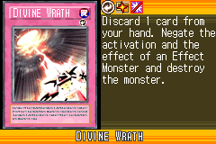](https://yugipedia.com/wiki/Divine_Wrath_(World_Championship_2006))||||

|Rare| | | | |
|---|---|---|---|---|
|[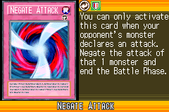](https://yugipedia.com/wiki/Negate_Attack_(World_Championship_2006))|[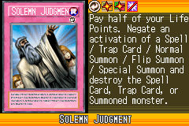](https://yugipedia.com/wiki/Solemn_Judgment_(World_Championship_2006))|)|[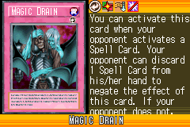](https://yugipedia.com/wiki/Magic_Drain_(World_Championship_2006))|)|
|[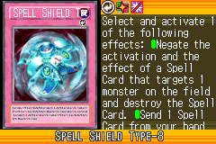](https://yugipedia.com/wiki/Spell_Shield_Type-8_(World_Championship_2006))|[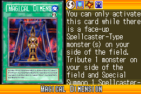](https://yugipedia.com/wiki/Magical_Dimension_(World_Championship_2006))|[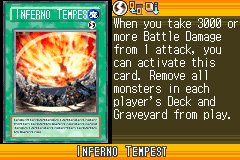](https://yugipedia.com/wiki/Inferno_Tempest_(World_Championship_2006))|)|[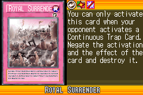](https://yugipedia.com/wiki/Royal_Surrender_(World_Championship_2006))|
|[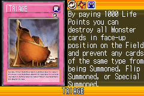](https://yugipedia.com/wiki/Triage_(World_Championship_2006))|[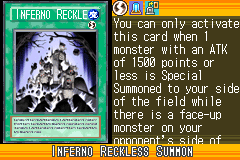](https://yugipedia.com/wiki/Inferno_Reckless_Summon_(World_Championship_2006))|[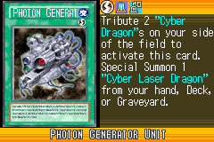](https://yugipedia.com/wiki/Photon_Generator_Unit_(World_Championship_2006))|[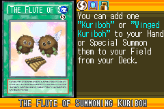](https://yugipedia.com/wiki/The_Flute_of_Summoning_Kuriboh_(World_Championship_2006))||

|Common| | | | |
|---|---|---|---|---|
|[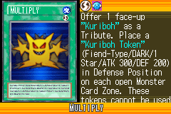](https://yugipedia.com/wiki/Multiply_(World_Championship_2006))|[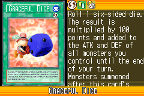](https://yugipedia.com/wiki/Graceful_Dice_(World_Championship_2006))|[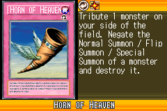](https://yugipedia.com/wiki/Horn_of_Heaven_(World_Championship_2006))|[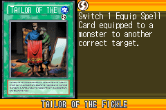](https://yugipedia.com/wiki/Tailor_of_the_Fickle_(World_Championship_2006))|[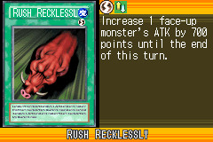](https://yugipedia.com/wiki/Rush_Recklessly_(World_Championship_2006))|
|)|)|[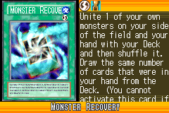](https://yugipedia.com/wiki/Monster_Recovery_(World_Championship_2006))|[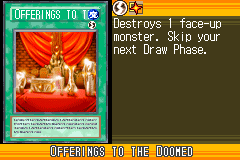](https://yugipedia.com/wiki/Offerings_to_the_Doomed_(World_Championship_2006))|[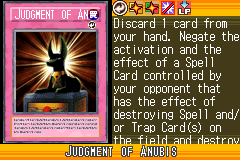](https://yugipedia.com/wiki/Judgment_of_Anubis_(World_Championship_2006))|
|[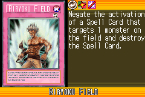](https://yugipedia.com/wiki/Riryoku_Field_(World_Championship_2006))|[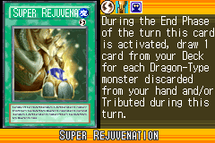](https://yugipedia.com/wiki/Super_Rejuvenation_(World_Championship_2006))|[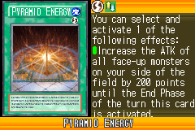](https://yugipedia.com/wiki/Pyramid_Energy_(World_Championship_2006))|[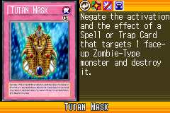](https://yugipedia.com/wiki/Tutan_Mask_(World_Championship_2006))|[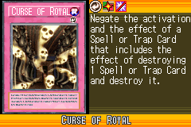](https://yugipedia.com/wiki/Curse_of_Royal_(World_Championship_2006))|
|[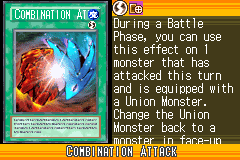](https://yugipedia.com/wiki/Combination_Attack_(World_Championship_2006))|[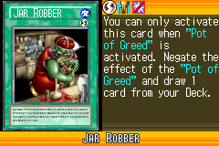](https://yugipedia.com/wiki/Jar_Robber_(World_Championship_2006))|[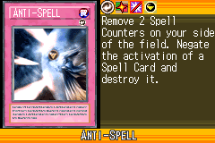](https://yugipedia.com/wiki/Anti-Spell_(World_Championship_2006))|[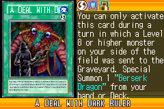](https://yugipedia.com/wiki/A_Deal_with_Dark_Ruler_(World_Championship_2006))|[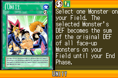](https://yugipedia.com/wiki/Unity_(World_Championship_2006))|
|[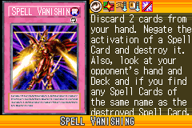](https://yugipedia.com/wiki/Spell_Vanishing_(World_Championship_2006))|[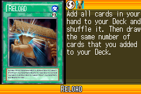](https://yugipedia.com/wiki/Reload_(World_Championship_2006))|[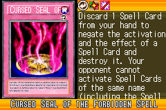](https://yugipedia.com/wiki/Cursed_Seal_of_the_Forbidden_Spell_(World_Championship_2006))|[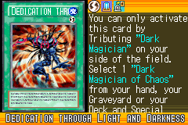](https://yugipedia.com/wiki/Dedication_through_Light_and_Darkness_(World_Championship_2006))|)|
|[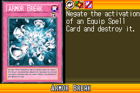](https://yugipedia.com/wiki/Armor_Break_(World_Championship_2006))|[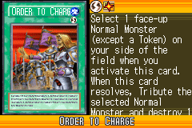](https://yugipedia.com/wiki/Order_to_Charge_(World_Championship_2006))|)|[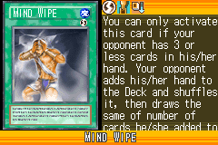](https://yugipedia.com/wiki/Mind_Wipe_(World_Championship_2006))|[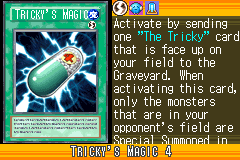](https://yugipedia.com/wiki/Tricky%27s_Magic_4_(World_Championship_2006))|
|[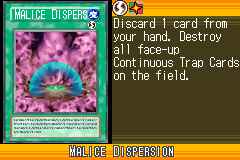](https://yugipedia.com/wiki/Malice_Dispersion_(World_Championship_2006))|[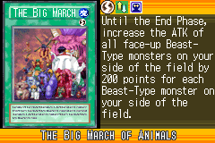](https://yugipedia.com/wiki/The_Big_March_of_Animals_(World_Championship_2006))|[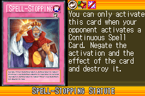](https://yugipedia.com/wiki/Spell-Stopping_Statute_(World_Championship_2006))|)|)|
|)|)|)|)|)|
