# Direct_Damage_Collection

|Secret| | | | |
|---|---|---|---|---|
|)|[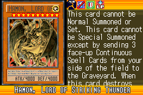](https://yugipedia.com/wiki/Hamon,_Lord_of_Striking_Thunder_(World_Championship_2006))||||

|Ultra| | | | |
|---|---|---|---|---|
|[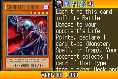](https://yugipedia.com/wiki/Vampire_Lord_(World_Championship_2006))|[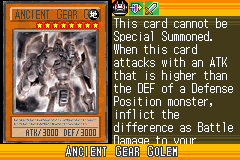](https://yugipedia.com/wiki/Ancient_Gear_Golem_(World_Championship_2006))|[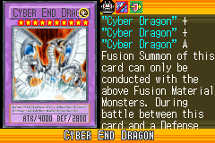](https://yugipedia.com/wiki/Cyber_End_Dragon_(World_Championship_2006))|[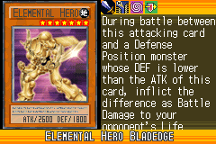](https://yugipedia.com/wiki/Elemental_Hero_Bladedge_(World_Championship_2006))||

|Super| | | | |
|---|---|---|---|---|
|[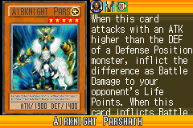](https://yugipedia.com/wiki/Airknight_Parshath_(World_Championship_2006))|[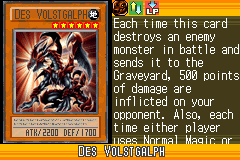](https://yugipedia.com/wiki/Des_Volstgalph_(World_Championship_2006))|)|[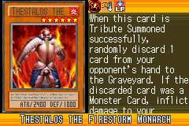](https://yugipedia.com/wiki/Thestalos_the_Firestorm_Monarch_(World_Championship_2006))|[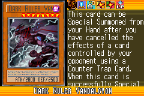](https://yugipedia.com/wiki/Dark_Ruler_Vandalgyon_(World_Championship_2006))|
|[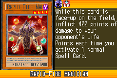](https://yugipedia.com/wiki/Rapid-Fire_Magician_(World_Championship_2006))|[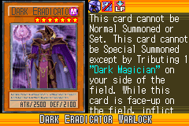](https://yugipedia.com/wiki/Dark_Eradicator_Warlock_(World_Championship_2006))||||

|Rare| | | | |
|---|---|---|---|---|
|[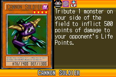](https://yugipedia.com/wiki/Cannon_Soldier_(World_Championship_2006))|)|)|)|)|
|)|[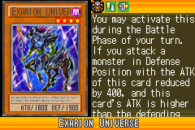](https://yugipedia.com/wiki/Exarion_Universe_(World_Championship_2006))|[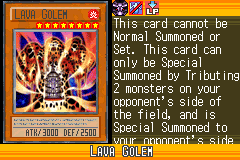](https://yugipedia.com/wiki/Lava_Golem_(World_Championship_2006))|[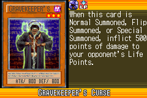](https://yugipedia.com/wiki/Gravekeeper%27s_Curse_(World_Championship_2006))|[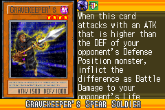](https://yugipedia.com/wiki/Gravekeeper%27s_Spear_Soldier_(World_Championship_2006))|
|[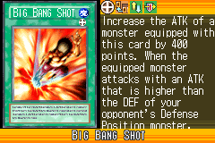](https://yugipedia.com/wiki/Big_Bang_Shot_(World_Championship_2006))|[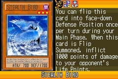](https://yugipedia.com/wiki/Stealth_Bird_(World_Championship_2006))|[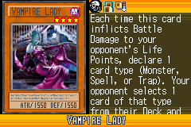](https://yugipedia.com/wiki/Vampire_Lady_(World_Championship_2006))|)|)|

|Common| | | | |
|---|---|---|---|---|
|)|[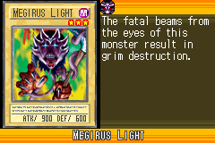](https://yugipedia.com/wiki/Megirus_Light_(World_Championship_2006))|[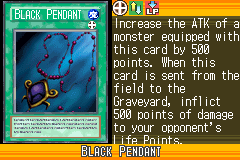](https://yugipedia.com/wiki/Black_Pendant_(World_Championship_2006))|[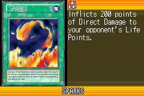](https://yugipedia.com/wiki/Sparks_(World_Championship_2006))|[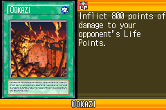](https://yugipedia.com/wiki/Ookazi_(World_Championship_2006))|
|)|[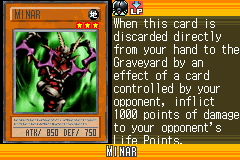](https://yugipedia.com/wiki/Minar_(World_Championship_2006))|)|)|[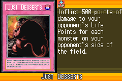](https://yugipedia.com/wiki/Just_Desserts_(World_Championship_2006))|
|[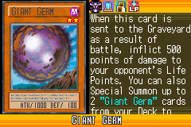](https://yugipedia.com/wiki/Giant_Germ_(World_Championship_2006))|)|)|)|[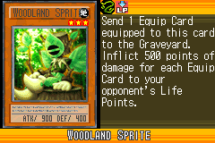](https://yugipedia.com/wiki/Woodland_Sprite_(World_Championship_2006))|
|)|)|)|)|)|
|)|)|[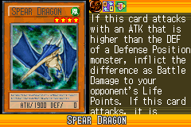](https://yugipedia.com/wiki/Spear_Dragon_(World_Championship_2006))|[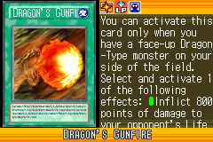](https://yugipedia.com/wiki/Dragon%27s_Gunfire_(World_Championship_2006))|[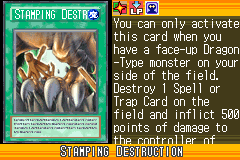](https://yugipedia.com/wiki/Stamping_Destruction_(World_Championship_2006))|
|)|[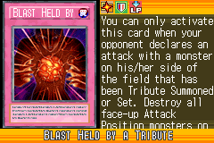](https://yugipedia.com/wiki/Blast_Held_by_a_Tribute_(World_Championship_2006))|[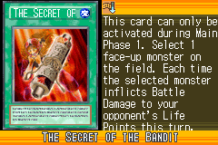](https://yugipedia.com/wiki/The_Secret_of_the_Bandit_(World_Championship_2006))|)|)|
|)|[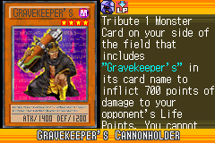](https://yugipedia.com/wiki/Gravekeeper%27s_Cannonholder_(World_Championship_2006))|)|)|[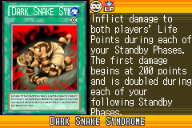](https://yugipedia.com/wiki/Dark_Snake_Syndrome_(World_Championship_2006))|
|[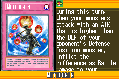](https://yugipedia.com/wiki/Meteorain_(World_Championship_2006))|)|[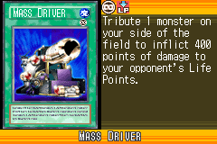](https://yugipedia.com/wiki/Mass_Driver_(World_Championship_2006))|[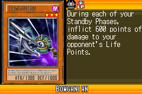](https://yugipedia.com/wiki/Bowganian_(World_Championship_2006))|[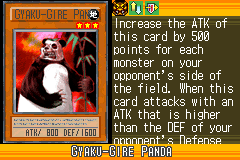](https://yugipedia.com/wiki/Gyaku-Gire_Panda_(World_Championship_2006))|
|[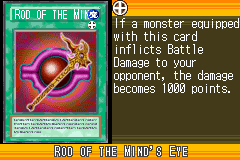](https://yugipedia.com/wiki/Rod_of_the_Mind%27s_Eye_(World_Championship_2006))|[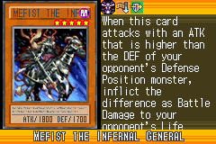](https://yugipedia.com/wiki/Mefist_the_Infernal_General_(World_Championship_2006))|)|[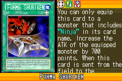](https://yugipedia.com/wiki/Fuhma_Shuriken_(World_Championship_2006))|[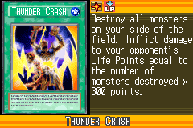](https://yugipedia.com/wiki/Thunder_Crash_(World_Championship_2006))|
|[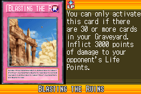](https://yugipedia.com/wiki/Blasting_the_Ruins_(World_Championship_2006))|[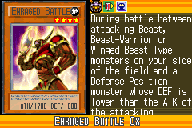](https://yugipedia.com/wiki/Enraged_Battle_Ox_(World_Championship_2006))|[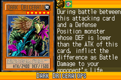](https://yugipedia.com/wiki/Dark_Driceratops_(World_Championship_2006))|[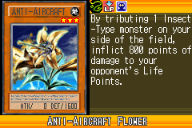](https://yugipedia.com/wiki/Anti-Aircraft_Flower_(World_Championship_2006))|[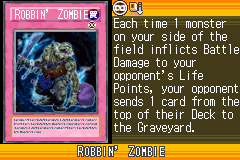](https://yugipedia.com/wiki/Robbin%27_Zombie_(World_Championship_2006))|
|[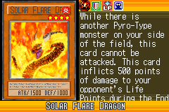](https://yugipedia.com/wiki/Solar_Flare_Dragon_(World_Championship_2006))|[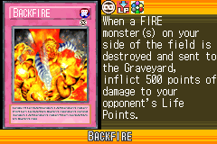](https://yugipedia.com/wiki/Backfire_(World_Championship_2006))|[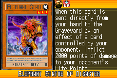](https://yugipedia.com/wiki/Elephant_Statue_of_Disaster_(World_Championship_2006))|)|)|
|)|)|)|)|)|
|)|)|)|)|)|
|)|)|)|)|)|
|)|)|)|)|)|
|)|)|)|)