# Direct_Attack_Collection

|Secret| | | | |
|---|---|---|---|---|
|[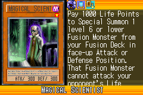](https://yugipedia.com/wiki/Magical_Scientist_(World_Championship_2006))|||||

|Ultra| | | | |
|---|---|---|---|---|
|[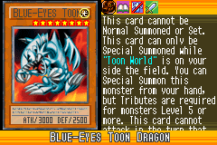](https://yugipedia.com/wiki/Blue-Eyes_Toon_Dragon_(World_Championship_2006))|[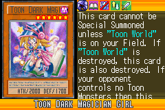](https://yugipedia.com/wiki/Toon_Dark_Magician_Girl_(World_Championship_2006))|[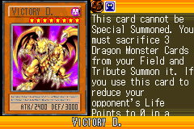](https://yugipedia.com/wiki/Victory_D._(World_Championship_2006))|[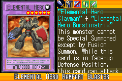](https://yugipedia.com/wiki/Elemental_Hero_Rampart_Blaster_(World_Championship_2006))||

|Super| | | | |
|---|---|---|---|---|
|[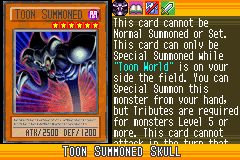](https://yugipedia.com/wiki/Toon_Summoned_Skull_(World_Championship_2006))|[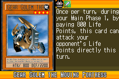](https://yugipedia.com/wiki/Gear_Golem_the_Moving_Fortress_(World_Championship_2006))|[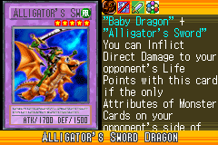](https://yugipedia.com/wiki/Alligator%27s_Sword_Dragon_(World_Championship_2006))|[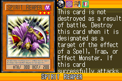](https://yugipedia.com/wiki/Spirit_Reaper_(World_Championship_2006))|[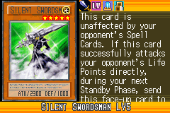](https://yugipedia.com/wiki/Silent_Swordsman_LV5_(World_Championship_2006))|
|[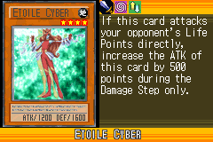](https://yugipedia.com/wiki/Etoile_Cyber_(World_Championship_2006))|||||

|Rare| | | | |
|---|---|---|---|---|
|[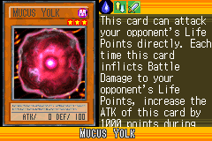](https://yugipedia.com/wiki/Mucus_Yolk_(World_Championship_2006))|[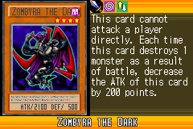](https://yugipedia.com/wiki/Zombyra_the_Dark_(World_Championship_2006))|[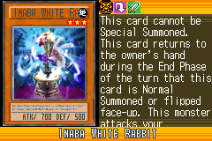](https://yugipedia.com/wiki/Inaba_White_Rabbit_(World_Championship_2006))|[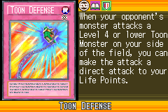](https://yugipedia.com/wiki/Toon_Defense_(World_Championship_2006))|)|
|[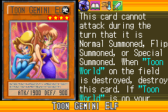](https://yugipedia.com/wiki/Toon_Gemini_Elf_(World_Championship_2006))|[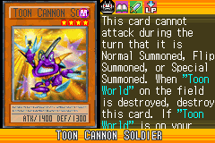](https://yugipedia.com/wiki/Toon_Cannon_Soldier_(World_Championship_2006))|[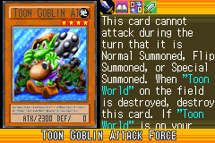](https://yugipedia.com/wiki/Toon_Goblin_Attack_Force_(World_Championship_2006))|)|[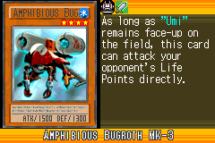](https://yugipedia.com/wiki/Amphibious_Bugroth_MK-3_(World_Championship_2006))|
|[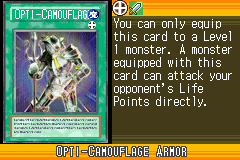](https://yugipedia.com/wiki/Opti-Camouflage_Armor_(World_Championship_2006))|[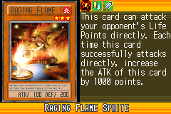](https://yugipedia.com/wiki/Raging_Flame_Sprite_(World_Championship_2006))||||

|Common| | | | |
|---|---|---|---|---|
|[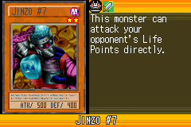](https://yugipedia.com/wiki/Jinzo_7_(World_Championship_2006))|[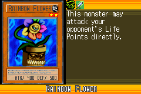](https://yugipedia.com/wiki/Rainbow_Flower_(World_Championship_2006))|[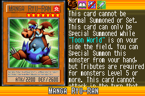](https://yugipedia.com/wiki/Manga_Ryu-Ran_(World_Championship_2006))|[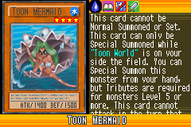](https://yugipedia.com/wiki/Toon_Mermaid_(World_Championship_2006))|[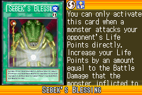](https://yugipedia.com/wiki/Sebek%27s_Blessing_(World_Championship_2006))|
|[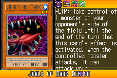](https://yugipedia.com/wiki/Jowls_of_Dark_Demise_(World_Championship_2006))|[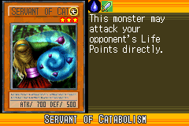](https://yugipedia.com/wiki/Servant_of_Catabolism_(World_Championship_2006))|[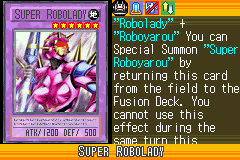](https://yugipedia.com/wiki/Super_Robolady_(World_Championship_2006))|[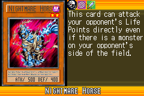](https://yugipedia.com/wiki/Nightmare_Horse_(World_Championship_2006))|[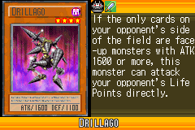](https://yugipedia.com/wiki/Drillago_(World_Championship_2006))|
|[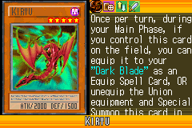](https://yugipedia.com/wiki/Kiryu_(World_Championship_2006))|[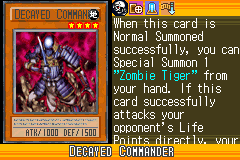](https://yugipedia.com/wiki/Decayed_Commander_(World_Championship_2006))|[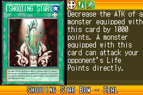](https://yugipedia.com/wiki/Shooting_Star_Bow_-_Ceal_(World_Championship_2006))|[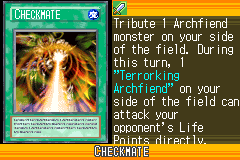](https://yugipedia.com/wiki/Checkmate_(World_Championship_2006))|[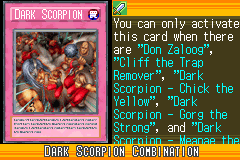](https://yugipedia.com/wiki/Dark_Scorpion_Combination_(World_Championship_2006))|
|[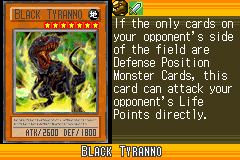](https://yugipedia.com/wiki/Black_Tyranno_(World_Championship_2006))|[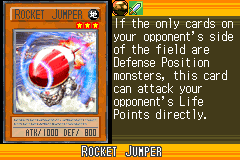](https://yugipedia.com/wiki/Rocket_Jumper_(World_Championship_2006))|[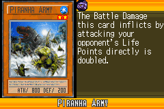](https://yugipedia.com/wiki/Piranha_Army_(World_Championship_2006))|[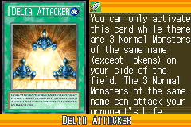](https://yugipedia.com/wiki/Delta_Attacker_(World_Championship_2006))|[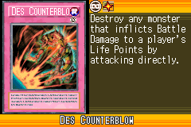](https://yugipedia.com/wiki/Des_Counterblow_(World_Championship_2006))|
|[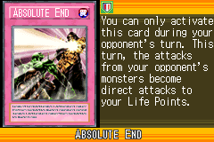](https://yugipedia.com/wiki/Absolute_End_(World_Championship_2006))|[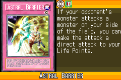](https://yugipedia.com/wiki/Astral_Barrier_(World_Championship_2006))|[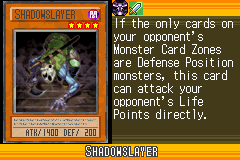](https://yugipedia.com/wiki/Shadowslayer_(World_Championship_2006))|[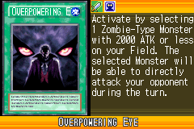](https://yugipedia.com/wiki/Overpowering_Eye_(World_Championship_2006))|[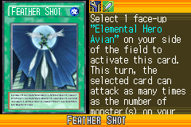](https://yugipedia.com/wiki/Feather_Shot_(World_Championship_2006))|
|[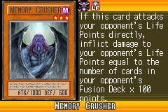](https://yugipedia.com/wiki/Memory_Crusher_(World_Championship_2006))