# Monster_Destroy_Collection

|Secret| | | | |
|---|---|---|---|---|
|)|)|)|)|)|

|Ultra| | | | |
|---|---|---|---|---|
|)|)|)|)|)|
|)|||||

|Super| | | | |
|---|---|---|---|---|
|)|)|)|)|)|
|[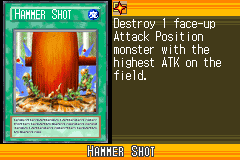](https://yugipedia.com/wiki/Hammer_Shot_(World_Championship_2006))|)|[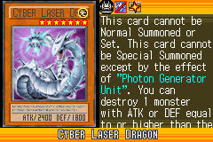](https://yugipedia.com/wiki/Cyber_Laser_Dragon_(World_Championship_2006))|)||

|Rare| | | | |
|---|---|---|---|---|
|[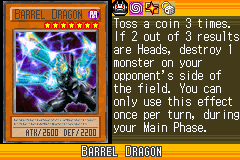](https://yugipedia.com/wiki/Barrel_Dragon_(World_Championship_2006))|)|)|)|)|
|)|)|[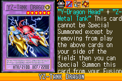](https://yugipedia.com/wiki/YZ-Tank_Dragon_(World_Championship_2006))|)|)|
|)|)|)|[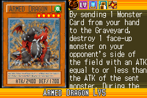](https://yugipedia.com/wiki/Armed_Dragon_LV5_(World_Championship_2006))|)|
|[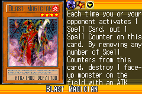](https://yugipedia.com/wiki/Blast_Magician_(World_Championship_2006))|)|)|)|)|

|Common| | | | |
|---|---|---|---|---|
|)|)|)|[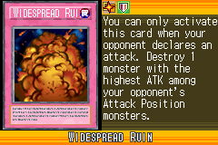](https://yugipedia.com/wiki/Widespread_Ruin_(World_Championship_2006))|)|
|)|)|)|)|)|
|)|)|[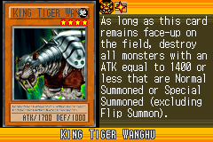](https://yugipedia.com/wiki/King_Tiger_Wanghu_(World_Championship_2006))|)|)|
|)|)|)|)|)|
|)|)|)|)|)|
|)|[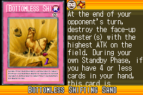](https://yugipedia.com/wiki/Bottomless_Shifting_Sand_(World_Championship_2006))|[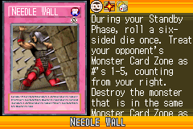](https://yugipedia.com/wiki/Needle_Wall_(World_Championship_2006))|)|[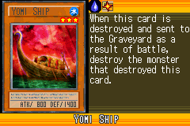](https://yugipedia.com/wiki/Yomi_Ship_(World_Championship_2006))|
|)|)|[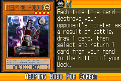](https://yugipedia.com/wiki/Helping_Robo_For_Combat_(World_Championship_2006))|)|)|
|[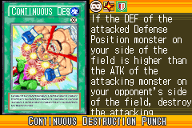](https://yugipedia.com/wiki/Continuous_Destruction_Punch_(World_Championship_2006))|)|)|)|)|
|)|[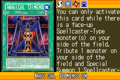](https://yugipedia.com/wiki/Magical_Dimension_(World_Championship_2006))|)|)|[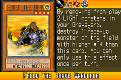](https://yugipedia.com/wiki/Freed_the_Brave_Wanderer_(World_Championship_2006))|
|)|[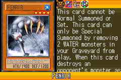](https://yugipedia.com/wiki/Fenrir_(World_Championship_2006))|)|)|)|
|)|[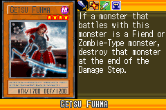](https://yugipedia.com/wiki/Getsu_Fuhma_(World_Championship_2006))|)|[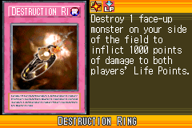](https://yugipedia.com/wiki/Destruction_Ring_(World_Championship_2006))|[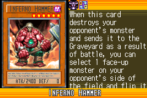](https://yugipedia.com/wiki/Inferno_Hammer_(World_Championship_2006))|
|)|[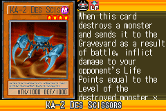](https://yugipedia.com/wiki/KA-2_Des_Scissors_(World_Championship_2006))|)|)|)|
|)|)|[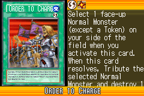](https://yugipedia.com/wiki/Order_to_Charge_(World_Championship_2006))|)|)|
|)|)|)|[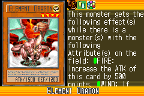](https://yugipedia.com/wiki/Element_Dragon_(World_Championship_2006))|)|
|)|)|)|)|)|
|)|)|[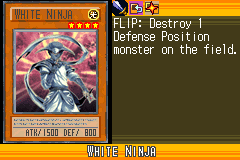](https://yugipedia.com/wiki/White_Ninja_(World_Championship_2006))|)|)|
|)|)|)|[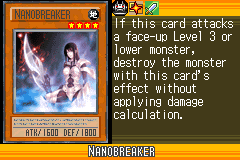](https://yugipedia.com/wiki/Nanobreaker_(World_Championship_2006))|)|
|)|[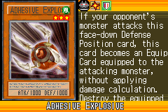](https://yugipedia.com/wiki/Adhesive_Explosive_(World_Championship_2006))|)|)|[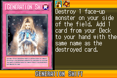](https://yugipedia.com/wiki/Generation_Shift_(World_Championship_2006))|
